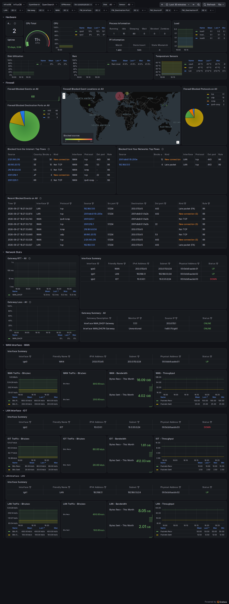
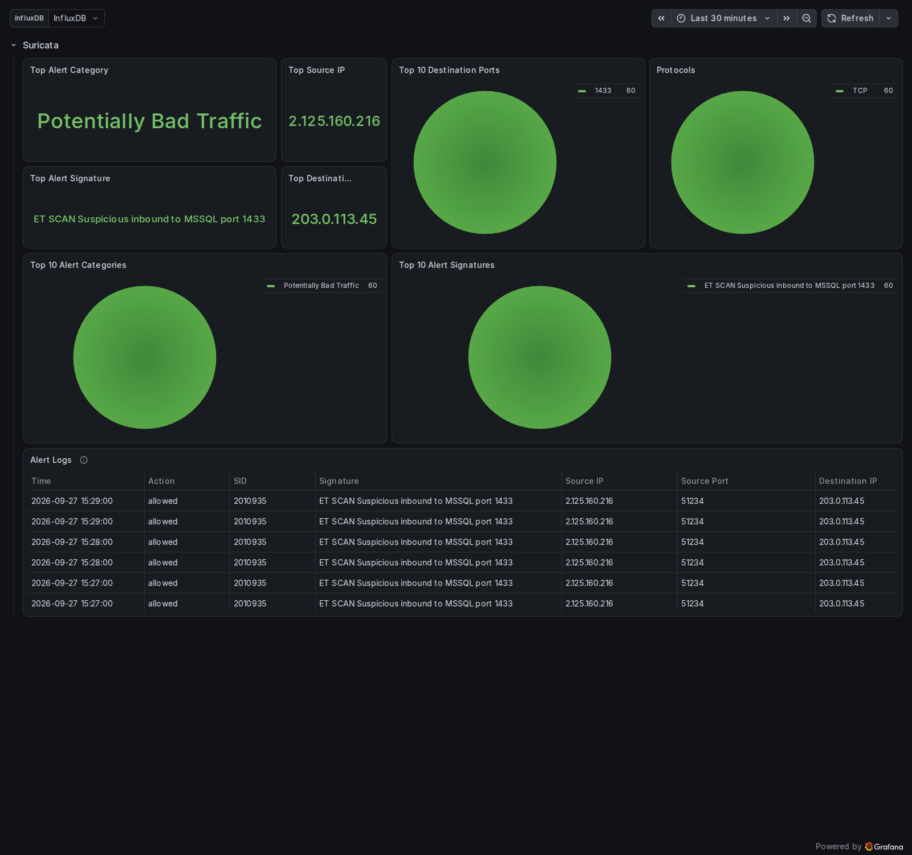
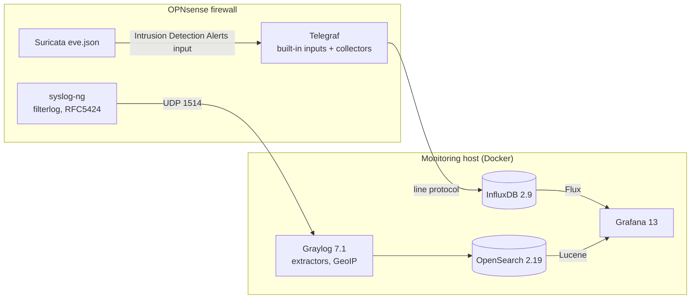

# OPNsense-Dashboard

Grafana dashboards for OPNsense firewalls: system health, interfaces,
gateways, firewall blocks with GeoIP, and Suricata alerts, fed by Telegraf,
Graylog and InfluxDB.

This project is maintained here. It began as a fork of
[bsmithio/OPNsense-Dashboard](https://github.com/bsmithio/OPNsense-Dashboard),
itself based on
[VictorRobellini/pfSense-Dashboard](https://github.com/VictorRobellini/pfSense-Dashboard);
see [Credits and history](#credits-and-history).

## What's monitored

- Active users, uptime, CPU load, per-core CPU, load average, RAM, disk
- CPU and ACPI temperature sensors
- Gateway round-trip time and loss (dpinger)
- Interfaces with IPv4/IPv6 addresses, subnet, MAC, status and OPNsense description
- WAN and LAN traffic and throughput
- Firewall blocks: events, ports, protocols, top source IP and a GeoIP map
- Suricata alerts (separate dashboard)





Screenshots show synthetic test data from `tests/e2e`.

## How it works



The metrics pipeline (InfluxDB, Grafana) works on its own. The firewall log
pipeline (Graylog, MongoDB, OpenSearch) is optional: set `COMPOSE_PROFILES=`
for a metrics-only install.

## Requirements

- **Firewall:** OPNsense 26.7.x with the os-telegraf plugin. The collectors
  are written against the OPNsense 26.7.4 source; older releases are untested.
- **Monitoring host:** Docker Engine with Compose v2, about 4 GB RAM for the
  full stack (1 GB for metrics only), and disk for InfluxDB and OpenSearch
  (see [docs/stack.md](docs/stack.md#storage)).
- **Full stack only:**
  - an x86-64 CPU with AVX, or arm64 ARMv8.2-A or later, which MongoDB
    requires. On Proxmox, set the VM CPU type to `x86-64-v3` or `host`.
  - `vm.max_map_count` of at least 262144 on the host (for OpenSearch).
- **Firewall map:** a free MaxMind GeoLite2 account.

## Supported versions

| Component | Version |
|---|---|
| OPNsense | 26.7.x (written against the 26.7.4 source); older releases untested |
| os-telegraf | 1.12.x |
| Grafana | 13.2.2 |
| InfluxDB | 2.9.1 (2.x only) |
| Graylog | 7.1.9 |
| OpenSearch | 2.19.6 |
| MongoDB | 7.0 |

Versions are pinned in `.env.example`; see the Settings table to change them.

## Quick start

```sh
git clone https://github.com/tekgnosis-net/OPNsense-Dashboard.git
cd OPNsense-Dashboard
cp .env.example .env        # then edit: passwords, tokens, TZ, MaxMind
docker compose up -d
docker compose run --rm graylog-init    # once, full stack only
```

Then set up the firewall ([docs/opnsense.md](docs/opnsense.md)), and open
Grafana at `http://<host>:3000`; the dashboards are in the **OPNsense** folder.
Full details: [docs/stack.md](docs/stack.md).

## Settings

All settings live in `.env`; `.env.example` has every one with its default.
Values containing `$` must be single-quoted. "First start" settings apply
only while the service's data volume is empty.

| Setting | Default | Meaning |
|---|---|---|
| `COMPOSE_PROFILES` | `logs` | `logs` = full stack; empty = metrics only (InfluxDB + Grafana) |
| `TZ` | `Etc/UTC` | Time zone for every container (IANA name) |
| `BIND_ADDRESS` | `0.0.0.0` | Address the published ports bind to |
| `GRAFANA_PORT` | `3000` | Grafana web port |
| `INFLUXDB_PORT` | `8086` | InfluxDB port (Telegraf on the firewall writes here) |
| `GRAYLOG_PORT` | `9000` | Graylog web port |
| `SYSLOG_PORT` | `1514` | UDP port the firewall sends syslog to |
| `GRAFANA_IMAGE` | `grafana/grafana:13.2.2` | Grafana image |
| `OPENSEARCH_PLUGIN_VERSION` | `2.34.4` | Grafana OpenSearch datasource plugin version |
| `INFLUXDB_IMAGE` | `influxdb:2.9.1` | InfluxDB image (2.x only; InfluxDB 3 has no Flux) |
| `GRAYLOG_IMAGE` | `graylog/graylog:7.1.9` | Graylog image |
| `MONGO_IMAGE` | `mongo:7.0` | MongoDB image (Graylog 7.1 supports 7.x–8.2.x; 8.x refuses to start on Ubuntu 26.04's 7.0.0-N kernels) |
| `OPENSEARCH_VERSION` | `2.19.6` | OpenSearch image tag and datasource version (Graylog 7.1 supports 1.1–2.19) |
| `GEOIPUPDATE_IMAGE` | `ghcr.io/maxmind/geoipupdate:v8.0.0` | MaxMind updater image |
| `INIT_IMAGE` | `alpine:3.24` | Image `graylog-init` runs in |
| `GRAFANA_ADMIN_USER` | `admin` | Grafana admin user (first start) |
| `GRAFANA_ADMIN_PASSWORD` | — (required) | Grafana admin password (first start) |
| `INFLUXDB_ADMIN_USER` | `admin` | InfluxDB admin user (first start) |
| `INFLUXDB_ADMIN_PASSWORD` | — (required) | InfluxDB admin password, 8–72 characters (first start) |
| `INFLUXDB_ORG` | `opnsense` | InfluxDB organization (first start) |
| `INFLUXDB_BUCKET` | `opnsense` | InfluxDB bucket (first start) |
| `INFLUXDB_RETENTION` | `30d` | How long InfluxDB keeps metrics, e.g. `30d`, `52w`, `0` = forever (first start; not validated) |
| `INFLUXDB_ADMIN_TOKEN` | — (required) | InfluxDB admin token, `openssl rand -hex 32` (first start) |
| `INFLUXDB_GRAFANA_TOKEN` | admin token | Token Grafana reads with; set a read-only token to limit access |
| `GRAYLOG_ADMIN_PASSWORD` | — (required) | Graylog `admin` password; also used by `graylog-init` |
| `GRAYLOG_PASSWORD_SECRET` | — (required) | Graylog password secret, at least 16 characters; `openssl rand -hex 48` |
| `GRAYLOG_EXTERNAL_URI` | `http://127.0.0.1:9000/` | URL you open Graylog at |
| `GRAYLOG_HEAP` | `1g` | Graylog Java heap (not validated; 512m–4g sensible) |
| `OPENSEARCH_HEAP` | `1g` | OpenSearch Java heap (not validated; 512m–half of RAM) |
| `GRAYLOG_JOURNAL_MAX_SIZE` | `2gb` | Disk Graylog reserves for its journal; it refuses to start without that much free (not validated; 512mb–20gb) |
| `GRAYLOG_INDEX_ROTATION` | `P1D` | Firewall log index rotation period, ISO-8601 (applied when `graylog-init` creates the index set) |
| `GRAYLOG_INDEX_MAX_COUNT` | `30` | Firewall log indices kept, clamped 1–3650 (applied when `graylog-init` creates the index set) |
| `MAXMIND_ACCOUNT_ID` | empty | MaxMind account ID for GeoLite2 |
| `MAXMIND_LICENSE_KEY` | empty | MaxMind licence key |
| `GEOIP_UPDATE_HOURS` | `72` | GeoIP database refresh interval in hours (not validated; 24–168 sensible) |
| `GEOIP_WAIT_SECONDS` | `600` | How long `graylog-init` waits for the first GeoIP download, clamped 0–3600 |
| `GRAYLOG_INIT_TIMEOUT_SECONDS` | `300` | How long `graylog-init` waits for the Graylog API, clamped 30–3600 |

The firewall-side exec timeout (`timeout = "10s"`) lives in
`opnsense/telegraf.d/custom.conf`, which is installed on the firewall.

## Documentation

- [docs/opnsense.md](docs/opnsense.md): router setup (Telegraf, collectors, remote syslog)
- [docs/stack.md](docs/stack.md): monitoring host setup (Docker stack, Graylog, Grafana)
- [docs/troubleshooting.md](docs/troubleshooting.md)

## Help and feedback

- Questions and setup help: [Discussions Q&A](https://github.com/tekgnosis-net/OPNsense-Dashboard/discussions/categories/q-a)
- Bugs and feature requests: [issues](https://github.com/tekgnosis-net/OPNsense-Dashboard/issues/new/choose)
- Ideas, and your own dashboards and setups: [Discussions](https://github.com/tekgnosis-net/OPNsense-Dashboard/discussions)

## Changelog

See [CHANGELOG.md](CHANGELOG.md). Coming from bsmithio/OPNsense-Dashboard?
Upgrade the router side with the Ansible playbook ([docs/opnsense.md](docs/opnsense.md))
and install the monitoring stack fresh.

## Repository layout

| Path | Contents |
|---|---|
| `opnsense/` | Files installed on the firewall: Telegraf exec scripts (`bin/`), Telegraf config (`telegraf.d/`), Ansible playbook (`ansible/`) |
| `graylog/` | Graylog content pack and `init/graylog-init.sh` (one-shot setup through the API) |
| `grafana/` | Dashboard JSON (`dashboards/`) and datasource/dashboard provisioning (`provisioning/`) |
| `docker-compose.yaml`, `.env.example` | Monitoring host stack and its settings |
| `tests/` | Static checks, unit tests and the end-to-end suite |
| `docs/` | Setup guides, troubleshooting and design records |

## Credits and history

This repository continues the work of:

- **VictorRobellini/pfSense-Dashboard** (2020): the original pfSense dashboard,
  Telegraf plugins and Graylog setup.
- **bsmithio/OPNsense-Dashboard** (2021–2023): the OPNsense port, Flux
  queries, firewall panels, Suricata dashboard and RFC5424 extractors.

Thanks also to [/u/trumee](https://www.reddit.com/r/PFSENSE/comments/fsss8r/additional_grafana_dashboard/fmal0t6/)
for the interface summary approach and to
[subract](https://github.com/IRQ10/Graylog-OPNsense_Extractors/pull/11) for the
RFC5424 extractors. Contributors are listed in [NOTICE](NOTICE).

## License

Changes made in this repository are released under the [MIT License](LICENSE).
The upstream projects were published without a license; see [NOTICE](NOTICE).
