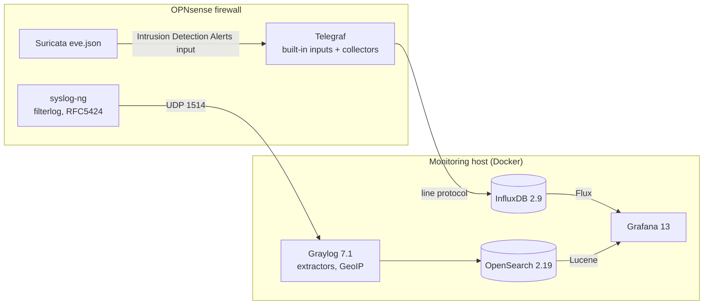

# OPNsense-Dashboard v2 Implementation Plan

> **For agentic workers:** REQUIRED SUB-SKILL: Use superpowers:subagent-driven-development (recommended) or superpowers:executing-plans to implement this plan task-by-task. Steps use checkbox (`- [ ]`) syntax for tracking.

**Goal:** Ship v2.0 of OPNsense-Dashboard as an independent project. That means:
- router-side collectors that work on OPNsense 26.7;
- a provisioned Grafana 13 / Graylog 7.1 / OpenSearch 2.19 / InfluxDB 2.9 stack;
- migrated and fixed dashboards;
- automated verification of all of the above.

**Architecture:** Three pipelines feed two Grafana dashboards:
1. **Metrics:** Telegraf on the router (built-in inputs plus two exec scripts) → InfluxDB 2 → Flux panels.
2. **Firewall logs:** OPNsense RFC5424 `filterlog` syslog → Graylog (extractors, stream, GeoIP pipeline) → OpenSearch → Lucene panels.
3. **Suricata:** os-telegraf's built-in "Intrusion Detection Alerts" input → InfluxDB → Suricata dashboard.

The monitoring host is configured entirely from `.env`: Docker Compose, Grafana provisioning files, and a one-shot `graylog-init` container that drives Graylog's REST API.

**Tech Stack:**

| Area | Components |
|---|---|
| Router | PHP 8.5, POSIX sh, TOML, Ansible (`ansible-core` 2.21) |
| Monitoring host | Docker Compose v2, `grafana/grafana:13.2.2` + `grafana-opensearch-datasource` 2.34.4, `influxdb:2.9.1`, `graylog/graylog:7.1.9`, `opensearchproject/opensearch:2.19.6`, `mongo:8.0`, `ghcr.io/maxmind/geoipupdate:v8.0.0` |
| Tests | Python 3.12 standard library only; `mcr.microsoft.com/playwright/python:v1.63.0-noble` for dashboard capture and screenshots |

**Spec:** `docs/design/2026-09-26-v2-modernization.md`. Section numbers (`§x.y`) below refer to it, as do decision IDs (`D1`–`D13`).

## Global Constraints

These apply to every task.

**Versions and identifiers**
- **Router target:** OPNsense 26.7.x (verified at 26.7.4), which runs FreeBSD 15.1 and PHP 8.5. The router PHP script's shebang is exactly `#!/usr/local/bin/php`.
- **Image and plugin pins** are the defaults of `.env` settings: `grafana/grafana:13.2.2`, `influxdb:2.9.1`, `graylog/graylog:7.1.9`, `opensearchproject/opensearch:2.19.6`, `mongo:8.0`, `ghcr.io/maxmind/geoipupdate:v8.0.0`, `grafana-opensearch-datasource@2.34.4`.
- **Datasource UIDs** are `influxdb-opnsense` and `opensearch-opnsense`.
- **Dashboard UIDs and titles are unchanged:** `suTmk8c7k` "OPNsense" and `94raP_-7z` "OPNsense Suricata".

**Data contracts**
- **Measurement, tag and field names and field types are unchanged** (§5.5). The one exception: the scripts no longer print `host=`, because Telegraf adds it.
- **Dashboards reference datasources only** through `${dataSource}` / `${ESdataSource}`.
- **Every Flux query reads** `from(bucket: v.defaultBucket)`.

**Settings and secrets**
- **Every threshold, window, cap or toggle is a `.env` setting** with a default. Scripts in this repo clamp values they read. Every setting is listed in the README settings table.
- **Every service gets `TZ`**, and times are shown in local time.
- **No secrets in output:** never print tokens, passwords or password hashes in logs, test output or commits.

**Upstream references**
- No `raw.githubusercontent.com/{bsmithio,Bsmith101}`, `github.com/Bsmith101`, `bsmithio.com` or `nuuls.com` references anywhere.
- Upstream credits are allowed only in `NOTICE`, `README.md`, `CHANGELOG.md` and `docs/design/`.

**Commits and host safety**
- **Five commits on branch `v2-modernization`,** one per phase (spec §7). Tasks inside a phase stage their work, and the last task of each phase commits.
- **Commit messages carry no Claude/AI attribution or trailers.** Docs go in the same commit as the behaviour they describe.
- **`$SCRATCH`** means the session scratchpad directory. One-shot helpers live there and are never committed.
- **Never touch other containers on the development host** (for example `netguest-*`).
  - End-to-end runs use compose project `opnsense-dash-test`, bind ports to `127.0.0.1`, and are removed with `down -v`.
  - Metrics-only runs use a second project, `opnsense-dash-test-metrics`.

## Review Focus

These are the five inputs most likely to hurt a real user that no single task naturally exercises. Each one has a test added to the task named.

1. **Assigned virtual interfaces** (PPPoE WAN with IPv6 only, VLAN `vlan0.10`, WireGuard `wg0` without a MAC). The plugin must print a valid line for each: `Unassigned` for missing addresses, the device name as `name`, and nothing that breaks line protocol. Test: case `virtual_interfaces` in Task 3.
2. **`.env` values that contain `$`** (for example a Grafana admin password like `pa$$word`). Compose interpolates `$` inside `.env` values unless the value is single-quoted. A user expects the password they typed to work. Tests: the `.env.example` guidance and the static check in Task 8; an end-to-end login with a single-quoted `$` password in Task 9.
3. **GeoIP database missing when `graylog-init` runs** (a new MaxMind key isn't active yet). Init must finish with a warning, and the map must start working once the file appears, without a restart. Test: the first phase of the stack smoke run in Task 9.
4. **Syslog timestamps with a non-UTC offset** (`+10:00`, like the maintainer's router). Messages must land in the right time window, so panels aren't empty (upstream #2). Test: the end-to-end syslog sender uses `+10:00` timestamps, and the queries assert data inside `now-30m..now` (Task 13).
5. **Re-running setup on existing volumes** (a second `docker compose up -d`, a second `graylog-init`). There must be no duplicate inputs, streams or index sets, and no errors. Test: `graylog-init` runs twice and the counts are asserted (Task 9).

---
## Phase 1: De-fork, layout, credits (commit 1)

### Task 1: New layout and removal of upstream download references

**Files:**
- Create:
  - `tests/run-static.sh`
  - `tests/static/check_upstream_refs.sh`
  - `tests/requirements-dev.txt`
  - `.gitignore`
  - `docs/opnsense.md`, `docs/stack.md`, `docs/troubleshooting.md` (generated)
- Move (`git mv`):
  - `plugins/telegraf_pfifgw.php` → `opnsense/bin/telegraf_pfifgw.php`
  - `plugins/telegraf_temperature.sh` → `opnsense/bin/telegraf_temperature.sh`
  - `config/custom.conf` → `opnsense/telegraf.d/custom.conf`
  - `ansible/playbook.yml` → `opnsense/ansible/playbook.yml`
  - `ansible/inventory.yml` → `opnsense/ansible/inventory.ini`
  - `ansible/README.md` → `opnsense/ansible/README.md`
  - `config/OPNsense-pack.json` → `graylog/OPNsense-pack.json`
  - `OPNsense-Grafana-Dashboard.json` → `grafana/dashboards/opnsense.json`
  - `OPNsense-Grafana-Dashboard-Suricata.json` → `grafana/dashboards/opnsense-suricata.json`
- Delete: `configure.md`, `plugins/README.md`, `Grafana-OPNsense.png`, `Grafana-OPNsense-Suricata.png`
- Modify: `opnsense/ansible/playbook.yml` (download URLs, interim until Task 5), `graylog/OPNsense-pack.json` (`vendor`, `url`)

**Interfaces:**
- Produces:
  - `tests/run-static.sh` runs every `tests/static/check_*.{sh,py}` and exits non-zero if any fails. Later tasks add checks just by adding files.
  - The directory layout of spec §4.

- [ ] **Step 1: Write the static-check runner and the upstream-reference check**

`tests/run-static.sh`:
```sh
#!/bin/sh
# Runs every static check under tests/static/. Exits non-zero if any fails.
set -u
cd "$(dirname "$0")/.." || exit 1
status=0
for check in tests/static/check_*; do
    case "$check" in
        *.py) runner=python3 ;;
        *.sh) runner=sh ;;
        *) continue ;;
    esac
    echo "== $check"
    "$runner" "$check" || status=1
done
if [ "$status" -eq 0 ]; then
    echo "static checks: all passed"
else
    echo "static checks: FAILED" >&2
fi
exit "$status"
```

`tests/static/check_upstream_refs.sh`:
```sh
#!/bin/sh
# Fails if any tracked file still points at the upstream authors' download
# URLs or image hosts. Credits may name the upstream projects (NOTICE, README,
# CHANGELOG) and the design records under docs/design/ quote them as evidence.
set -eu
cd "$(dirname "$0")/../.."
pattern='raw\.githubusercontent\.com/(bsmithio|Bsmith101)|github\.com/Bsmith101|bsmithio\.com|nuuls\.com'
if git grep -n -I -E "$pattern" -- . ':!docs/design/' ':!tests/static/check_upstream_refs.sh'; then
    echo "FAIL: upstream download URLs or image hosts found (listed above)" >&2
    exit 1
fi
echo "ok: no upstream download URLs or image hosts"
```

`tests/requirements-dev.txt`:
```
ansible-core==2.21.4
ansible-lint==26.9.0
yamllint==1.38.0
```

`.gitignore`:
```
.env
.venv/
tests/e2e/.work/
```

- [ ] **Step 2: Run the check and confirm it fails on today's tree**

Run: `git add tests .gitignore && sh tests/run-static.sh`
Expected: FAIL. The output lists hits in `configure.md`, `ansible/playbook.yml` and `plugins/README.md`, and ends with `static checks: FAILED`.

- [ ] **Step 3: Move files into the new layout**

```bash
mkdir -p opnsense/bin opnsense/telegraf.d opnsense/ansible graylog grafana/dashboards docs
git mv plugins/telegraf_pfifgw.php opnsense/bin/telegraf_pfifgw.php
git mv plugins/telegraf_temperature.sh opnsense/bin/telegraf_temperature.sh
git mv config/custom.conf opnsense/telegraf.d/custom.conf
git mv ansible/playbook.yml opnsense/ansible/playbook.yml
git mv ansible/inventory.yml opnsense/ansible/inventory.ini
git mv ansible/README.md opnsense/ansible/README.md
git mv config/OPNsense-pack.json graylog/OPNsense-pack.json
git mv OPNsense-Grafana-Dashboard.json grafana/dashboards/opnsense.json
git mv OPNsense-Grafana-Dashboard-Suricata.json grafana/dashboards/opnsense-suricata.json
git rm -q Grafana-OPNsense.png Grafana-OPNsense-Suricata.png
```

`config/suricata/` stays where it is until Task 5 deletes it.

- [ ] **Step 4: Split `configure.md` into `docs/` and rewrite the links**

Save this as `$SCRATCH/split_configure.py`, where `$SCRATCH` is the session scratchpad. It is a one-shot tool and is not committed.
```python
#!/usr/bin/env python3
"""One-shot (v2 plan Task 1): split configure.md into docs/*.md, rewrite links."""
import pathlib
import re

RAW = "https://raw.githubusercontent.com/tekgnosis-net/OPNsense-Dashboard/master/"
MOVED = {
    "config/custom.conf": "opnsense/telegraf.d/custom.conf",
    "plugins/telegraf_pfifgw.php": "opnsense/bin/telegraf_pfifgw.php",
    "plugins/telegraf_temperature.sh": "opnsense/bin/telegraf_temperature.sh",
    "config/OPNsense-pack.json": "graylog/OPNsense-pack.json",
    "OPNsense-Grafana-Dashboard.json": "grafana/dashboards/opnsense.json",
    "OPNsense-Grafana-Dashboard-Suricata.json": "grafana/dashboards/opnsense-suricata.json",
}
SYSLOG_TARGET = (
    "- Transport: UDP(4)\n"
    "- Applications: filter (filterlog)\n"
    "- Hostname: the Docker host running Graylog\n"
    "- Port: 1514\n"
    "- RFC5424: checked\n"
)


def fix(text: str) -> str:
    text = re.sub(
        r"https://raw\.githubusercontent\.com/(?:bsmithio|Bsmith101)/OPNsense-Dashboard/master/([\w./-]+)",
        lambda m: RAW + MOVED.get(m.group(1), m.group(1)),
        text,
    )
    text = text.replace(
        "https://github.com/bsmithio/OPNsense-Dashboard/tree/master/ansible",
        "[opnsense/ansible](../opnsense/ansible/)",
    )
    for old, new in {
        "(./config/custom.conf)": "(../opnsense/telegraf.d/custom.conf)",
        "(./config/suricata/suricata.conf)": "(../config/suricata/suricata.conf)",
        "(./config/suricata/custom.yaml)": "(../config/suricata/custom.yaml)",
    }.items():
        text = text.replace(old, new)
    text = re.sub(r"^!\[OPNsense Syslog Target\]\(https://i\.nuuls\.com/[^)]*\)\n",
                  SYSLOG_TARGET, text, flags=re.M)
    text = re.sub(r"^!\[[^\]]*\]\(https://www\.bsmithio\.com/[^)]*\)\n\n?", "", text, flags=re.M)
    return text


def target(h2: str, h3: str | None) -> str:
    if h2 == "Troubleshooting":
        return "troubleshooting"
    if h2 == "Configuring Telegraf":
        return "opnsense"
    if h2 == "Configuring Graylog":
        return "opnsense" if h3 and h3.startswith("Add Graylog server as syslog target") else "stack"
    if h2.startswith("Configuration for the Suricata dashboard"):
        return "stack" if h3 and h3.startswith("Import the Suricata Dashboard") else "opnsense"
    return "stack"  # Docker, Configuring InfluxDB, Configuring Grafana


blocks, h2, h3, buf = [], None, None, []
for line in fix(pathlib.Path("configure.md").read_text()).splitlines(keepends=True):
    if line.startswith("## ") or line.startswith("### "):
        if h2 is not None:
            blocks.append((h2, h3, "".join(buf)))
        buf = []
        if line.startswith("## "):
            h2, h3 = line[3:].strip(), None
            continue
        h3 = line[4:].strip()
    if h2 is not None:
        buf.append(line)
blocks.append((h2, h3, "".join(buf)))

out = {
    "opnsense": ["# OPNsense (router) setup\n\n"],
    "stack": ["# Monitoring host setup\n\n"],
    "troubleshooting": ["# Troubleshooting\n\n"],
}
last_h2 = {}
for h2, h3, text in blocks:
    dest = target(h2, h3)
    if dest != "troubleshooting" and last_h2.get(dest) != h2:
        out[dest].append(f"## {h2}\n\n")
        last_h2[dest] = h2
    out[dest].append(text)

plugins = fix(pathlib.Path("plugins/README.md").read_text())
plugins = re.sub(r"^# ", "### ", plugins, flags=re.M)
out["opnsense"].append("\n## Plugin reference\n\n" + plugins)

for name, parts in out.items():
    pathlib.Path(f"docs/{name}.md").write_text("".join(parts).rstrip() + "\n")

playbook = pathlib.Path("opnsense/ansible/playbook.yml")
playbook.write_text(fix(playbook.read_text()))
```

Run:
```bash
python3 "$SCRATCH/split_configure.py"
git rm -q configure.md plugins/README.md
python3 - <<'EOF'
import json, pathlib
p = pathlib.Path("graylog/OPNsense-pack.json")
d = json.loads(p.read_text())
d["vendor"] = "tekgnosis-net"
d["url"] = "https://github.com/tekgnosis-net/OPNsense-Dashboard"
p.write_text(json.dumps(d, indent=2) + "\n")
EOF
git add docs opnsense graylog grafana
```

- [ ] **Step 5: Run the checks and confirm they pass**

Run: `sh tests/run-static.sh && for f in graylog/OPNsense-pack.json grafana/dashboards/*.json; do python3 -m json.tool "$f" >/dev/null || echo "BAD $f"; done`
Expected: `ok: no upstream download URLs or image hosts`, then `static checks: all passed`, and no `BAD` lines.

Then open `docs/opnsense.md` and `docs/stack.md` and check that every heading from the old `configure.md` appears exactly once across the three files: `grep -h '^##' docs/*.md`.

- [ ] **Step 6: Stage**

Run: `git add -A tests .gitignore docs opnsense graylog grafana && git status --short`
Expected: renames (`R`) for the moved files, `D` for the four deleted files, `A` for the new files. Nothing unstaged except `CLAUDE.md` and `supertool`.

### Task 2: License, notice, README, issue templates, CLAUDE.md, then commit 1

**Files:**
- Create:
  - `LICENSE`, `NOTICE`
  - `.github/ISSUE_TEMPLATE/bug_report.yml`, `enhancement.yml`, `question.yml`, `config.yml`
  - `.github/pull_request_template.md`
  - `tests/static/check_repo_meta.py`
- Modify: `README.md` (rewrite), `CLAUDE.md` (rewrite for the new layout; currently untracked)

**Interfaces:**
- Consumes: `tests/run-static.sh` (Task 1).
- Produces: `check_repo_meta.py`, which later tasks extend when they add required files.

- [ ] **Step 1: Write the failing metadata check**

`tests/static/check_repo_meta.py`:
```python
#!/usr/bin/env python3
"""Repository metadata required by the v2 de-fork (spec §5.1)."""
import pathlib
import sys

ROOT = pathlib.Path(__file__).resolve().parents[2]
errors = []


def need(path, *needles):
    p = ROOT / path
    if not p.is_file():
        errors.append(f"missing {path}")
        return
    text = p.read_text()
    for needle in needles:
        if needle not in text:
            errors.append(f"{path}: expected to mention {needle!r}")


need("LICENSE", "MIT License", "tekgnosis-net")
need("NOTICE", "VictorRobellini/pfSense-Dashboard", "bsmithio/OPNsense-Dashboard",
     "without a license", "48119ee")
need("README.md", "## Credits and history", "NOTICE", "LICENSE", "docs/opnsense.md", "docs/stack.md")
for name in ("bug_report.yml", "enhancement.yml", "question.yml", "config.yml"):
    need(f".github/ISSUE_TEMPLATE/{name}")
need(".github/ISSUE_TEMPLATE/config.yml", "blank_issues_enabled: false")
need(".github/pull_request_template.md", "tests/run-static.sh", "tests/run-unit.sh")
need("CLAUDE.md", "tests/run-static.sh", "opnsense/bin/telegraf_pfifgw.php")

for error in errors:
    print(f"FAIL: {error}", file=sys.stderr)
print("ok: repository metadata present" if not errors else "")
sys.exit(1 if errors else 0)
```

Run: `sh tests/run-static.sh`
Expected: FAIL with `missing LICENSE`, `missing NOTICE`, and so on.

- [ ] **Step 2: Write LICENSE and NOTICE**

`LICENSE`:
```
MIT License

Copyright (c) 2026 tekgnosis-net

Permission is hereby granted, free of charge, to any person obtaining a copy
of this software and associated documentation files (the "Software"), to deal
in the Software without restriction, including without limitation the rights
to use, copy, modify, merge, publish, distribute, sublicense, and/or sell
copies of the Software, and to permit persons to whom the Software is
furnished to do so, subject to the following conditions:

The above copyright notice and this permission notice shall be included in all
copies or substantial portions of the Software.

THE SOFTWARE IS PROVIDED "AS IS", WITHOUT WARRANTY OF ANY KIND, EXPRESS OR
IMPLIED, INCLUDING BUT NOT LIMITED TO THE WARRANTIES OF MERCHANTABILITY,
FITNESS FOR A PARTICULAR PURPOSE AND NONINFRINGEMENT. IN NO EVENT SHALL THE
AUTHORS OR COPYRIGHT HOLDERS BE LIABLE FOR ANY CLAIM, DAMAGES OR OTHER
LIABILITY, WHETHER IN AN ACTION OF CONTRACT, TORT OR OTHERWISE, ARISING FROM,
OUT OF OR IN CONNECTION WITH THE SOFTWARE OR THE USE OR OTHER DEALINGS IN THE
SOFTWARE.
```

`NOTICE`:
```
OPNsense-Dashboard
Copyright (c) 2026 tekgnosis-net
https://github.com/tekgnosis-net/OPNsense-Dashboard

This project is maintained independently at the address above. It began as a
fork and carries forward the work of earlier projects:

  2020        VictorRobellini/pfSense-Dashboard
              https://github.com/VictorRobellini/pfSense-Dashboard
              The original pfSense dashboard, Telegraf plugins and Graylog setup.

  2021-2023   bsmithio/OPNsense-Dashboard
              https://github.com/bsmithio/OPNsense-Dashboard
              The OPNsense port, Flux queries, firewall panels, Suricata
              dashboard and RFC5424 extractors.

Contributors to those projects, from the git history (alphabetical):
Alex Andrascu, Brendan Smith, Evan Richardson, mark, Matt Bentley,
Matthias (Maddosaurus), NKnusperer, tiny6996, Victor Robellini, Will Blanton.

Thanks carried over from the upstream README: /u/trumee (Reddit) for the
interface summary approach, and subract for the RFC5424 extractors
(IRQ10/Graylog-OPNsense_Extractors pull request 11).

Licensing: the upstream repositories were published without a license. The
MIT License in LICENSE covers changes made in this repository after commit
48119ee (2023-10-10, the last upstream commit). Code carried over from the
upstream projects remains the work of its respective authors.
```

- [ ] **Step 3: Rewrite README.md for commit 1**

Replace `README.md` entirely with the text below. Phases 3–5 extend it with the quick start, settings table, screenshots and supported versions.
````markdown
# OPNsense-Dashboard

Grafana dashboards for OPNsense firewalls: system health, interfaces,
gateways, firewall blocks with GeoIP, and Suricata alerts, fed by Telegraf,
Graylog and InfluxDB.

This project is maintained here. It began as a fork of
[bsmithio/OPNsense-Dashboard](https://github.com/bsmithio/OPNsense-Dashboard),
itself based on
[VictorRobellini/pfSense-Dashboard](https://github.com/VictorRobellini/pfSense-Dashboard);
see [Credits and history](#credits-and-history).

## What's monitored

- Active users, uptime, CPU load, per-core CPU, load average, RAM, disk
- CPU and ACPI temperature sensors
- Gateway round-trip time and loss (dpinger)
- Interfaces with IPv4/IPv6 addresses, subnet, MAC, status and OPNsense description
- WAN and LAN traffic and throughput
- Firewall blocks: events, ports, protocols, top source IP and a GeoIP map
- Suricata alerts (separate dashboard)

## Documentation

- [docs/opnsense.md](docs/opnsense.md): router setup (Telegraf, collectors, remote syslog)
- [docs/stack.md](docs/stack.md): monitoring host setup (Docker stack, Graylog, Grafana)
- [docs/troubleshooting.md](docs/troubleshooting.md)

## Repository layout

| Path | Contents |
|---|---|
| `opnsense/` | Files installed on the firewall: Telegraf exec scripts (`bin/`), Telegraf config (`telegraf.d/`), Ansible playbook (`ansible/`) |
| `graylog/` | Graylog content pack |
| `grafana/dashboards/` | Dashboard JSON |
| `docker-compose.yaml` | Monitoring host stack |
| `tests/` | Static checks, unit tests and the end-to-end suite |
| `docs/` | Setup guides, troubleshooting and design records |

## Credits and history

This repository continues the work of:

- **VictorRobellini/pfSense-Dashboard** (2020): the original pfSense dashboard,
  Telegraf plugins and Graylog setup.
- **bsmithio/OPNsense-Dashboard** (2021–2023): the OPNsense port, Flux
  queries, firewall panels, Suricata dashboard and RFC5424 extractors.

Thanks also to [/u/trumee](https://www.reddit.com/r/PFSENSE/comments/fsss8r/additional_grafana_dashboard/fmal0t6/)
for the interface summary approach and to
[subract](https://github.com/IRQ10/Graylog-OPNsense_Extractors/pull/11) for the
RFC5424 extractors. Contributors are listed in [NOTICE](NOTICE).

## License

Changes made in this repository are released under the [MIT License](LICENSE).
The upstream projects were published without a license; see [NOTICE](NOTICE).
````

- [ ] **Step 4: Write the issue forms and PR template**

`.github/ISSUE_TEMPLATE/bug_report.yml`:
```yaml
name: Bug report
description: Something on the dashboards, the router scripts or the stack does not work.
labels: [bug]
body:
  - type: markdown
    attributes:
      value: |
        Please check [troubleshooting](https://github.com/tekgnosis-net/OPNsense-Dashboard/blob/master/docs/troubleshooting.md) first.
        Remove secrets (tokens, passwords) from anything you paste.
  - type: input
    id: opnsense-version
    attributes:
      label: OPNsense version
      description: System > Firmware > Status, for example 26.7.4
    validations:
      required: true
  - type: input
    id: telegraf-plugin-version
    attributes:
      label: os-telegraf plugin version
      placeholder: "1.12.15"
    validations:
      required: true
  - type: dropdown
    id: area
    attributes:
      label: Area
      options:
        - Router scripts / Telegraf
        - Graylog / firewall logs
        - Grafana dashboards
        - Docker stack / provisioning
        - Ansible playbook
        - Documentation
    validations:
      required: true
  - type: dropdown
    id: mode
    attributes:
      label: Install mode
      options:
        - Full stack (COMPOSE_PROFILES=logs)
        - Metrics-only
  - type: textarea
    id: images
    attributes:
      label: Stack image versions
      description: Output of `docker compose images`
      render: text
  - type: textarea
    id: what-happened
    attributes:
      label: What happened, and what did you expect?
      description: Name the dashboard and panel for display problems.
    validations:
      required: true
  - type: textarea
    id: telegraf-test
    attributes:
      label: Telegraf test output
      description: Run as root on the firewall and trim to the relevant lines.
      placeholder: telegraf --test --config /usr/local/etc/telegraf.conf --config-directory /usr/local/etc/telegraf.d
      render: text
  - type: textarea
    id: logs
    attributes:
      label: Relevant logs
      description: For example `docker compose logs graylog --tail 100`
      render: text
```

`.github/ISSUE_TEMPLATE/enhancement.yml`:
```yaml
name: Enhancement
description: Suggest a new panel, metric or improvement.
labels: [enhancement]
body:
  - type: textarea
    id: problem
    attributes:
      label: What would you like to see or change?
    validations:
      required: true
  - type: textarea
    id: why
    attributes:
      label: Why is it useful?
      description: What question would this answer about your firewall?
  - type: textarea
    id: data
    attributes:
      label: Where would the data come from?
      description: Telegraf input, OPNsense API, syslog, Suricata, ... (if known)
```

`.github/ISSUE_TEMPLATE/question.yml`:
```yaml
name: Question
description: Ask about setup or usage.
labels: [question]
body:
  - type: textarea
    id: question
    attributes:
      label: Your question
      description: Include your OPNsense version and install mode if relevant.
    validations:
      required: true
```

`.github/ISSUE_TEMPLATE/config.yml`:
```yaml
blank_issues_enabled: false
contact_links:
  - name: Setup guides
    url: https://github.com/tekgnosis-net/OPNsense-Dashboard/tree/master/docs
    about: Router and monitoring-host setup, troubleshooting.
```

`.github/pull_request_template.md`:
```markdown
## What and why

## How it was tested

- [ ] `sh tests/run-static.sh`
- [ ] `sh tests/run-unit.sh`
- [ ] `sh tests/e2e/run.sh` (stack, provisioning or dashboard changes)
- [ ] On a real OPNsense router (router-side changes), version:

## Checklist

- [ ] Docs updated in this PR (README, docs/, CLAUDE.md as relevant)
- [ ] New or changed settings added to `.env.example` and the README settings table
- [ ] Dashboard JSON keeps `${dataSource}` / `${ESdataSource}` and `v.defaultBucket`
```

- [ ] **Step 5: Rewrite CLAUDE.md for the new layout**

Keep the prefix lines exactly:
```
# CLAUDE.md

This file provides guidance to Claude Code (claude.ai/code) when working with code in this repository.
```

Then update these sections:
- **"What this repo is":** list the directories from the README layout table. Say it is maintained here, and that the design spec is `docs/design/2026-09-26-v2-modernization.md`. Remove the fork/upstream remote sentence.
- **"Validating changes":** replace the per-file command list with `sh tests/run-static.sh`. Say that `tests/run-unit.sh` and `tests/e2e/run.sh` arrive in later phases of v2.
- **Paths:** replace every old path (`plugins/`, `config/`, `configure.md`, top-level dashboard JSON) with the new one.
- **"Raw GitHub URLs point at upstream" contract:** remove it. Replace it with a note that `tests/static/check_upstream_refs.sh` forbids upstream download URLs.
- **Content pack description:** correct the stream rule from `application_name == filterlog` to `application_name CONTAINS filterlog`.
- Leave every other section as it is. Phases 2–5 update them.

- [ ] **Step 6: Run the checks**

Run: `sh tests/run-static.sh`
Expected: `ok: repository metadata present`, `ok: no upstream download URLs or image hosts`, `static checks: all passed`.

- [ ] **Step 7: Commit 1**

```bash
git add LICENSE NOTICE README.md CLAUDE.md .github tests
git status --short   # only supertool may remain untracked
git commit -q -F - <<'EOF'
Restructure repository and credit upstream as an independent project

Move router files under opnsense/, the Graylog pack under graylog/ and the
dashboards under grafana/dashboards/. Split configure.md into docs/ and
point every download at this repository instead of the upstream authors'
URLs and image hosts. Add an MIT LICENSE for changes from 48119ee on, a
NOTICE crediting VictorRobellini/pfSense-Dashboard and
bsmithio/OPNsense-Dashboard, issue and PR templates, and a static-check
runner that forbids upstream download references.
EOF
git log --oneline -1
```

## Phase 2: Router side for OPNsense 26.7 (commit 2)

### Task 3: Rewrite `telegraf_pfifgw.php`, test-first

**Files:**
- Create:
  - `tests/run-unit.sh`
  - `tests/php/run.sh`
  - `tests/php/stubs/config.inc`, `tests/php/stubs/util.inc`, `tests/php/stubs/interfaces.inc`, `tests/php/stubs/plugins.inc.d/dpinger.inc`
  - `tests/php/base_fixture.php`
  - `tests/php/cases/{normal,escaping,missing_details,gateway_states,virtual_interfaces}/{fixture.php,expected.txt}`
  - `tests/static/check_router_files.py`
- Modify (rewrite): `opnsense/bin/telegraf_pfifgw.php`

**Interfaces:**
- **Consumes:** the OPNsense 26.7.4 functions below, stubbed with the same signatures (spec §3.1).
  - `get_configured_interface_with_descr(): array<string ifname, string descr>`
  - `get_real_interface(string $if = 'wan', string $family = 'all'): string` returns `$if` unchanged when the interface is unknown.
  - `legacy_interfaces_details(?string $intf = null): array<device, details>`
  - `interfaces_primary_address(string $if, ?array $details = null): [ip, "net/bits", bits, device]` returns `[null, null, null, null]` when there is no address. `interfaces_primary_address6(...)` has the same shape.
  - `dpinger_status(): array<gateway name, ['status', 'delay', 'stddev', 'loss', ...]>`
  - `(new \OPNsense\Routing\Gateways())->gatewaysIndexedByName(): array<name, ['name', 'interface', 'descr', 'gateway'?, 'monitor'?, 'monitor_disable' '0'|'1', ...]>`
- **Produces** stdout line protocol with exactly these lines:
  - `interface,name=…,ip4_address=…,ip4_subnet=…,ip6_address=…,ip6_subnet=…,mac_address=…,friendlyname=…,source=pfconfig status=<1|0|2>`
  - `gateways,interface=…,gateway_name=… monitor="…",source="…",gwdescr="…"[,delay=<f>,stddev=<f>,loss=<f>],status="<1|0|2|Unavailable>"`
- **Test harness contract used by Tasks 4 and 15:** `tests/run-unit.sh` runs each `tests/<suite>/run.sh` that exists, for the suites `php` and `shell`.

- [ ] **Step 1: Write the stubs and the runners**

`tests/php/stubs/config.inc`:
```php
<?php

/*
 * Test stub for OPNsense's config.inc. In OPNsense, requiring config.inc
 * registers the MVC autoloader that provides this class (core 26.7.4).
 */

namespace OPNsense\Routing {
    class Gateways
    {
        public function gatewaysIndexedByName($disabled = false, $localhost = false, $inactive = false)
        {
            return $GLOBALS['__fx']['gateways'] ?? [];
        }
    }
}
```

`tests/php/stubs/util.inc`:
```php
<?php

/* Test stub for OPNsense's util.inc (signatures as of core 26.7.4). */

function get_configured_interface_with_descr()
{
    return $GLOBALS['__fx']['interfaces'] ?? [];
}

function get_real_interface($interface = 'wan', $family = 'all')
{
    return $GLOBALS['__fx']['devices'][$interface] ?? $interface;
}
```

`tests/php/stubs/interfaces.inc`:
```php
<?php

/* Test stub for OPNsense's interfaces.inc / interfaces.lib.inc (core 26.7.4). */

function legacy_interfaces_details($intf = null)
{
    $details = $GLOBALS['__fx']['details'] ?? [];
    return $intf === null ? $details : [$intf => $details[$intf] ?? []];
}

function interfaces_primary_address($interface, $ifconfig_details = null)
{
    return $GLOBALS['__fx']['primary4'][$interface] ?? [null, null, null, null];
}

function interfaces_primary_address6($interface, $ifconfig_details = null)
{
    return $GLOBALS['__fx']['primary6'][$interface] ?? [null, null, null, null];
}
```

`tests/php/stubs/plugins.inc.d/dpinger.inc`:
```php
<?php

/* Test stub for OPNsense's plugins.inc.d/dpinger.inc (core 26.7.4). */

function dpinger_status()
{
    return $GLOBALS['__fx']['dpinger'] ?? [];
}
```

`tests/php/run.sh`:
```sh
#!/bin/sh
# Runs opnsense/bin/telegraf_pfifgw.php against each fixture in tests/php/cases/
# with stub OPNsense includes, and diffs stdout against expected.txt. Any PHP
# notice, warning or error (sent to stderr) also fails the case.
set -u
root=$(cd "$(dirname "$0")/../.." && pwd)
script="$root/opnsense/bin/telegraf_pfifgw.php"
tmp=$(mktemp -d)
trap 'rm -rf "$tmp"' EXIT
status=0
for case_dir in "$root"/tests/php/cases/*/; do
    name=$(basename "$case_dir")
    php -n -d error_reporting=E_ALL -d display_errors=stderr \
        -d include_path="$root/tests/php/stubs" \
        -d auto_prepend_file="${case_dir}fixture.php" \
        "$script" >"$tmp/$name.out" 2>"$tmp/$name.err"
    rc=$?
    if [ "$rc" -eq 0 ] && [ ! -s "$tmp/$name.err" ] \
        && diff -u "${case_dir}expected.txt" "$tmp/$name.out" >"$tmp/$name.diff"; then
        echo "ok   php/$name"
    else
        echo "FAIL php/$name (exit $rc)"
        cat "$tmp/$name.err" "$tmp/$name.diff"
        status=1
    fi
done
exit "$status"
```

`tests/run-unit.sh`:
```sh
#!/bin/sh
# Runs the router-script unit tests (tests/php, tests/shell).
set -u
cd "$(dirname "$0")/.." || exit 1
status=0
for suite in php shell; do
    [ -f "tests/$suite/run.sh" ] || continue
    sh "tests/$suite/run.sh" || status=1
done
if [ "$status" -eq 0 ]; then
    echo "unit tests: all passed"
else
    echo "unit tests: FAILED" >&2
fi
exit "$status"
```

- [ ] **Step 2: Write the fixtures and expected output**

`tests/php/base_fixture.php`:
```php
<?php

/*
 * A typical router as OPNsense core 26.7.4 describes it: WAN igb0 with IPv4
 * and IPv6, LAN igb1, IOT igb2 without carrier, a monitored IPv4 gateway and
 * an unmonitored auto-generated IPv6 gateway.
 */
function base_fixture(): array
{
    $flags = ['up', 'broadcast', 'running', 'simplex', 'multicast'];
    return [
        'interfaces' => ['lan' => 'LAN', 'opt1' => 'IOT', 'wan' => 'WAN'],
        'devices' => ['wan' => 'igb0', 'lan' => 'igb1', 'opt1' => 'igb2'],
        'details' => [
            'igb0' => ['flags' => $flags, 'macaddr' => '00:0d:b9:aa:bb:01', 'status' => 'active'],
            'igb1' => ['flags' => $flags, 'macaddr' => '00:0d:b9:aa:bb:02', 'status' => 'active'],
            'igb2' => ['flags' => $flags, 'macaddr' => '00:0d:b9:aa:bb:03', 'status' => 'no carrier'],
        ],
        'primary4' => [
            'wan' => ['203.0.113.45', '203.0.113.0/24', 24, 'igb0'],
            'lan' => ['192.168.1.1', '192.168.1.0/24', 24, 'igb1'],
            'opt1' => ['10.0.50.1', '10.0.50.0/24', 24, 'igb2'],
        ],
        'primary6' => [
            'wan' => ['2001:db8:0:1::1a2b', '2001:db8:0:1::1a2b/128', 128, 'igb0'],
            'lan' => ['2001:db8:1:10::1', '2001:db8:1:10::/64', 64, 'igb1'],
        ],
        'gateways' => [
            'WAN_DHCP' => [
                'name' => 'WAN_DHCP', 'interface' => 'wan', 'descr' => 'Interface WAN_DHCP Gateway',
                'gateway' => '203.0.113.1', 'monitor' => '1.1.1.1', 'monitor_disable' => '0', 'if' => 'igb0',
            ],
            'WAN_DHCP6' => [
                'name' => 'WAN_DHCP6', 'interface' => 'wan', 'descr' => 'Interface WAN_DHCP6 Gateway',
                'gateway' => 'fe80::1%igb0', 'monitor_disable' => '1', 'if' => 'igb0',
            ],
        ],
        'dpinger' => [
            'WAN_DHCP' => ['status' => 'none', 'monitor' => '1.1.1.1', 'name' => 'WAN_DHCP',
                'stddev' => '0.4 ms', 'delay' => '12.3 ms', 'loss' => '0.0 %'],
            'WAN_DHCP6' => ['status' => 'none', 'monitor' => '~', 'name' => 'WAN_DHCP6',
                'stddev' => '~', 'delay' => '~', 'loss' => '~'],
        ],
    ];
}
```

`tests/php/cases/normal/fixture.php`:
```php
<?php

require __DIR__ . '/../../base_fixture.php';
$GLOBALS['__fx'] = base_fixture();
```

`tests/php/cases/normal/expected.txt`:
```
interface,name=igb1,ip4_address=192.168.1.1,ip4_subnet=192.168.1.0/24,ip6_address=2001:db8:1:10::1,ip6_subnet=2001:db8:1:10::/64,mac_address=00:0d:b9:aa:bb:02,friendlyname=LAN,source=pfconfig status=1
interface,name=igb2,ip4_address=10.0.50.1,ip4_subnet=10.0.50.0/24,ip6_address=Unassigned,ip6_subnet=Unassigned,mac_address=00:0d:b9:aa:bb:03,friendlyname=IOT,source=pfconfig status=0
interface,name=igb0,ip4_address=203.0.113.45,ip4_subnet=203.0.113.0/24,ip6_address=2001:db8:0:1::1a2b,ip6_subnet=2001:db8:0:1::1a2b/128,mac_address=00:0d:b9:aa:bb:01,friendlyname=WAN,source=pfconfig status=1
gateways,interface=wan,gateway_name=WAN_DHCP monitor="1.1.1.1",source="203.0.113.1",gwdescr="Interface WAN_DHCP Gateway",delay=12.3,stddev=0.4,loss=0,status="1"
gateways,interface=wan,gateway_name=WAN_DHCP6 monitor="Unmonitored",source="fe80::1%igb0",gwdescr="Interface WAN_DHCP6 Gateway",status="1"
```

`tests/php/cases/escaping/fixture.php`:
```php
<?php

require __DIR__ . '/../../base_fixture.php';
$fx = base_fixture();
$fx['interfaces'] = ['lan' => 'My LAN, main=1'];
$fx['gateways'] = [
    'GW_ESC' => [
        'name' => 'GW_ESC', 'interface' => 'wan', 'descr' => "Fibre \"backup\"\nC:\\link",
        'gateway' => '198.51.100.1', 'monitor' => '192.0.2.1', 'monitor_disable' => '0',
    ],
];
$fx['dpinger'] = ['GW_ESC' => ['status' => 'none', 'delay' => '5.0 ms', 'stddev' => '1.0 ms', 'loss' => '0.0 %']];
$GLOBALS['__fx'] = $fx;
```

`tests/php/cases/escaping/expected.txt`:
```
interface,name=igb1,ip4_address=192.168.1.1,ip4_subnet=192.168.1.0/24,ip6_address=2001:db8:1:10::1,ip6_subnet=2001:db8:1:10::/64,mac_address=00:0d:b9:aa:bb:02,friendlyname=My\ LAN\,\ main\=1,source=pfconfig status=1
gateways,interface=wan,gateway_name=GW_ESC monitor="192.0.2.1",source="198.51.100.1",gwdescr="Fibre \"backup\" C:\\link",delay=5,stddev=1,loss=0,status="1"
```

`tests/php/cases/missing_details/fixture.php`:
```php
<?php

/* An enabled interface whose device is absent from ifconfig: status unknown. */
$GLOBALS['__fx'] = [
    'interfaces' => ['opt9' => 'LAB'],
    'devices' => [],
    'details' => [],
    'primary4' => [],
    'primary6' => [],
    'gateways' => [],
    'dpinger' => [],
];
```

`tests/php/cases/missing_details/expected.txt`:
```
interface,name=opt9,ip4_address=Unassigned,ip4_subnet=Unassigned,ip6_address=Unassigned,ip6_subnet=Unassigned,mac_address=Unavailable,friendlyname=LAB,source=pfconfig status=2
```

`tests/php/cases/gateway_states/fixture.php`:
```php
<?php

/*
 * Every dpinger state (core 26.7.4 dpinger_status()): down, partial loss
 * (PR #35), startup with no data yet ("~"), the three degraded states,
 * force_down, a gateway dpinger does not report, and a dynamic gateway with no
 * address yet plus a config-side 'loss' key that must be ignored (#79: "1.2 ms").
 */
$gw = static function (string $name, array $extra = []): array {
    return array_merge([
        'name' => $name, 'interface' => 'wan', 'descr' => "$name gateway",
        'gateway' => '198.51.100.1', 'monitor' => '192.0.2.1', 'monitor_disable' => '0',
    ], $extra);
};
$dynamic = $gw('GW_DYNAMIC', ['monitor' => '', 'loss' => '99', 'dynamic' => true]);
unset($dynamic['gateway']);

$GLOBALS['__fx'] = [
    'interfaces' => [],
    'gateways' => [
        'GW_DOWN' => $gw('GW_DOWN'),
        'GW_LOSSY' => $gw('GW_LOSSY'),
        'GW_STARTING' => $gw('GW_STARTING'),
        'GW_DELAY' => $gw('GW_DELAY'),
        'GW_LOSS' => $gw('GW_LOSS'),
        'GW_BOTH' => $gw('GW_BOTH'),
        'GW_FORCED' => $gw('GW_FORCED'),
        'GW_MISSING' => $gw('GW_MISSING'),
        'GW_DYNAMIC' => $dynamic,
    ],
    'dpinger' => [
        'GW_DOWN' => ['status' => 'down', 'delay' => '0.0 ms', 'stddev' => '0.0 ms', 'loss' => '100.0 %'],
        'GW_LOSSY' => ['status' => 'none', 'delay' => '25.1 ms', 'stddev' => '3.2 ms', 'loss' => '12.5 %'],
        'GW_STARTING' => ['status' => 'down', 'delay' => '~', 'stddev' => '~', 'loss' => '~'],
        'GW_DELAY' => ['status' => 'delay', 'delay' => '250.0 ms', 'stddev' => '10.0 ms', 'loss' => '0.0 %'],
        'GW_LOSS' => ['status' => 'loss', 'delay' => '30.0 ms', 'stddev' => '2.0 ms', 'loss' => '25.0 %'],
        'GW_BOTH' => ['status' => 'delay+loss', 'delay' => '300.0 ms', 'stddev' => '20.0 ms', 'loss' => '30.0 %'],
        'GW_FORCED' => ['status' => 'force_down', 'delay' => '~', 'stddev' => '~', 'loss' => '~'],
        'GW_DYNAMIC' => ['status' => 'none', 'delay' => '1.2 ms', 'stddev' => '0.1 ms', 'loss' => '0.0 %'],
    ],
];
```

`tests/php/cases/gateway_states/expected.txt`:
```
gateways,interface=wan,gateway_name=GW_DOWN monitor="192.0.2.1",source="198.51.100.1",gwdescr="GW_DOWN gateway",delay=0,stddev=0,loss=100,status="0"
gateways,interface=wan,gateway_name=GW_LOSSY monitor="192.0.2.1",source="198.51.100.1",gwdescr="GW_LOSSY gateway",delay=25.1,stddev=3.2,loss=12.5,status="1"
gateways,interface=wan,gateway_name=GW_STARTING monitor="192.0.2.1",source="198.51.100.1",gwdescr="GW_STARTING gateway",status="0"
gateways,interface=wan,gateway_name=GW_DELAY monitor="192.0.2.1",source="198.51.100.1",gwdescr="GW_DELAY gateway",delay=250,stddev=10,loss=0,status="2"
gateways,interface=wan,gateway_name=GW_LOSS monitor="192.0.2.1",source="198.51.100.1",gwdescr="GW_LOSS gateway",delay=30,stddev=2,loss=25,status="2"
gateways,interface=wan,gateway_name=GW_BOTH monitor="192.0.2.1",source="198.51.100.1",gwdescr="GW_BOTH gateway",delay=300,stddev=20,loss=30,status="2"
gateways,interface=wan,gateway_name=GW_FORCED monitor="192.0.2.1",source="198.51.100.1",gwdescr="GW_FORCED gateway",status="0"
gateways,interface=wan,gateway_name=GW_MISSING monitor="192.0.2.1",source="198.51.100.1",gwdescr="GW_MISSING gateway",status="Unavailable"
gateways,interface=wan,gateway_name=GW_DYNAMIC monitor="Unavailable",source="Unavailable",gwdescr="GW_DYNAMIC gateway",delay=1.2,stddev=0.1,loss=0,status="1"
```

`tests/php/cases/virtual_interfaces/fixture.php` (Review Focus 1):
```php
<?php

/*
 * PPPoE WAN with IPv6 only, a VLAN and a WireGuard tunnel. Point-to-point
 * devices report no media status and an all-zero MAC (core 26.7.4 parser).
 */
$ptp = ['up', 'pointopoint', 'running', 'multicast'];
$GLOBALS['__fx'] = [
    'interfaces' => ['lan' => 'LAN', 'opt2' => 'GUEST', 'opt3' => 'VPN', 'wan' => 'WAN'],
    'devices' => ['wan' => 'pppoe0', 'lan' => 'igb1', 'opt2' => 'vlan0.10', 'opt3' => 'wg0'],
    'details' => [
        'pppoe0' => ['flags' => $ptp, 'macaddr' => '00:00:00:00:00:00', 'status' => ''],
        'igb1' => ['flags' => ['up', 'broadcast', 'running'], 'macaddr' => '00:0d:b9:aa:bb:02', 'status' => 'active'],
        'vlan0.10' => ['flags' => ['up', 'broadcast', 'running'], 'macaddr' => '00:0d:b9:aa:bb:02', 'status' => 'active'],
        'wg0' => ['flags' => $ptp, 'macaddr' => '00:00:00:00:00:00', 'status' => ''],
    ],
    'primary4' => [
        'lan' => ['192.168.1.1', '192.168.1.0/24', 24, 'igb1'],
        'opt2' => ['10.0.10.1', '10.0.10.0/24', 24, 'vlan0.10'],
        'opt3' => ['10.8.0.1', '10.8.0.0/24', 24, 'wg0'],
    ],
    'primary6' => [
        'wan' => ['2001:db8:0:1::1a2b', '2001:db8:0:1::1a2b/128', 128, 'pppoe0'],
    ],
    'gateways' => [],
    'dpinger' => [],
];
```

`tests/php/cases/virtual_interfaces/expected.txt`:
```
interface,name=igb1,ip4_address=192.168.1.1,ip4_subnet=192.168.1.0/24,ip6_address=Unassigned,ip6_subnet=Unassigned,mac_address=00:0d:b9:aa:bb:02,friendlyname=LAN,source=pfconfig status=1
interface,name=vlan0.10,ip4_address=10.0.10.1,ip4_subnet=10.0.10.0/24,ip6_address=Unassigned,ip6_subnet=Unassigned,mac_address=00:0d:b9:aa:bb:02,friendlyname=GUEST,source=pfconfig status=1
interface,name=wg0,ip4_address=10.8.0.1,ip4_subnet=10.8.0.0/24,ip6_address=Unassigned,ip6_subnet=Unassigned,mac_address=00:00:00:00:00:00,friendlyname=VPN,source=pfconfig status=1
interface,name=pppoe0,ip4_address=Unassigned,ip4_subnet=Unassigned,ip6_address=2001:db8:0:1::1a2b,ip6_subnet=2001:db8:0:1::1a2b/128,mac_address=00:00:00:00:00:00,friendlyname=WAN,source=pfconfig status=1
```

- [ ] **Step 3: Run the tests against the old script and confirm they fail**

Run: `sh tests/run-unit.sh`
Expected: all five cases print `FAIL php/<case>`, with `Call to undefined function get_interfaces_info()` or `return_gateways_status()` on stderr. The run ends with `unit tests: FAILED`.

- [ ] **Step 4: Rewrite the plugin**

Replace `opnsense/bin/telegraf_pfifgw.php` entirely:
```php
#!/usr/local/bin/php
<?php

/*
 * Telegraf exec input for OPNsense-Dashboard.
 *
 * Prints InfluxDB line protocol for two measurements:
 *   interface  one line per enabled interface: addresses, MAC, description, status
 *   gateways   one line per gateway: monitor, dpinger delay/stddev/loss, status
 * Telegraf adds the host tag. Needs Services > Telegraf > General > Run as Root.
 * Written against opnsense/core 26.7.4.
 */

// Keep PHP errors off stdout so they can never corrupt the line protocol.
ini_set('display_errors', 'stderr');

require_once 'config.inc';
require_once 'util.inc';
require_once 'interfaces.inc';
require_once 'plugins.inc.d/dpinger.inc';

/* Tag value: escape the characters line protocol uses as separators. */
function lp_tag($value, string $fallback): string
{
    $value = trim(str_replace(["\r", "\n"], ' ', (string)$value));
    if ($value === '') {
        $value = $fallback;
    }
    return str_replace([',', '=', ' '], ['\,', '\=', '\ '], $value);
}

/* String field value: double-quoted, with backslashes and quotes escaped. */
function lp_string($value, string $fallback): string
{
    $value = trim(str_replace(["\r", "\n"], ' ', (string)$value));
    if ($value === '') {
        $value = $fallback;
    }
    return '"' . str_replace(['\\', '"'], ['\\\\', '\\"'], $value) . '"';
}

/* dpinger reports "12.3 ms" or "0.0 %", and "~" while it has no data yet. */
function lp_number($value): ?string
{
    if (!is_string($value) || !preg_match('/^\s*(-?[0-9]+(?:\.[0-9]+)?)/', $value, $match)) {
        return null;
    }
    return (string)(float)$match[1];
}

/* 1 = up, 0 = down, 2 = unknown; the rule OPNsense's interface overview uses. */
function interface_status(?array $details): int
{
    if ($details === null) {
        return 2;
    }
    $status = in_array('up', $details['flags'] ?? [], true) ? 'up' : 'down';
    if (!empty($details['status']) && !in_array($details['status'], ['active', 'running'], true)) {
        $status = $details['status'];
    }
    if ($status === 'up' || $status === 'associated') {
        return 1;
    }
    if ($status === 'down' || strpos($status, 'no carrier') === 0) {
        return 0;
    }
    return 2;
}

/* "1" online, "0" offline, "2" degraded (delay and/or loss above threshold). */
function gateway_status(?string $status): string
{
    switch ($status) {
        case 'none':
            return '1';
        case 'down':
        case 'force_down':
            return '0';
        case 'delay':
        case 'loss':
        case 'delay+loss':
            return '2';
        default:
            return 'Unavailable';
    }
}

$details = legacy_interfaces_details();

foreach (get_configured_interface_with_descr() as $ifname => $descr) {
    $device = get_real_interface($ifname);
    $ifinfo = $details[$device] ?? null;
    [$ip4, $net4] = interfaces_primary_address($ifname, $details);
    [$ip6, $net6] = interfaces_primary_address6($ifname, $details);
    printf(
        "interface,name=%s,ip4_address=%s,ip4_subnet=%s,ip6_address=%s,ip6_subnet=%s,"
        . "mac_address=%s,friendlyname=%s,source=pfconfig status=%d\n",
        lp_tag($device, 'Unassigned'),
        lp_tag($ip4, 'Unassigned'),
        lp_tag($net4, 'Unassigned'),
        lp_tag($ip6, 'Unassigned'),
        lp_tag($net6, 'Unassigned'),
        lp_tag($ifinfo['macaddr'] ?? null, 'Unavailable'),
        lp_tag($descr, strtoupper($ifname)),
        interface_status($ifinfo)
    );
}

$dpinger = dpinger_status();

foreach ((new \OPNsense\Routing\Gateways())->gatewaysIndexedByName() as $name => $gateway) {
    $state = $dpinger[$name] ?? [];
    $monitor = !empty($gateway['monitor_disable']) ? 'Unmonitored' : ($gateway['monitor'] ?? '');
    $fields = [
        'monitor=' . lp_string($monitor, 'Unavailable'),
        'source=' . lp_string($gateway['gateway'] ?? '', 'Unavailable'),
        'gwdescr=' . lp_string($gateway['descr'] ?? '', 'Unassigned'),
    ];
    foreach (['delay', 'stddev', 'loss'] as $key) {
        $number = lp_number($state[$key] ?? null);
        if ($number !== null) {
            $fields[] = "{$key}={$number}";
        }
    }
    $fields[] = 'status=' . lp_string(gateway_status($state['status'] ?? null), 'Unavailable');
    printf(
        "gateways,interface=%s,gateway_name=%s %s\n",
        lp_tag($gateway['interface'] ?? '', 'Unassigned'),
        lp_tag($name, 'Unassigned'),
        implode(',', $fields)
    );
}
```

- [ ] **Step 5: Run the tests and confirm they pass**

Run: `sh tests/run-unit.sh`
Expected: `ok   php/escaping`, `ok   php/gateway_states`, `ok   php/missing_details`, `ok   php/normal`, `ok   php/virtual_interfaces`, then `unit tests: all passed`.

- [ ] **Step 6: Add the removed-API check**

`tests/static/check_router_files.py`. Task 4 and Task 5 extend this same file.
```python
#!/usr/bin/env python3
"""Router-side invariants from upstream issues (spec §6.3)."""
import pathlib
import sys

ROOT = pathlib.Path(__file__).resolve().parents[2]
errors = []

# OPNsense removed or deprecated these; the old script broke on each (#57, #61, #78, #82).
plugin = (ROOT / "opnsense/bin/telegraf_pfifgw.php").read_text()
for api in ("get_interfaces_info", "find_interface_network", "return_gateways_status",
            "convert_seconds_to_hms", "php-cgi"):
    if api in plugin:
        errors.append(f"telegraf_pfifgw.php uses removed API or binary: {api}")
if not plugin.startswith("#!/usr/local/bin/php\n"):
    errors.append("telegraf_pfifgw.php must start with #!/usr/local/bin/php")

for error in errors:
    print(f"FAIL: {error}", file=sys.stderr)
if not errors:
    print("ok: router files")
sys.exit(1 if errors else 0)
```

Run: `sh tests/run-static.sh`
Expected: `ok: router files` and `static checks: all passed`.

- [ ] **Step 7: Stage**

Run: `git add tests opnsense/bin/telegraf_pfifgw.php`

### Task 4: Temperature script, test-first

**Files:**
- Create:
  - `tests/shell/run.sh`
  - `tests/shell/bin/sysctl` (executable)
  - `tests/shell/cases/{intel,amd,none,invalid}/{aF.txt,values.txt,expected.txt}`
- Modify:
  - `opnsense/bin/telegraf_temperature.sh` (rewrite)
  - `tests/static/check_router_files.py`

**Interfaces:**
- **Consumes:** FreeBSD `sysctl -aF`, which prints lines like `name: FORMAT`, where Kelvin sensors have format `IK…`. It also uses `sysctl -i <oids…>`, which prints `name: 45.0C` (spec §3.1; the OPNsense core discovery command is in `actions_system.conf`).
- **Produces:** lines of the form `temperature,sensor=<name> degrees=<value>`.
  - `dev.cpu.N.temperature` becomes `cpuN`.
  - `hw.acpi.thermal.tzN.temperature` becomes `tzN`.
  - Any other OID loses its `dev.` prefix, loses a `.temperature` suffix, and has its dots removed.

- [ ] **Step 1: Write the fake sysctl, the runner and the fixtures**

`tests/shell/bin/sysctl`:
```sh
#!/bin/sh
# Fake FreeBSD sysctl(8) for unit tests. "sysctl -aF" replays
# $SYSCTL_CASE/aF.txt; "sysctl -i OID..." prints each OID's line from
# $SYSCTL_CASE/values.txt (unknown OIDs print nothing, as -i does).
case "${1:-}" in
    -aF)
        cat "$SYSCTL_CASE/aF.txt"
        ;;
    -i)
        shift
        for oid in "$@"; do
            awk -F ': ' -v oid="$oid" '$1 == oid' "$SYSCTL_CASE/values.txt"
        done
        ;;
    *)
        echo "fake sysctl: unsupported arguments: $*" >&2
        exit 2
        ;;
esac
```

`tests/shell/run.sh`:
```sh
#!/bin/sh
# Runs opnsense/bin/telegraf_temperature.sh against each fixture in
# tests/shell/cases/ with a fake sysctl on PATH and diffs the output.
set -u
root=$(cd "$(dirname "$0")/../.." && pwd)
script="$root/opnsense/bin/telegraf_temperature.sh"
tmp=$(mktemp -d)
trap 'rm -rf "$tmp"' EXIT
status=0
for case_dir in "$root"/tests/shell/cases/*/; do
    name=$(basename "$case_dir")
    PATH="$root/tests/shell/bin:$PATH" SYSCTL_CASE="$case_dir" \
        sh "$script" >"$tmp/$name.out" 2>"$tmp/$name.err"
    rc=$?
    if [ "$rc" -eq 0 ] && [ ! -s "$tmp/$name.err" ] \
        && diff -u "${case_dir}expected.txt" "$tmp/$name.out" >"$tmp/$name.diff"; then
        echo "ok   shell/$name"
    else
        echo "FAIL shell/$name (exit $rc)"
        cat "$tmp/$name.err" "$tmp/$name.diff"
        status=1
    fi
done
exit "$status"
```

`tests/shell/cases/intel/aF.txt`:
```
kern.ostype: A
hw.ncpu: I
dev.cpu.0.temperature: IK
dev.cpu.0.coretemp.tjmax: IK
dev.cpu.0.coretemp.delta: I
dev.cpu.1.temperature: IK
dev.cpu.1.coretemp.tjmax: IK
hw.acpi.thermal.tz0.temperature: IK
hw.acpi.thermal.tz0._PSV: IK
hw.acpi.thermal.tz0._CRT: IK
```
`tests/shell/cases/intel/values.txt`:
```
dev.cpu.0.temperature: 45.0C
dev.cpu.1.temperature: 47.0C
dev.cpu.0.coretemp.tjmax: 100.0C
dev.cpu.1.coretemp.tjmax: 100.0C
hw.acpi.thermal.tz0.temperature: 27.9C
hw.acpi.thermal.tz0._PSV: -1
hw.acpi.thermal.tz0._CRT: 105.0C
```
`tests/shell/cases/intel/expected.txt`:
```
temperature,sensor=cpu0 degrees=45.0
temperature,sensor=cpu1 degrees=47.0
temperature,sensor=tz0 degrees=27.9
```

`tests/shell/cases/amd/aF.txt`:
```
dev.amdtemp.0.core0.sensor0: IK
dev.amdtemp.0.ccd0: IK
dev.pchtherm.0.temperature: IK
hw.acpi.thermal.tz0.temperature: IK
kern.hostname: A
```
`tests/shell/cases/amd/values.txt`:
```
dev.amdtemp.0.ccd0: 41.3C
dev.amdtemp.0.core0.sensor0: 40.5C
dev.pchtherm.0.temperature: 38.0C
hw.acpi.thermal.tz0.temperature: 29.8C
```
`tests/shell/cases/amd/expected.txt`:
```
temperature,sensor=amdtemp0ccd0 degrees=41.3
temperature,sensor=amdtemp0core0sensor0 degrees=40.5
temperature,sensor=pchtherm0 degrees=38.0
temperature,sensor=tz0 degrees=29.8
```

`tests/shell/cases/none/aF.txt`:
```
kern.ostype: A
hw.ncpu: I
```
`tests/shell/cases/none/values.txt`: create it as an empty file.
`tests/shell/cases/none/expected.txt`: create it as an empty file.

`tests/shell/cases/invalid/aF.txt`:
```
dev.cpu.0.temperature: IK
dev.cpu.1.temperature: IK
```
`tests/shell/cases/invalid/values.txt`. A negative raw Kelvin value prints as a bare integer; see `sysctl.c` in §3.1.
```
dev.cpu.0.temperature: -1
dev.cpu.1.temperature: 50.0C
```
`tests/shell/cases/invalid/expected.txt`:
```
temperature,sensor=cpu1 degrees=50.0
```

Run: `chmod +x tests/shell/bin/sysctl && git add tests/shell && git update-index --chmod=+x tests/shell/bin/sysctl`

- [ ] **Step 2: Run the tests against the old script and confirm they fail**

Run: `sh tests/run-unit.sh`
Expected: `FAIL shell/intel`, `FAIL shell/amd` and `FAIL shell/invalid`, with `fake sysctl: unsupported arguments: dev.cpu` on stderr. The PHP cases still pass.

- [ ] **Step 3: Rewrite the script**

Replace `opnsense/bin/telegraf_temperature.sh` entirely:
```sh
#!/bin/sh
# Telegraf exec input for OPNsense-Dashboard: temperature sensors as InfluxDB
# line protocol, e.g. "temperature,sensor=cpu0 degrees=45.0". Telegraf adds
# the host tag. Sensors are found the way OPNsense core finds them: every
# Kelvin-typed sysctl (format IK), minus thresholds and ACPI trip points.

oids=$(sysctl -aF 2>/dev/null \
    | awk -F ': ' '$2 ~ /^IK/ { print $1 }' \
    | grep -v -e '\._' -e '\.ctt' -e '\.[pt][m012]' -e '\.tjmax' \
    | LC_ALL=C sort)
[ -n "$oids" ] || exit 0

# Splitting the OID list into separate arguments is intended.
# shellcheck disable=SC2086
sysctl -i $oids | awk -F ': ' '
    $2 ~ /^-?[0-9]+(\.[0-9]+)?C$/ {
        sensor = $1
        sub(/^hw\.acpi\.thermal\./, "", sensor)
        sub(/^dev\./, "", sensor)
        sub(/\.temperature$/, "", sensor)
        gsub(/\./, "", sensor)
        degrees = $2
        sub(/C$/, "", degrees)
        printf "temperature,sensor=%s degrees=%s\n", sensor, degrees
    }'
```

- [ ] **Step 4: Run the tests and confirm they pass**

Run: `sh tests/run-unit.sh && shellcheck -s sh opnsense/bin/telegraf_temperature.sh tests/shell/bin/sysctl tests/shell/run.sh`
Expected: all nine cases `ok`, `unit tests: all passed`, and no shellcheck output.

- [ ] **Step 5: Extend the router check with the temperature shebang**

In `tests/static/check_router_files.py`, insert before the `for error in errors:` loop:
```python
temperature = (ROOT / "opnsense/bin/telegraf_temperature.sh").read_text()
if not temperature.startswith("#!/bin/sh\n"):  # #4: a blank first line broke the shebang
    errors.append("telegraf_temperature.sh must start with #!/bin/sh")
```
Run: `sh tests/run-static.sh`. Expected: `static checks: all passed`.

- [ ] **Step 6: Stage**

Run: `git add tests opnsense/bin/telegraf_temperature.sh`

### Task 5: Telegraf config, Suricata removal, Ansible, lint

**Files:**
- Modify (rewrite):
  - `opnsense/telegraf.d/custom.conf`
  - `opnsense/ansible/playbook.yml`, `opnsense/ansible/inventory.ini`, `opnsense/ansible/README.md`
- Delete: `config/suricata/custom.yaml`, `config/suricata/suricata.conf`
- Create: `.yamllint`, `tests/static/check_lint.sh`
- Modify: `tests/static/check_router_files.py`

**Interfaces:**
- **Consumes:** the script paths from Tasks 3 and 4, installed as `/usr/local/bin/telegraf_pfifgw.php` and `/usr/local/bin/telegraf_temperature.sh`.
- **Produces:**
  - **Playbook:** `opnsense/ansible/playbook.yml` targets inventory group `opnsense` and reads files from `{{ playbook_dir }}/../..`.
  - **Lint check:** `tests/static/check_lint.sh` lints every JSON, PHP, sh and YAML file. Phase 3 adds compose checks as a separate file.

- [ ] **Step 1: Extend the router check with the config and playbook invariants**

In `tests/static/check_router_files.py`, change the imports to:
```python
import pathlib
import re
import sys
import tomllib
```
and insert before the `for error in errors:` loop:
```python
# Exactly our two scripts, run directly as root (no sudo), with a timeout long
# enough for routers with many gateways (#4, #83, PR #54).
conf = tomllib.loads((ROOT / "opnsense/telegraf.d/custom.conf").read_text())
execs = conf.get("inputs", {}).get("exec", [])
want = ["/usr/local/bin/telegraf_pfifgw.php", "/bin/sh /usr/local/bin/telegraf_temperature.sh"]
if len(execs) != 1:
    errors.append("custom.conf must define exactly one [[inputs.exec]]")
elif execs[0].get("commands") != want or execs[0].get("timeout") != "10s" \
        or execs[0].get("data_format") != "influx":
    errors.append(f"custom.conf must run {want} with timeout \"10s\" and data_format \"influx\"")

# Every task that edits sudoers validates it with visudo (PR #36); files come
# from the checkout, never downloaded.
playbook = (ROOT / "opnsense/ansible/playbook.yml").read_text()
for task in re.split(r"\n(?=\s*- name: )", playbook):
    if "lineinfile" in task and "sudoers" in task \
            and "validate: /usr/local/sbin/visudo -cf %s" not in task:
        errors.append(f"sudoers task without visudo validation: {task.strip().splitlines()[0]}")
if "get_url" in playbook or "raw.githubusercontent.com" in playbook:
    errors.append("playbook must copy files from the checkout, not download them")

for legacy in ("config/suricata/custom.yaml", "config/suricata/suricata.conf"):
    if (ROOT / legacy).exists():
        errors.append(f"{legacy} is obsolete since OPNsense 26.1; use the Intrusion Detection Alerts input")
```

Run: `sh tests/run-static.sh`
Expected: FAIL. The output reports `custom.conf must run …`, `playbook must copy files …`, and both obsolete Suricata files.

- [ ] **Step 2: Rewrite `custom.conf` and delete the Suricata files**

`opnsense/telegraf.d/custom.conf`:
```toml
# OPNsense-Dashboard: Telegraf exec input for interface, gateway and
# temperature metrics. Install as /usr/local/etc/telegraf.d/custom.conf.
# Needs Services > Telegraf > General > "Run as Root" (no sudo is used).
[[inputs.exec]]
  commands = [
    "/usr/local/bin/telegraf_pfifgw.php",
    "/bin/sh /usr/local/bin/telegraf_temperature.sh"
  ]
  timeout = "10s"
  data_format = "influx"
```

Run: `git rm -q config/suricata/custom.yaml config/suricata/suricata.conf`

- [ ] **Step 3: Rewrite the Ansible files**

`opnsense/ansible/playbook.yml`:
```yaml
---
# Installs the OPNsense-Dashboard Telegraf collectors on OPNsense 26.7 from
# this checkout and removes files and sudoers lines left by earlier versions.
# GUI settings (Run as Root, inputs, Influx output, remote syslog) are
# described in docs/opnsense.md and are not changed here.
- name: Install OPNsense-Dashboard collectors
  hosts: opnsense
  gather_facts: false
  vars:
    repo_root: "{{ playbook_dir }}/../.."
    sudoers_file: /usr/local/etc/sudoers
    telegraf_confdir: /usr/local/etc/telegraf.d

  tasks:
    - name: Check that the os-telegraf plugin is installed
      ansible.builtin.stat:
        path: /usr/local/etc/rc.d/telegraf
      register: telegraf_rc

    - name: Stop if os-telegraf is missing
      ansible.builtin.assert:
        that: telegraf_rc.stat.exists
        fail_msg: Install os-telegraf (System > Firmware > Plugins) before running this playbook.

    # Remove in dependency order: Defaults references the alias, the alias
    # references the script.
    - name: Remove legacy sudoers Defaults line for the pfifgw script
      ansible.builtin.lineinfile:
        path: "{{ sudoers_file }}"
        regexp: '^Defaults\\?!PFIF?GW\b'
        state: absent
        validate: /usr/local/sbin/visudo -cf %s

    - name: Remove legacy sudoers command alias for the pfifgw script
      ansible.builtin.lineinfile:
        path: "{{ sudoers_file }}"
        regexp: '^Cmnd_Alias\s+PFIF?GW\b'
        state: absent
        validate: /usr/local/sbin/visudo -cf %s

    - name: Remove legacy sudoers rules for the telegraf user
      ansible.builtin.lineinfile:
        path: "{{ sudoers_file }}"
        regexp: '^telegraf\s+ALL\s*='
        state: absent
        validate: /usr/local/sbin/visudo -cf %s

    - name: Remove files from earlier versions
      ansible.builtin.file:
        path: "{{ item }}"
        state: absent
      loop:
        - "{{ telegraf_confdir }}/suricata.conf"
        - /usr/local/opnsense/service/templates/OPNsense/IDS/custom.yaml
        - /tmp/eve.json
      notify: Restart telegraf

    - name: Create the Telegraf drop-in directory
      ansible.builtin.file:
        path: "{{ telegraf_confdir }}"
        state: directory
        owner: telegraf
        group: telegraf
        mode: "0750"

    - name: Install the collector scripts
      ansible.builtin.copy:
        src: "{{ repo_root }}/opnsense/bin/{{ item }}"
        dest: "/usr/local/bin/{{ item }}"
        owner: root
        group: wheel
        mode: "0755"
      loop:
        - telegraf_pfifgw.php
        - telegraf_temperature.sh
      notify: Restart telegraf

    - name: Install the exec input configuration
      ansible.builtin.copy:
        src: "{{ repo_root }}/opnsense/telegraf.d/custom.conf"
        dest: "{{ telegraf_confdir }}/custom.conf"
        owner: root
        group: wheel
        mode: "0644"
      notify: Restart telegraf

  handlers:
    - name: Restart telegraf
      ansible.builtin.service:
        name: telegraf
        state: restarted
```

`opnsense/ansible/inventory.ini`:
```ini
# Firewalls to provision. Replace the address with your OPNsense host.
[opnsense]
192.168.1.1

[opnsense:vars]
ansible_user=root
ansible_python_interpreter=/usr/local/bin/python3
```

`opnsense/ansible/README.md`:
````markdown
# Ansible playbook

Installs the collector scripts and the Telegraf exec configuration from this
checkout onto an OPNsense 26.7 firewall. It also removes leftovers from
earlier versions of this project: the sudoers lines, the old Suricata files
and `/tmp/eve.json`.

It does not change GUI settings. See [docs/opnsense.md](../../docs/opnsense.md)
for those, including **Run as Root**, which the collectors need.

You need:
- ansible-core 2.21 or later on the machine you run it from;
- SSH access to the firewall as root;
- the os-telegraf plugin installed on the firewall.

```sh
cd opnsense/ansible
# edit inventory.ini: set your firewall's address
ansible-playbook -i inventory.ini -k playbook.yml
```

`-k` asks for the root SSH password. Leave it out if you use SSH keys.
````

`.yamllint`:
```yaml
extends: default
rules:
  document-start: disable
  line-length:
    max: 120
  truthy:
    allowed-values: ["true", "false"]
    check-keys: false
  comments:
    min-spaces-from-content: 1
```

- [ ] **Step 4: Write the lint check**

`tests/static/check_lint.sh`:
```sh
#!/bin/sh
# Syntax and lint for every tracked JSON, PHP, shell and YAML file.
# Needs jq, php, shellcheck and, from tests/requirements-dev.txt,
# ansible-playbook, ansible-lint and yamllint (a .venv/ in the repo root is
# picked up automatically).
set -u
cd "$(dirname "$0")/../.." || exit 1
[ -d .venv/bin ] && PATH="$PWD/.venv/bin:$PATH"
status=0
fail() { echo "FAIL: $*" >&2; status=1; }

for f in $(git ls-files '*.json'); do
    jq empty "$f" 2>/dev/null || fail "invalid JSON: $f"
done
for f in $(git ls-files '*.php' '*.inc'); do
    php -n -l "$f" >/dev/null || fail "php -l: $f"
done
# shellcheck disable=SC2046
shellcheck -s sh $(git ls-files '*.sh') tests/shell/bin/sysctl || fail shellcheck
# shellcheck disable=SC2046
yamllint -s $(git ls-files '*.yml' '*.yaml' '.yamllint') || fail yamllint
(cd opnsense/ansible && ansible-playbook -i inventory.ini --syntax-check playbook.yml >/dev/null) \
    || fail "ansible-playbook --syntax-check"
(cd opnsense/ansible && ansible-lint --offline playbook.yml) || fail ansible-lint

[ "$status" -eq 0 ] && echo "ok: lint"
exit "$status"
```

Install the dev tools once: `python3 -m venv .venv && .venv/bin/pip install -q -r tests/requirements-dev.txt`

- [ ] **Step 5: Run everything**

Run: `git add -A opnsense .yamllint tests config && sh tests/run-static.sh && sh tests/run-unit.sh`
Expected: `ok: lint`, `ok: router files`, `static checks: all passed`, and `unit tests: all passed`.
- If ansible-lint or yamllint reports style findings in files touched here, fix them in the file. Don't disable rules.
- A finding in a dashboard JSON can't happen yet, because JSON is only parsed.

- [ ] **Step 6: Stage**

Run: `git add -A opnsense .yamllint tests config`

### Task 6: Normalize the Graylog content pack

**Files:**
- Create:
  - `tests/lib/filterlog.py` (synthetic filterlog lines, shared with the end-to-end suite)
  - `tests/static/check_content_pack.py`
- Modify: `graylog/OPNsense-pack.json`

**Interfaces:**
- **Produces** `tests/lib/filterlog.py`:
  - `HEADERS: dict[(ipver, proto), str]` gives the CSV column header for each IP version and protocol.
  - `line(ipver, proto, *, host="fw-a.example.lan", when=None, seq=1, iface="igb0", action="block", direction="in", src=…, dst=…, sport=51234, dport=443) -> str` returns a full RFC5424 syslog line.
  - `PROTOCOLS = [("4","tcp"), ("4","udp"), ("4","icmp"), ("6","tcp"), ("6","udp"), ("6","ipv6-icmp")]`.
  - Task 13 uses `line()` for the syslog sender.
- **Pack contract:**
  - The GeoIP adapter path is `/usr/share/graylog/geoip/GeoLite2-Country.mmdb`; Task 8 mounts the `geoip_data` volume there.
  - Pack `id` is unchanged and `rev` is `3`; Task 9 reads both from the file.

- [ ] **Step 1: Write the line generator**

`tests/lib/filterlog.py`:
```python
"""Synthetic OPNsense filterlog syslog lines (filterlog 0.9, OPNsense 26.7.4).

Field layout from opnsense/ports opnsense/filterlog/files (description.txt,
print-ip.c, print-ip6.c, print-tcp.c):
  common: rulenr, subrulenr, anchor, label (rule id), interface, reason,
          action, dir, ipversion
  IPv4:   tos, ecn, ttl, id, offset, flags, protonum, protoname, length, src, dst
  IPv6:   class, flow, hoplimit, protoname, protonum, length, src, dst
  TCP:    srcport, dstport, datalen, flags, seq, ack, window, urg, options
  UDP:    srcport, dstport, datalen
  other:  one field, "datalength=<n>"
Protocol names come from FreeBSD /etc/protocols: 58 is "ipv6-icmp".
"""
from datetime import datetime

COMMON = "rule-number,sub-rule-number,anchor,rid,interface,reason,action,direction,ip-version"
IPV4 = "tos,ecn,ttl,id,offset,ip-flags,protocol-id,protocol-name,length,src-ip,dst-ip"
IPV6 = "class,flow-label,hop-limit,protocol-name,protocol-id,length,src-ip,dst-ip"
TCP = "src-port,dst-port,datalength,tcp-flags,sequence,ack,window,urg,tcp-options"
UDP = "src-port,dst-port,datalength"
OTHER = "datalength"

HEADERS = {
    ("4", "tcp"): f"{COMMON},{IPV4},{TCP}",
    ("4", "udp"): f"{COMMON},{IPV4},{UDP}",
    ("4", "icmp"): f"{COMMON},{IPV4},{OTHER}",
    ("6", "tcp"): f"{COMMON},{IPV6},{TCP}",
    ("6", "udp"): f"{COMMON},{IPV6},{UDP}",
    ("6", "ipv6-icmp"): f"{COMMON},{IPV6},{OTHER}",
}
PROTOCOLS = list(HEADERS)
PROTO_NUMBER = {"tcp": 6, "udp": 17, "icmp": 1, "ipv6-icmp": 58}
RULE_ID = "fae559338f65e11c53669fc3642c93c2"


def fields(ipver, proto, *, iface="igb0", action="block", direction="in",
           src=None, dst=None, sport=51234, dport=443):
    src = src or ("2.125.160.216" if ipver == "4" else "2001:218::1")
    dst = dst or ("203.0.113.45" if ipver == "4" else "2001:db8:0:1::1a2b")
    head = ["96", "", "", RULE_ID, iface, "match", action, direction, ipver]
    if ipver == "4":
        ip = ["0x0", "", "64", "12345", "0", "DF", str(PROTO_NUMBER[proto]), proto, "60", src, dst]
    else:
        ip = ["0x00", "0x00000", "64", proto, str(PROTO_NUMBER[proto]), "40", src, dst]
    if proto == "tcp":
        tail = [str(sport), str(dport), "0", "S", "1234567890", "", "64240", "", "mss;sackOK;TS;nop;wscale"]
    elif proto == "udp":
        tail = [str(sport), str(dport), "40"]
    else:
        tail = ["datalength=64"]
    return head + ip + tail


def line(ipver, proto, *, host="fw-a.example.lan", when=None, seq=1, **kw):
    """One RFC5424 line as OPNsense's syslog-ng sends it (RFC5424 enabled)."""
    when = when or datetime.now().astimezone()
    stamp = when.isoformat(timespec="milliseconds")
    msg = ",".join(fields(ipver, proto, **kw))
    return f'<134>1 {stamp} {host} filterlog 71234 - [meta sequenceId="{seq}"] {msg}'
```

- [ ] **Step 2: Write the failing pack check**

`tests/static/check_content_pack.py`:
```python
#!/usr/bin/env python3
"""Graylog content pack invariants (spec §5.2): each synthetic filterlog line
is claimed by exactly one extractor and splits into exactly that extractor's
columns; headers match filterlog 0.9; the GeoIP rule sets only the country;
the pack points at this project."""
import json
import pathlib
import re
import sys

ROOT = pathlib.Path(__file__).resolve().parents[2]
sys.path.insert(0, str(ROOT / "tests/lib"))
import filterlog  # noqa: E402

pack = json.loads((ROOT / "graylog/OPNsense-pack.json").read_text())
errors = []


def val(node):
    return node["@value"] if isinstance(node, dict) and "@value" in node else node


def java_regex(pattern):
    # Java accepts inline flags after "^"; Python 3.11+ needs them first.
    return re.compile(pattern.replace("^(?i)", "(?i)^", 1))


def entity(kind):
    found = [e["data"] for e in pack["entities"] if e["type"]["name"] == kind]
    if len(found) != 1:
        errors.append(f"expected one {kind} entity, found {len(found)}")
    return found[0] if found else {}


if pack.get("vendor") != "tekgnosis-net" or not pack.get("url", "").endswith("tekgnosis-net/OPNsense-Dashboard"):
    errors.append("pack vendor/url must point at tekgnosis-net/OPNsense-Dashboard")

syslog_input = entity("input")
cfg = syslog_input.get("configuration", {})
if val(cfg.get("port")) != 1514 or val(cfg.get("store_full_message")) is not True:
    errors.append("syslog input must listen on 1514 and store full_message")

extractors = [{
    "title": val(x["title"]),
    "condition": java_regex(val(x["condition_value"])),
    "regex": java_regex(val(x["configuration"]["regex_value"])),
    "header": val(x["converters"][0]["configuration"]["column_header"]),
} for x in syslog_input.get("extractors", [])]
if len(extractors) != 6:
    errors.append(f"expected 6 extractors, found {len(extractors)}")

for (ipver, proto), header in filterlog.HEADERS.items():
    raw = filterlog.line(ipver, proto)
    matches = [x for x in extractors if x["condition"].search(raw)]
    if len(matches) != 1:
        errors.append(f"IPv{ipver} {proto}: {len(matches)} extractors match, want 1 "
                      f"({[m['title'] for m in matches]})")
        continue
    x = matches[0]
    if x["header"] != header:
        errors.append(f"{x['title']}: header\n    is   {x['header']}\n    want {header}")
    found = x["regex"].search(raw)
    columns = found.group(1).split(",") if found else []
    if len(columns) != len(header.split(",")):
        errors.append(f"{x['title']}: filterlog sends {len(columns)} columns, header has "
                      f"{len(header.split(','))}")

rule = val(entity("pipeline_rule").get("source", ""))
if 'set_field("src-ip-geo-country"' not in rule or "geo-location" in rule or "geo-city" in rule:
    errors.append("GeoIP rule must set only src-ip-geo-country (GeoLite2-Country has no location/city)")

adapter = entity("lookup_adapter").get("configuration", {})
if val(adapter.get("path")) != "/usr/share/graylog/geoip/GeoLite2-Country.mmdb" \
        or val(adapter.get("database_type")) != "MAXMIND_COUNTRY":
    errors.append("GeoIP adapter must read /usr/share/graylog/geoip/GeoLite2-Country.mmdb as MAXMIND_COUNTRY")

stream = entity("stream")
rules = [(val(r["field"]), val(r["type"]), val(r["value"])) for r in stream.get("stream_rules", [])]
if rules != [("application_name", "CONTAINS", "filterlog")]:
    errors.append(f"stream rule must be application_name CONTAINS filterlog, got {rules}")

for error in errors:
    print(f"FAIL: {error}", file=sys.stderr)
if not errors:
    print("ok: content pack")
sys.exit(1 if errors else 0)
```

Run: `sh tests/run-static.sh`
Expected: FAIL. The output reports:
- `IPv6 ipv6-icmp: 0 extractors match`;
- header mismatches for the other five extractors (`tracker`, `ipversion`, `flags`, `f1`/`f2`, `opnsense-rid`);
- `IPv6 TCP … 26 columns, header has 27`;
- the GeoIP rule;
- the adapter path.

- [ ] **Step 3: Normalize the pack**

Save this as `$SCRATCH/fix_pack.py` (one-shot, not committed) and run `python3 "$SCRATCH/fix_pack.py"`:
```python
#!/usr/bin/env python3
"""One-shot (v2 plan Task 6): normalize graylog/OPNsense-pack.json."""
import json
import pathlib
import sys

sys.path.insert(0, "tests/lib")
import filterlog  # noqa: E402

path = pathlib.Path("graylog/OPNsense-pack.json")
pack = json.loads(path.read_text())
BY_TITLE = {
    "OPNsense: RFC5424 IPv4 TCP": ("4", "tcp"),
    "OPNsense: RFC5424 IPv4 UDP": ("4", "udp"),
    "OPNsense: RFC5424 IPv4 ICMP": ("4", "icmp"),
    "OPNsense: RFC5424 IPv6 TCP": ("6", "tcp"),
    "OPNsense: RFC5424 IPv6 UDP": ("6", "udp"),
    "OPNsense: RFC5424 IPv6 ICMP": ("6", "ipv6-icmp"),
}
RULE = (
    'rule "GeoIP lookup: src-ip"\n'
    "when\n"
    '  has_field("src-ip")\n'
    "then\n"
    '  let geo = lookup("geoip", to_string($message."src-ip"));\n'
    '  set_field("src-ip-geo-country", geo["country"].iso_code);\n'
    "end"
)

for entity in pack["entities"]:
    kind, data = entity["type"]["name"], entity["data"]
    if kind == "input":
        for x in data["extractors"]:
            key = BY_TITLE[x["title"]["@value"]]
            x["converters"][0]["configuration"]["column_header"]["@value"] = filterlog.HEADERS[key]
            if key == ("6", "ipv6-icmp"):
                cond = x["condition_value"]["@value"]
                x["condition_value"]["@value"] = cond.replace(",icmp,", ",ipv6-icmp,")
    elif kind == "pipeline_rule":
        data["source"]["@value"] = RULE
    elif kind == "lookup_adapter":
        data["configuration"]["path"]["@value"] = "/usr/share/graylog/geoip/GeoLite2-Country.mmdb"

pack["rev"] = 3
pack["summary"] = "Syslog input, filterlog extractors, stream and GeoIP lookup for OPNsense-Dashboard."
pack["description"] = "Maintained at https://github.com/tekgnosis-net/OPNsense-Dashboard"
path.write_text(json.dumps(pack, indent=2) + "\n")
```

- [ ] **Step 4: Run the checks and confirm they pass**

Run: `sh tests/run-static.sh`
Expected: `ok: content pack` and `static checks: all passed`.

Also confirm the fields the dashboards query survived: `jq -r '.entities[] | select(.type.name=="input") | .data.extractors[].converters[0].configuration.column_header["@value"]' graylog/OPNsense-pack.json | tr , '\n' | sort -u | grep -x -e interface -e action -e src-ip -e dst-ip -e dst-port -e protocol-name`. It prints all six names.

- [ ] **Step 5: Stage**

Run: `git add tests/lib tests/static/check_content_pack.py graylog/OPNsense-pack.json`

### Task 7: Router documentation, then commit 2

**Files:**
- Modify:
  - `docs/opnsense.md` (rewrite)
  - `CLAUDE.md` (router-side sections)
  - `tests/static/check_repo_meta.py` (add doc assertions)

- [ ] **Step 1: Add the doc assertions (failing)**

In `tests/static/check_repo_meta.py`, before the `for error in errors:` loop, add:
```python
need("docs/opnsense.md", "Run as Root", "RFC5424", "Intrusion Detection Alerts",
     "telegraf --test", "opnsense/ansible", "Thermal Sensors")
```
Run: `sh tests/run-static.sh`. Expected: FAIL on `docs/opnsense.md: expected to mention 'Run as Root'`.

- [ ] **Step 2: Rewrite `docs/opnsense.md`**

Replace the file with:
````markdown
# OPNsense (router) setup

Tested with OPNsense 26.7.x. Older releases are untested.

This page sets up the firewall side:
- Telegraf sends metrics to InfluxDB.
- The firewall log goes to Graylog over syslog.

Set up the monitoring host first ([stack.md](stack.md)). You will need its
address, the InfluxDB organization and bucket, a Telegraf write token, and
the syslog port.

## 1. Install the Telegraf plugin

System > Firmware > Plugins: install **os-telegraf**.

## 2. Configure Telegraf

Services > Telegraf.

**General**
- Enable Telegraf Agent: checked
- **Run as Root: checked.**
  - The collectors read pf statistics, dpinger gateway status and Suricata's
    `eve.json`, and only root can read those.
  - Without it, the `pf` input fails, the dashboard's Host list stays empty,
    and every panel is blank.
- Leave Hostname empty. The firewall panels match InfluxDB's `host` tag
  against the hostname in the syslog messages, and both must be the
  firewall's own hostname.

**Input**
- CPU, Disk, Memory, Processes, System: checked (they are on by default)
- Network: checked
- PF: checked
- Intrusion Detection Alerts: checked if you use Intrusion Detection and want
  the Suricata dashboard

**Output**
- Enable Influx v2 Output: checked
- Influx v2 URL: `http://<monitoring-host>:8086`, the host running the stack
  (not `localhost`)
- Influx v2 Token: the Telegraf write token (see stack.md, "Create the Telegraf
  token")
- Influx v2 Organization and Influx v2 Bucket: your `INFLUXDB_ORG` and
  `INFLUXDB_BUCKET`
- Leave "Enable Influx Output" (the v1 output) unchecked.

Click Save and Apply.

## 3. Install the collectors

The collectors are two scripts and one Telegraf drop-in file.

### With Ansible (recommended)

See [opnsense/ansible](../opnsense/ansible/README.md). The playbook copies
the files from your checkout and removes leftovers from earlier versions.

### By hand

As root on the firewall:

```sh
base=https://raw.githubusercontent.com/tekgnosis-net/OPNsense-Dashboard/master
fetch -o /usr/local/bin/telegraf_pfifgw.php "$base/opnsense/bin/telegraf_pfifgw.php"
fetch -o /usr/local/bin/telegraf_temperature.sh "$base/opnsense/bin/telegraf_temperature.sh"
chmod 755 /usr/local/bin/telegraf_pfifgw.php /usr/local/bin/telegraf_temperature.sh
mkdir -p /usr/local/etc/telegraf.d
fetch -o /usr/local/etc/telegraf.d/custom.conf "$base/opnsense/telegraf.d/custom.conf"
configctl telegraf restart
```

`fetch` is FreeBSD's built-in downloader; `curl -o` works too.

### Upgrading from bsmithio/OPNsense-Dashboard

The old setup edited sudoers and installed Suricata files that are no longer
used. The Ansible playbook removes them. By hand:

- Remove `/usr/local/etc/telegraf.d/suricata.conf`,
  `/usr/local/opnsense/service/templates/OPNsense/IDS/custom.yaml` and
  `/tmp/eve.json`.
- Run `visudo` and delete these lines, in this order: `Defaults!PFIFGW …`,
  `Cmnd_Alias PFIFGW …`, and any `telegraf ALL=…` line.
  - Use `visudo` rather than `printf`/`tee`: the root shell (tcsh) expands `!`
    even inside quotes.

## 4. Temperature sensors

System > Settings > Miscellaneous > Thermal Sensors > Hardware:
- choose "Intel Core* CPU on-die thermal sensor (coretemp)" or
  "AMD K8, K10 and K11 CPU on-die thermal sensor (amdtemp)";
- then reboot.

ACPI thermal zones work without this setting. Systems without sensors just
report nothing.

## 5. Send the firewall log to Graylog

System > Settings > Logging > Remote, then add a destination:
- Enabled: checked
- Transport: UDP(4)
- Applications: filter (filterlog)
- Levels: include `info`; filterlog logs at that level
- Hostname: the monitoring host
- Port: `SYSLOG_PORT` from `.env` (default 1514)
- **RFC5424: checked.** This is required: the Graylog extractors only match
  RFC5424 messages.
- Description: Graylog

## 6. Suricata (optional)

1. Enable Intrusion Detection as usual: Services > Intrusion Detection >
   Administration.
2. Tick **Intrusion Detection Alerts** on the Telegraf Input tab. Telegraf
   then reads `/var/log/suricata/eve.json`.

No extra files are needed. OPNsense 26.1 removed the `custom.yaml` hook that
earlier versions of this project used.

## 7. Check that it works

Run these **as root**. Testing as the `telegraf` user hides the root-only
failures that "Run as Root" fixes.

```sh
/usr/local/bin/telegraf_pfifgw.php            # interface and gateways lines
sh /usr/local/bin/telegraf_temperature.sh     # temperature lines (empty without sensors)
telegraf --test --config /usr/local/etc/telegraf.conf --config-directory /usr/local/etc/telegraf.d
pluginctl -r return_gateways_status           # dpinger's view of gateway delay and loss
```

## What the collectors send

| Measurement | Tags | Fields | Source |
|---|---|---|---|
| `interface` | `host`, `name` (device), `ip4_address`, `ip4_subnet`, `ip6_address`, `ip6_subnet`, `mac_address`, `friendlyname` (OPNsense description), `source` | `status`: 1 up, 0 down, 2 unknown | `telegraf_pfifgw.php` |
| `gateways` | `host`, `interface`, `gateway_name` | `monitor`, `source`, `gwdescr`, `status` ("1" online, "0" offline, "2" degraded, "Unavailable"); `delay` and `stddev` in ms and `loss` in %, left out until dpinger has data | `telegraf_pfifgw.php` |
| `temperature` | `host`, `sensor` (`cpu0`, `tz0`, `amdtemp0core0sensor0`, …) | `degrees` (°C) | `telegraf_temperature.sh` |
| `system`, `cpu`, `mem`, `disk`, `processes`, `pf`, `net` | Telegraf defaults | Telegraf defaults | os-telegraf inputs |
| `suricata` | `host`, `event_type`, `src_ip`, `src_port`, `dest_ip`, `dest_port` | `alert_signature`, `alert_category`, `alert_action`, `alert_signature_id`, `proto`, … | Intrusion Detection Alerts input |

Telegraf adds the `host` tag to every measurement.
````

- [ ] **Step 3: Update CLAUDE.md (router side)**

In CLAUDE.md:
- **Validating changes:** add `sh tests/run-unit.sh`, with one line on what it covers: the PHP plugin against stubs of the OPNsense 26.7.4 functions, and the temperature script against a fake `sysctl`. Add the `.venv` install line for `check_lint.sh`.
- **Metrics pipeline description:** replace it with the new behaviour:
  - Run as Root, no sudo;
  - `dpinger_status()` and `Gateways()`;
  - Telegraf owns the `host` tag;
  - Suricata comes from the built-in "Intrusion Detection Alerts" input.
  Remove the `config/suricata` paragraph.
- **Content pack:** describe the normalized headers. Point to `tests/lib/filterlog.py` as the reference layout, and note that ICMPv6 is logged as `ipv6-icmp`.
- **Cross-file contracts:** add that a change to a plugin's output must update `tests/php/cases/*/expected.txt` in the same commit.

- [ ] **Step 4: Run everything**

Run: `sh tests/run-static.sh && sh tests/run-unit.sh`
Expected: `static checks: all passed` and `unit tests: all passed`.

- [ ] **Step 5: Commit 2**

```bash
git add -A docs/opnsense.md CLAUDE.md tests opnsense graylog config .yamllint
git status --short    # only supertool untracked
git commit -q -F - <<'EOF'
Support OPNsense 26.7 on the router side

Rewrite telegraf_pfifgw.php for the OPNsense 24.1+ API (dpinger_status,
the argument-less Gateways model, one legacy_interfaces_details call):
fixes the fatal get_interfaces_info error, gateways always showing as
unmonitored, fake zero delay/loss before dpinger has data and unescaped
tag values. Degraded gateways report status 2. Telegraf now owns the host
tag. Discover temperature sensors the way core does (Kelvin sysctls).

Telegraf runs as root, so the exec input drops sudo and gets a 10s
timeout; Suricata comes from os-telegraf's Intrusion Detection Alerts
input because 26.1 removed the custom.yaml hook. The Ansible playbook
copies files from the checkout and removes the old sudoers lines and
Suricata files. Normalize the Graylog extractor headers to filterlog
0.9 (ICMPv6 is "ipv6-icmp"), keep only the country in the GeoIP rule.

Covered by PHP and shell unit tests with OPNsense 26.7.4-shaped fixtures
and static checks for the upstream regressions.
EOF
git log --oneline -1
```

## Phase 3: Provisioned monitoring stack (commit 3)

> **Refinement of spec §5.3, to confirm at plan review.** `.env` holds a plaintext `GRAYLOG_ADMIN_PASSWORD` instead of `GRAYLOG_ROOT_PASSWORD_SHA2`. The graylog service's entrypoint derives the SHA-256 at start-up, so `graylog-init` can authenticate with the same single secret and the two values can never disagree.

### Task 8: `.env.example` and `docker-compose.yaml`

**Files:**
- Create: `.env.example`, `tests/static/check_compose.sh`
- Modify (rewrite): `docker-compose.yaml`

**Interfaces:**
- **Consumes:**
  - `graylog/OPNsense-pack.json`, whose adapter path is `/usr/share/graylog/geoip/GeoLite2-Country.mmdb` (Task 6);
  - `grafana/dashboards/` and `grafana/provisioning/` (Task 9).
- **Produces:**
  - **Service names:** `influxdb`, `grafana`, `mongodb`, `opensearch`, `graylog`, `geoipupdate`, `graylog-init`.
  - **Volumes:** `influxdb_data`, `influxdb_config`, `grafana_data`, `mongodb_data`, `mongodb_config`, `opensearch_data`, `graylog_data`, `geoip_data`.
  - **Profiles:** `logs` and `init`.
  - **Environment the Grafana container gets for provisioning:** `INFLUXDB_ORG`, `INFLUXDB_BUCKET`, `INFLUXDB_GRAFANA_TOKEN`, `OPENSEARCH_VERSION`.
  - **Environment `graylog-init` gets:** `GRAYLOG_URL`, `GRAYLOG_ADMIN_USER`, `GRAYLOG_ADMIN_PASSWORD`, `CONTENT_PACK`, `GEOIP_FILE`, `GEOIP_WAIT_SECONDS`, `GRAYLOG_INDEX_ROTATION`, `GRAYLOG_INDEX_MAX_COUNT`.

- [ ] **Step 1: Write the failing compose check**

`tests/static/check_compose.sh`:
```sh
#!/bin/sh
# Compose invariants (spec §5.3, D10; Review Focus 2): renders in both profile
# modes with .env.example, every service sets TZ, every ${VAR} used by the
# compose file is defined in .env.example, and .env.example explains quoting.
set -eu
cd "$(dirname "$0")/../.."
tmp=$(mktemp -d)
trap 'rm -rf "$tmp"' EXIT
fail() { echo "FAIL: $*" >&2; exit 1; }

[ -f .env.example ] || fail ".env.example is missing"
sed 's/^COMPOSE_PROFILES=.*/COMPOSE_PROFILES=/' .env.example >"$tmp/metrics.env"

docker compose --env-file .env.example config -q
docker compose --env-file .env.example config --services | sort >"$tmp/full"
docker compose --env-file "$tmp/metrics.env" config --services | sort >"$tmp/metrics"
printf '%s\n' geoipupdate grafana graylog influxdb mongodb opensearch | diff -u - "$tmp/full" \
    || fail "full mode must run exactly the six services above"
printf '%s\n' grafana influxdb | diff -u - "$tmp/metrics" \
    || fail "metrics-only mode must run only grafana and influxdb"

docker compose --env-file .env.example --profile init config --format json \
    | jq -e '[.services[] | select(.environment.TZ == null)] | length == 0' >/dev/null \
    || fail "every service must set TZ"

for var in $(grep -o '\${[A-Z_]*' docker-compose.yaml | tr -d '${' | sort -u); do
    grep -q "^$var=" .env.example || fail "\${$var} is used in docker-compose.yaml but missing from .env.example"
done
grep -q "single quotes" .env.example || fail ".env.example must explain quoting values that contain \$"
echo "ok: compose"
```

Run: `sh tests/run-static.sh`
Expected: `FAIL: .env.example is missing`.

- [ ] **Step 2: Write `.env.example`**

```sh
# OPNsense-Dashboard settings. Copy to .env and edit before the first start:
#     cp .env.example .env
# Every setting is described in the README settings table.
#
# Values that contain $ must be wrapped in single quotes, e.g.
#     GRAFANA_ADMIN_PASSWORD='pa$$word'
# otherwise Docker Compose treats $ as the start of a variable. The generated
# secrets suggested below (openssl rand -hex ...) never contain $.
#
# "First start" settings are only read while the service's data volume is
# empty; see docs/stack.md for changing them later.

# Service groups. "logs" adds Graylog, MongoDB, OpenSearch and geoipupdate for
# the Firewall row. Leave empty for a metrics-only install.
COMPOSE_PROFILES=logs

# Time zone for every container (IANA name, e.g. Australia/Brisbane).
TZ=Etc/UTC

# Address the published ports bind to (0.0.0.0 = all interfaces) and the ports.
BIND_ADDRESS=0.0.0.0
GRAFANA_PORT=3000
INFLUXDB_PORT=8086
GRAYLOG_PORT=9000
SYSLOG_PORT=1514

# Pinned images. Change deliberately, then run tests/e2e/run.sh.
GRAFANA_IMAGE=grafana/grafana:13.2.2
OPENSEARCH_PLUGIN_VERSION=2.34.4
INFLUXDB_IMAGE=influxdb:2.9.1
GRAYLOG_IMAGE=graylog/graylog:7.1.9
MONGO_IMAGE=mongo:8.0
OPENSEARCH_VERSION=2.19.6
GEOIPUPDATE_IMAGE=ghcr.io/maxmind/geoipupdate:v8.0.0
INIT_IMAGE=alpine:3.24

# Grafana admin login (first start).
GRAFANA_ADMIN_USER=admin
GRAFANA_ADMIN_PASSWORD=change-me

# InfluxDB (first start): admin login, organization, bucket, retention.
INFLUXDB_ADMIN_USER=admin
INFLUXDB_ADMIN_PASSWORD=change-me-too
INFLUXDB_ORG=opnsense
INFLUXDB_BUCKET=opnsense
INFLUXDB_RETENTION=30d
# Admin token, generate with: openssl rand -hex 32
INFLUXDB_ADMIN_TOKEN=replace-with-output-of-openssl-rand-hex-32
# Token Grafana reads with. Empty = the admin token; set a read-only token to
# limit Grafana's access.
INFLUXDB_GRAFANA_TOKEN=

# Graylog admin password (user "admin") and password secret
# (openssl rand -hex 48). Changing the secret later invalidates sessions.
GRAYLOG_ADMIN_PASSWORD=change-me-as-well
GRAYLOG_PASSWORD_SECRET=replace-with-output-of-openssl-rand-hex-48
# URL you open Graylog at (used for links in the Graylog UI).
GRAYLOG_EXTERNAL_URI=http://127.0.0.1:9000/
# Java heap for Graylog and OpenSearch, e.g. 1g or 768m.
GRAYLOG_HEAP=1g
OPENSEARCH_HEAP=1g
# Disk space Graylog reserves for its message journal (512mb-20gb).
GRAYLOG_JOURNAL_MAX_SIZE=2gb
# Firewall log index: rotate every period (ISO-8601, e.g. P1D), keep N indices
# (1-3650). Applied when graylog-init creates the index set.
GRAYLOG_INDEX_ROTATION=P1D
GRAYLOG_INDEX_MAX_COUNT=30

# MaxMind GeoLite2 (free account: https://www.maxmind.com/en/geolite2/signup).
MAXMIND_ACCOUNT_ID=
MAXMIND_LICENSE_KEY=
# How often geoipupdate refreshes the database, in hours.
GEOIP_UPDATE_HOURS=72
# How long graylog-init waits for the first GeoIP download (0-3600 seconds).
GEOIP_WAIT_SECONDS=600
```

- [ ] **Step 3: Rewrite `docker-compose.yaml`**

```yaml
# OPNsense-Dashboard monitoring stack. Settings come from .env (see
# .env.example and the README settings table).
#   Full stack:   COMPOSE_PROFILES=logs (the default in .env.example)
#   Metrics only: COMPOSE_PROFILES=     (InfluxDB and Grafana only)
#   One-time Graylog setup: docker compose run --rm graylog-init
name: opnsense-dashboard

services:
  influxdb:
    image: ${INFLUXDB_IMAGE:-influxdb:2.9.1}
    restart: unless-stopped
    environment:
      TZ: ${TZ:-Etc/UTC}
      DOCKER_INFLUXDB_INIT_MODE: setup
      DOCKER_INFLUXDB_INIT_USERNAME: ${INFLUXDB_ADMIN_USER:-admin}
      DOCKER_INFLUXDB_INIT_PASSWORD: ${INFLUXDB_ADMIN_PASSWORD:?set INFLUXDB_ADMIN_PASSWORD in .env}
      DOCKER_INFLUXDB_INIT_ORG: ${INFLUXDB_ORG:-opnsense}
      DOCKER_INFLUXDB_INIT_BUCKET: ${INFLUXDB_BUCKET:-opnsense}
      DOCKER_INFLUXDB_INIT_RETENTION: ${INFLUXDB_RETENTION:-30d}
      DOCKER_INFLUXDB_INIT_ADMIN_TOKEN: ${INFLUXDB_ADMIN_TOKEN:?set INFLUXDB_ADMIN_TOKEN in .env}
    ports:
      - ${BIND_ADDRESS:-0.0.0.0}:${INFLUXDB_PORT:-8086}:8086
    volumes:
      - influxdb_data:/var/lib/influxdb2
      - influxdb_config:/etc/influxdb2
    healthcheck:
      test: ["CMD", "curl", "-fsS", "http://localhost:8086/health"]
      interval: 10s
      timeout: 5s
      retries: 12

  grafana:
    image: ${GRAFANA_IMAGE:-grafana/grafana:13.2.2}
    restart: unless-stopped
    depends_on:
      influxdb:
        condition: service_healthy
    environment:
      TZ: ${TZ:-Etc/UTC}
      GF_SECURITY_ADMIN_USER: ${GRAFANA_ADMIN_USER:-admin}
      GF_SECURITY_ADMIN_PASSWORD: ${GRAFANA_ADMIN_PASSWORD:?set GRAFANA_ADMIN_PASSWORD in .env}
      GF_PLUGINS_PREINSTALL_SYNC: grafana-opensearch-datasource@${OPENSEARCH_PLUGIN_VERSION:-2.34.4}
      GF_PLUGINS_PREINSTALL_AUTO_UPDATE: "false"
      INFLUXDB_ORG: ${INFLUXDB_ORG:-opnsense}
      INFLUXDB_BUCKET: ${INFLUXDB_BUCKET:-opnsense}
      INFLUXDB_GRAFANA_TOKEN: ${INFLUXDB_GRAFANA_TOKEN:-${INFLUXDB_ADMIN_TOKEN}}
      OPENSEARCH_VERSION: ${OPENSEARCH_VERSION:-2.19.6}
    ports:
      - ${BIND_ADDRESS:-0.0.0.0}:${GRAFANA_PORT:-3000}:3000
    volumes:
      - grafana_data:/var/lib/grafana
      - ./grafana/provisioning:/etc/grafana/provisioning:ro
      - ./grafana/dashboards:/var/lib/grafana/dashboards:ro

  mongodb:
    image: ${MONGO_IMAGE:-mongo:8.0}
    profiles: [logs]
    restart: unless-stopped
    environment:
      TZ: ${TZ:-Etc/UTC}
    volumes:
      - mongodb_data:/data/db
      - mongodb_config:/data/configdb
    healthcheck:
      test: ["CMD", "mongosh", "--quiet", "--eval", "db.adminCommand('ping').ok"]
      interval: 10s
      timeout: 5s
      retries: 12

  opensearch:
    image: opensearchproject/opensearch:${OPENSEARCH_VERSION:-2.19.6}
    profiles: [logs]
    restart: unless-stopped
    environment:
      TZ: ${TZ:-Etc/UTC}
      discovery.type: single-node
      action.auto_create_index: "false"
      DISABLE_SECURITY_PLUGIN: "true"
      DISABLE_INSTALL_DEMO_CONFIG: "true"
      OPENSEARCH_JAVA_OPTS: -Xms${OPENSEARCH_HEAP:-1g} -Xmx${OPENSEARCH_HEAP:-1g}
    ulimits:
      memlock: {soft: -1, hard: -1}
      nofile: {soft: 65536, hard: 65536}
    volumes:
      - opensearch_data:/usr/share/opensearch/data
    healthcheck:
      test: ["CMD-SHELL", "curl -fsS 'http://localhost:9200/_cluster/health?wait_for_status=yellow&timeout=5s' >/dev/null"]
      interval: 10s
      timeout: 10s
      retries: 30

  graylog:
    image: ${GRAYLOG_IMAGE:-graylog/graylog:7.1.9}
    profiles: [logs]
    restart: unless-stopped
    depends_on:
      mongodb:
        condition: service_healthy
      opensearch:
        condition: service_healthy
    # Derive the root password hash from the one plaintext secret in .env so
    # graylog-init can log in with the same value.
    entrypoint:
      - /bin/sh
      - -c
      - |
        GRAYLOG_ROOT_PASSWORD_SHA2=$$(printf '%s' "$$GRAYLOG_ADMIN_PASSWORD" | sha256sum | cut -d' ' -f1)
        export GRAYLOG_ROOT_PASSWORD_SHA2
        unset GRAYLOG_ADMIN_PASSWORD
        exec /usr/bin/tini -- /docker-entrypoint.sh
    environment:
      TZ: ${TZ:-Etc/UTC}
      GRAYLOG_ROOT_TIMEZONE: ${TZ:-Etc/UTC}
      GRAYLOG_ADMIN_PASSWORD: ${GRAYLOG_ADMIN_PASSWORD:?set GRAYLOG_ADMIN_PASSWORD in .env}
      GRAYLOG_PASSWORD_SECRET: ${GRAYLOG_PASSWORD_SECRET:?set GRAYLOG_PASSWORD_SECRET in .env}
      GRAYLOG_HTTP_BIND_ADDRESS: 0.0.0.0:9000
      GRAYLOG_HTTP_EXTERNAL_URI: ${GRAYLOG_EXTERNAL_URI:-http://127.0.0.1:9000/}
      GRAYLOG_ELASTICSEARCH_HOSTS: http://opensearch:9200
      GRAYLOG_MONGODB_URI: mongodb://mongodb:27017/graylog
      GRAYLOG_MESSAGE_JOURNAL_MAX_SIZE: ${GRAYLOG_JOURNAL_MAX_SIZE:-2gb}
      GRAYLOG_SERVER_JAVA_OPTS: -Xms${GRAYLOG_HEAP:-1g} -Xmx${GRAYLOG_HEAP:-1g}
    ports:
      - ${BIND_ADDRESS:-0.0.0.0}:${GRAYLOG_PORT:-9000}:9000
      - ${BIND_ADDRESS:-0.0.0.0}:${SYSLOG_PORT:-1514}:1514/udp
    volumes:
      - graylog_data:/usr/share/graylog/data
      - geoip_data:/usr/share/graylog/geoip:ro
    healthcheck:
      test: ["CMD-SHELL", "(curl -fsS http://localhost:9000/api/system/lbstatus || wget -qO- http://localhost:9000/api/system/lbstatus) | grep -q ALIVE"]
      interval: 10s
      timeout: 5s
      retries: 30
      start_period: 60s

  geoipupdate:
    image: ${GEOIPUPDATE_IMAGE:-ghcr.io/maxmind/geoipupdate:v8.0.0}
    profiles: [logs]
    restart: on-failure:10
    environment:
      TZ: ${TZ:-Etc/UTC}
      GEOIPUPDATE_ACCOUNT_ID: ${MAXMIND_ACCOUNT_ID:-}
      GEOIPUPDATE_LICENSE_KEY: ${MAXMIND_LICENSE_KEY:-}
      GEOIPUPDATE_EDITION_IDS: GeoLite2-Country
      GEOIPUPDATE_FREQUENCY: ${GEOIP_UPDATE_HOURS:-72}
      GEOIPUPDATE_DB_DIR: /usr/share/GeoIP
    volumes:
      - geoip_data:/usr/share/GeoIP

  graylog-init:
    image: ${INIT_IMAGE:-alpine:3.24}
    profiles: [init]
    depends_on:
      graylog:
        condition: service_healthy
    environment:
      TZ: ${TZ:-Etc/UTC}
      GRAYLOG_URL: http://graylog:9000
      GRAYLOG_ADMIN_USER: admin
      GRAYLOG_ADMIN_PASSWORD: ${GRAYLOG_ADMIN_PASSWORD:?set GRAYLOG_ADMIN_PASSWORD in .env}
      CONTENT_PACK: /init/OPNsense-pack.json
      GEOIP_FILE: /geoip/GeoLite2-Country.mmdb
      GEOIP_WAIT_SECONDS: ${GEOIP_WAIT_SECONDS:-600}
      GRAYLOG_INDEX_ROTATION: ${GRAYLOG_INDEX_ROTATION:-P1D}
      GRAYLOG_INDEX_MAX_COUNT: ${GRAYLOG_INDEX_MAX_COUNT:-30}
    volumes:
      - ./graylog/init/graylog-init.sh:/init/graylog-init.sh:ro
      - ./graylog/OPNsense-pack.json:/init/OPNsense-pack.json:ro
      - geoip_data:/geoip:ro
    entrypoint: ["/bin/sh", "-c", "apk add --no-cache --quiet curl jq && exec sh /init/graylog-init.sh"]

volumes:
  influxdb_data:
  influxdb_config:
  grafana_data:
  mongodb_data:
  mongodb_config:
  opensearch_data:
  graylog_data:
  geoip_data:
```

- [ ] **Step 4: Run the checks**

Run: `git add .env.example docker-compose.yaml tests/static/check_compose.sh && sh tests/run-static.sh`
Expected: `ok: compose` and `static checks: all passed`. The old `version:` warning is gone.

- [ ] **Step 5: Stage** (already staged in Step 4)

### Task 9: Grafana provisioning, `graylog-init`, and the stack smoke test

**Files:**
- Create:
  - `grafana/provisioning/datasources/datasources.yaml`
  - `grafana/provisioning/dashboards/dashboards.yaml`
  - `graylog/init/graylog-init.sh`
  - `tests/e2e/e2e.env`, `tests/e2e/compose.e2e.yaml`, `tests/e2e/lib.sh`, `tests/e2e/stack_smoke.sh`

**Interfaces:**
- **Consumes:** the service, volume and env contract from Task 8, and the pack `id`/`rev` from Task 6.
- **Produces:**
  - **Datasource UIDs:** `influxdb-opnsense` (name `InfluxDB`) and `opensearch-opnsense` (name `OpenSearch`).
  - **`tests/e2e/lib.sh` functions:** `compose`, `fail`, `say`, `wait_for SECONDS WHAT CMD…`, `fetch_mmdb`, `install_mmdb`, `graylog_api PATH`, `grafana_api PATH`, `teardown`.
  - **Variables exported by `tests/e2e/lib.sh`:** `GRAFANA_URL`, `GRAYLOG_URL`, `INFLUXDB_URL`, plus the `e2e.env` values, used by Task 13's Python scripts.
  - **`E2E_KEEP=1`** leaves the stack running; **`E2E_EXTRA_COMPOSE=path`** adds one more compose file.

- [ ] **Step 1: Write the end-to-end environment and helpers**

`tests/e2e/e2e.env`:
```sh
# Test-only settings for tests/e2e. Not secrets; never use them for a real install.
COMPOSE_PROFILES=logs
TZ=Australia/Brisbane
BIND_ADDRESS=127.0.0.1
GRAFANA_PORT=13000
INFLUXDB_PORT=18086
GRAYLOG_PORT=19000
SYSLOG_PORT=11514
INIT_IMAGE=alpine:3.24
GRAFANA_ADMIN_USER=admin
# Single-quoted so Compose keeps the $ characters (Review Focus 2).
GRAFANA_ADMIN_PASSWORD='pa$$word-e2e'
INFLUXDB_ADMIN_USER=admin
INFLUXDB_ADMIN_PASSWORD=e2e-influx-password
INFLUXDB_ORG=e2e-org
# Deliberately not "opnsense", so a hard-coded bucket in a dashboard fails.
INFLUXDB_BUCKET=fw-metrics
INFLUXDB_RETENTION=30d
INFLUXDB_ADMIN_TOKEN=e2e-admin-token-0000000000000000000000000000000000000000000000000
INFLUXDB_GRAFANA_TOKEN=
GRAYLOG_ADMIN_PASSWORD=e2e-graylog-password
GRAYLOG_PASSWORD_SECRET=e2e-password-secret-0123456789abcdef0123456789abcdef0123456789abcdef
GRAYLOG_EXTERNAL_URI=http://127.0.0.1:19000/
GRAYLOG_HEAP=768m
OPENSEARCH_HEAP=512m
GRAYLOG_JOURNAL_MAX_SIZE=512mb
GRAYLOG_INDEX_ROTATION=P1D
GRAYLOG_INDEX_MAX_COUNT=2
MAXMIND_ACCOUNT_ID=
MAXMIND_LICENSE_KEY=
GEOIP_UPDATE_HOURS=72
GEOIP_WAIT_SECONDS=600
```

`tests/e2e/compose.e2e.yaml`:
```yaml
# Test-only override: tests/e2e/lib.sh copies MaxMind's public test database
# into the GeoIP volume instead of downloading GeoLite2 with a licence key.
services:
  geoipupdate:
    profiles: !override [disabled]
```

`tests/e2e/lib.sh`:
```sh
# Shared helpers for tests/e2e/*.sh (POSIX sh; source, do not run). Scripts in
# tests/e2e source it directly; from elsewhere set E2E_DIR first.
# shellcheck shell=sh
E2E_DIR=${E2E_DIR:-$(cd "$(dirname "$0")" && pwd)}
ROOT=$(cd "$E2E_DIR/../.." && pwd)
WORK="$E2E_DIR/.work"
PROJECT=${E2E_PROJECT:-opnsense-dash-test}
E2E_ENV_FILE=${E2E_ENV_FILE:-$E2E_DIR/e2e.env}
# MaxMind's public GeoLite2-Country test database, pinned by commit and checksum.
MMDB_URL=https://raw.githubusercontent.com/maxmind/MaxMind-DB/000a8df991543651637fd9c16b7a7f8480370514/test-data/GeoLite2-Country-Test.mmdb
MMDB_SHA256=6996ce679243c7f719b901ebe3b490048af2fb5965163f083857533841154fd8
mkdir -p "$WORK"

# shellcheck disable=SC1090
. "$E2E_ENV_FILE"
GRAFANA_URL="http://127.0.0.1:$GRAFANA_PORT"
GRAYLOG_URL="http://127.0.0.1:$GRAYLOG_PORT"
INFLUXDB_URL="http://127.0.0.1:$INFLUXDB_PORT"
export GRAFANA_URL GRAYLOG_URL INFLUXDB_URL GRAFANA_ADMIN_USER GRAFANA_ADMIN_PASSWORD \
    INFLUXDB_ORG INFLUXDB_BUCKET INFLUXDB_ADMIN_TOKEN GRAYLOG_ADMIN_PASSWORD SYSLOG_PORT ROOT

fail() { echo "E2E FAIL: $*" >&2; exit 1; }
say() { echo "== $*"; }

compose() {
    if [ -n "${E2E_EXTRA_COMPOSE:-}" ]; then
        set -- -f "$E2E_EXTRA_COMPOSE" "$@"
    fi
    docker compose -p "$PROJECT" --project-directory "$ROOT" --env-file "$E2E_ENV_FILE" \
        -f "$ROOT/docker-compose.yaml" -f "$E2E_DIR/compose.e2e.yaml" "$@"
}

wait_for() { # SECONDS DESCRIPTION COMMAND...
    limit=$1 what=$2
    shift 2
    waited=0
    until "$@" >/dev/null 2>&1; do
        [ "$waited" -lt "$limit" ] || fail "timed out after ${limit}s waiting for $what"
        sleep 3
        waited=$((waited + 3))
    done
}

fetch_mmdb() {
    [ -s "$WORK/GeoLite2-Country.mmdb" ] || curl -fsSL -o "$WORK/GeoLite2-Country.mmdb" "$MMDB_URL"
    echo "$MMDB_SHA256  $WORK/GeoLite2-Country.mmdb" | sha256sum -c - >/dev/null \
        || fail "MaxMind test database checksum mismatch"
}

install_mmdb() {
    docker run --rm -v "${PROJECT}_geoip_data:/geoip" -v "$WORK:/src:ro" "$INIT_IMAGE" \
        cp /src/GeoLite2-Country.mmdb /geoip/GeoLite2-Country.mmdb
}

graylog_api() { # PATH -> JSON
    curl -fsS -u "admin:$GRAYLOG_ADMIN_PASSWORD" -H 'X-Requested-By: e2e' "$GRAYLOG_URL/api$1"
}

grafana_api() { # PATH -> JSON
    curl -fsS -u "$GRAFANA_ADMIN_USER:$GRAFANA_ADMIN_PASSWORD" "$GRAFANA_URL/api$1"
}

teardown() {
    if [ "${E2E_KEEP:-0}" = 1 ]; then
        say "E2E_KEEP=1: leaving project $PROJECT running"
        return 0
    fi
    compose --profile init down -v --remove-orphans >/dev/null 2>&1 || true
}
```

- [ ] **Step 2: Write the smoke test (it fails now: no provisioning, no init script)**

`tests/e2e/stack_smoke.sh`:
```sh
#!/bin/sh
# End-to-end smoke test of the provisioned stack (spec §5.3; Review Focus 2, 3, 5).
# Needs docker, curl, jq and about 4 GB free RAM. E2E_KEEP=1 leaves it running.
set -eu
. "$(dirname "$0")/lib.sh"
trap teardown EXIT

say "clean start of project $PROJECT"
keep=${E2E_KEEP:-0}
E2E_KEEP=0
teardown
E2E_KEEP=$keep
fetch_mmdb
compose up -d --wait --wait-timeout 600 || fail "stack did not become healthy"

say "graylog-init before the GeoIP database exists (must warn, not fail)"
out=$(compose run --rm -e GEOIP_WAIT_SECONDS=3 graylog-init) || fail "graylog-init failed on its first run"
echo "$out"
echo "$out" | grep -q "WARNING: .*GeoLite2-Country.mmdb not found" \
    || fail "graylog-init did not warn about the missing GeoIP database"

say "GeoIP lookups recover once the database appears, without a restart"
install_mmdb
geo_gb() {
    graylog_api "/system/lookup/tables/geoip/query?key=2.125.160.216" \
        | jq -e '[.. | .iso_code? // empty] | index("GB") != null'
}
wait_for 180 "GeoIP lookup of 2.125.160.216 to return GB" geo_gb

say "graylog-init again: nothing duplicated"
compose run --rm graylog-init >/dev/null || fail "graylog-init failed on its second run"
count() { graylog_api "$1" | jq -r "$2"; }
[ "$(count /system/inputs '[.inputs[] | select(.title == "Syslog UDP")] | length')" = 1 ] \
    || fail "expected exactly one Syslog UDP input"
[ "$(count /streams '[.streams[] | select(.title == "OPNsense / filterlog")] | length')" = 1 ] \
    || fail "expected exactly one OPNsense / filterlog stream"
[ "$(count /system/indices/index_sets '[.index_sets[] | select(.index_prefix == "opnsense_filterlog")] | length')" = 1 ] \
    || fail "expected exactly one opnsense_filterlog index set"
pack_id=$(jq -r .id "$ROOT/graylog/OPNsense-pack.json")
[ "$(count "/system/content_packs/$pack_id/installations" '.total')" = 1 ] \
    || fail "expected exactly one content pack installation"
[ "$(count /streams '[.streams[] | select(.title == "OPNsense / filterlog") | .disabled][0]')" = false ] \
    || fail "the filterlog stream is paused"
order=$(count /system/messageprocessors/config \
    '[.processor_order[].class_name | select(test("MessageFilterChain|StreamMatcher|PipelineInterpreter")) | split(".") | last] | join(",")')
[ "$order" = "MessageFilterChainProcessor,StreamMatcherFilterProcessor,PipelineInterpreter" ] \
    || fail "message processor order is $order"

say "second compose up on the existing volumes"
compose up -d --wait --wait-timeout 300 || fail "second compose up failed"

say "Grafana: \$ password, datasources, dashboards"
grafana_api /user >/dev/null || fail "Grafana rejected the single-quoted \$ admin password"
for uid in influxdb-opnsense opensearch-opnsense; do
    grafana_api "/datasources/uid/$uid/health" | jq -e '.status == "OK"' >/dev/null \
        || fail "datasource $uid is not healthy"
done
for uid in suTmk8c7k 94raP_-7z; do
    grafana_api "/dashboards/uid/$uid" >/dev/null || fail "dashboard $uid is not provisioned"
done
say "stack smoke test passed"
```

Run: `sh tests/e2e/stack_smoke.sh`
Expected: FAIL. `graylog-init` can't find `/init/graylog-init.sh`, and Grafana has no provisioned datasources.

- [ ] **Step 3: Write the Grafana provisioning**

`grafana/provisioning/datasources/datasources.yaml`:
```yaml
# Provisioned datasources. Values come from the grafana service's environment
# (docker-compose.yaml). The dashboards pick them through their ${dataSource}
# and ${ESdataSource} variables, so the UIDs here are not hard-coded there.
apiVersion: 1
datasources:
  - name: InfluxDB
    uid: influxdb-opnsense
    type: influxdb
    access: proxy
    url: http://influxdb:8086
    isDefault: true
    jsonData:
      version: Flux
      organization: $INFLUXDB_ORG
      defaultBucket: $INFLUXDB_BUCKET
    secureJsonData:
      token: $INFLUXDB_GRAFANA_TOKEN
  # flavor and version are provisioned so the plugin never needs the UI's
  # "Get version and save" button (grafana/opensearch-datasource#1083).
  - name: OpenSearch
    uid: opensearch-opnsense
    type: grafana-opensearch-datasource
    access: proxy
    url: http://opensearch:9200
    jsonData:
      database: "opnsense_filterlog_*"
      timeField: timestamp
      flavor: opensearch
      version: $OPENSEARCH_VERSION
      pplEnabled: false
      maxConcurrentShardRequests: 5
      logMessageField: message
```

`grafana/provisioning/dashboards/dashboards.yaml`:
```yaml
apiVersion: 1
providers:
  - name: opnsense
    orgId: 1
    folder: OPNsense
    type: file
    disableDeletion: false
    allowUiUpdates: true
    updateIntervalSeconds: 60
    options:
      path: /var/lib/grafana/dashboards
      foldersFromFilesStructure: false
```

- [ ] **Step 4: Write `graylog-init.sh`**

`graylog/init/graylog-init.sh`:
```sh
#!/bin/sh
# One-shot Graylog setup for OPNsense-Dashboard (spec §5.3). Safe to re-run:
# every step checks the current state first. Never prints secrets.
#   docker compose run --rm graylog-init
# Env (set by docker-compose.yaml): GRAYLOG_URL, GRAYLOG_ADMIN_USER,
# GRAYLOG_ADMIN_PASSWORD, CONTENT_PACK, GEOIP_FILE, GEOIP_WAIT_SECONDS (0-3600),
# GRAYLOG_INDEX_ROTATION (ISO-8601 period), GRAYLOG_INDEX_MAX_COUNT (1-3650).
set -eu
# shellcheck disable=SC3040  # busybox ash (alpine) supports pipefail
set -o pipefail

: "${GRAYLOG_URL:=http://graylog:9000}"
: "${GRAYLOG_ADMIN_USER:=admin}"
: "${GRAYLOG_ADMIN_PASSWORD:?GRAYLOG_ADMIN_PASSWORD is required}"
: "${CONTENT_PACK:=/init/OPNsense-pack.json}"
: "${GEOIP_FILE:=/geoip/GeoLite2-Country.mmdb}"
INDEX_PREFIX=opnsense_filterlog
STREAM_TITLE="OPNsense / filterlog"

log() { echo "graylog-init: $*"; }

clamp() { # VALUE MIN MAX DEFAULT
    case "$1" in '' | *[!0-9]*) echo "$4"; return ;; esac
    if [ "$1" -lt "$2" ]; then echo "$2"; elif [ "$1" -gt "$3" ]; then echo "$3"; else echo "$1"; fi
}
GEOIP_WAIT=$(clamp "${GEOIP_WAIT_SECONDS:-600}" 0 3600 600)
MAX_INDICES=$(clamp "${GRAYLOG_INDEX_MAX_COUNT:-30}" 1 3650 30)
ROTATION=${GRAYLOG_INDEX_ROTATION:-P1D}
case "$ROTATION" in
    P*) ;;
    *) log "GRAYLOG_INDEX_ROTATION must be an ISO-8601 period such as P1D; using P1D"; ROTATION=P1D ;;
esac

api() { # METHOD PATH [BODY | @FILE] -> response body; fails on HTTP errors
    method=$1 path=$2 body=${3-}
    if [ -n "$body" ]; then
        curl -fsS -u "$GRAYLOG_ADMIN_USER:$GRAYLOG_ADMIN_PASSWORD" -X "$method" \
            -H 'X-Requested-By: graylog-init' -H 'Content-Type: application/json' \
            --data-binary "$body" "$GRAYLOG_URL/api$path"
    else
        curl -fsS -u "$GRAYLOG_ADMIN_USER:$GRAYLOG_ADMIN_PASSWORD" -X "$method" \
            -H 'X-Requested-By: graylog-init' "$GRAYLOG_URL/api$path"
    fi
}
```
The rest of the script:
```sh
log "waiting for Graylog at $GRAYLOG_URL"
tries=0
until [ "$(curl -fsS "$GRAYLOG_URL/api/system/lbstatus" 2>/dev/null)" = ALIVE ]; do
    tries=$((tries + 1))
    [ "$tries" -le 100 ] || { log "Graylog did not become ready within 300s"; exit 1; }
    sleep 3
done
api GET /system >/dev/null || { log "cannot log in as $GRAYLOG_ADMIN_USER: check GRAYLOG_ADMIN_PASSWORD"; exit 1; }

# 1. GeoIP database (new MaxMind keys can take minutes to activate).
waited=0
while [ ! -s "$GEOIP_FILE" ] && [ "$waited" -lt "$GEOIP_WAIT" ]; do
    sleep 5
    waited=$((waited + 5))
done
if [ -s "$GEOIP_FILE" ]; then
    log "GeoIP database present"
else
    log "WARNING: $GEOIP_FILE not found after ${GEOIP_WAIT}s; the map stays empty until geoipupdate downloads it (no restart needed)"
fi

# 2. Index set for the firewall log.
index_set_id=$(api GET /system/indices/index_sets \
    | jq -r --arg p "$INDEX_PREFIX" '[.index_sets[] | select(.index_prefix == $p) | .id][0] // empty')
if [ -z "$index_set_id" ]; then
    body=$(jq -n --arg p "$INDEX_PREFIX" --arg rot "$ROTATION" --argjson max "$MAX_INDICES" '{
        title: "OPNsense / filterlog", description: "OPNsense firewall log (filterlog)",
        index_prefix: $p, shards: 1, replicas: 0, index_analyzer: "standard",
        index_optimization_max_num_segments: 1, index_optimization_disabled: false,
        field_type_refresh_interval: 5000, writable: true, use_legacy_rotation: true,
        rotation_strategy_class: "org.graylog2.indexer.rotation.strategies.TimeBasedRotationStrategy",
        rotation_strategy: {
            type: "org.graylog2.indexer.rotation.strategies.TimeBasedRotationStrategyConfig",
            rotation_period: $rot, rotate_empty_index_set: false},
        retention_strategy_class: "org.graylog2.indexer.retention.strategies.DeletionRetentionStrategy",
        retention_strategy: {
            type: "org.graylog2.indexer.retention.strategies.DeletionRetentionStrategyConfig",
            max_number_of_indices: $max}}')
    index_set_id=$(api POST /system/indices/index_sets "$body" | jq -r .id)
    log "created index set $INDEX_PREFIX (rotate $ROTATION, keep $MAX_INDICES)"
else
    log "index set $INDEX_PREFIX already exists"
fi

# 3. Content pack: upload once, install once (a second install duplicates inputs).
pack_id=$(jq -r .id "$CONTENT_PACK")
pack_rev=$(jq -r .rev "$CONTENT_PACK")
uploaded=$(api GET /system/content_packs \
    | jq --arg id "$pack_id" --argjson rev "$pack_rev" '[.content_packs[] | select(.id == $id and .rev == $rev)] | length')
if [ "$uploaded" -eq 0 ]; then
    api POST /system/content_packs "@$CONTENT_PACK" >/dev/null
    log "uploaded content pack rev $pack_rev"
fi
installs=$(api GET "/system/content_packs/$pack_id/installations" | jq .total)
if [ "$installs" -eq 0 ]; then
    api POST "/system/content_packs/$pack_id/$pack_rev/installations" \
        '{"entity":{"parameters":{},"comment":"graylog-init"}}' >/dev/null
    log "installed content pack rev $pack_rev"
else
    log "content pack already installed"
fi

# 4. Stream: write to our index set, not the default one, and run it
#    (streams from content packs start paused).
stream_id=$(api GET /streams \
    | jq -r --arg t "$STREAM_TITLE" '[.streams[] | select(.title == $t) | .id][0] // empty')
[ -n "$stream_id" ] || { log "stream '$STREAM_TITLE' not found after installing the content pack"; exit 1; }
stream=$(api GET "/streams/$stream_id")
if [ "$(echo "$stream" | jq -r .index_set_id)" != "$index_set_id" ]; then
    api PUT "/streams/$stream_id" "$(jq -n --arg id "$index_set_id" \
        '{description: "OPNsense filter logs", index_set_id: $id, remove_matches_from_default_stream: true}')" >/dev/null
    log "stream now writes to $INDEX_PREFIX"
fi
if [ "$(echo "$stream" | jq -r .disabled)" = true ]; then
    api POST "/streams/$stream_id/resume" >/dev/null
    log "stream resumed"
fi

# 5. GeoIP pipeline connected to the stream (the pack normally does this).
pipeline_id=$(api GET /system/pipelines/pipeline \
    | jq -r '[.[] | select(.title == "GeoIP") | .id][0] // empty')
[ -n "$pipeline_id" ] || { log "GeoIP pipeline not found"; exit 1; }
connections=$(api GET /system/pipelines/connections)
if ! echo "$connections" | jq -e --arg s "$stream_id" --arg p "$pipeline_id" \
        'any(.[]; .stream_id == $s and (.pipeline_ids | index($p)))' >/dev/null; then
    ids=$(echo "$connections" | jq -c --arg s "$stream_id" --arg p "$pipeline_id" \
        '[.[] | select(.stream_id == $s) | .pipeline_ids[]] + [$p] | unique')
    api POST /system/pipelines/connections/to_stream \
        "$(jq -n --arg s "$stream_id" --argjson ids "$ids" '{stream_id: $s, pipeline_ids: $ids}')" >/dev/null
    log "connected the GeoIP pipeline to the stream"
fi

# 6. Processing order: extractors (filter chain), then stream rules, then
#    pipelines (the GeoIP pipeline hangs off the stream).
want='["org.graylog2.messageprocessors.MessageFilterChainProcessor","org.graylog2.messageprocessors.StreamMatcherFilterProcessor","org.graylog.plugins.pipelineprocessor.processors.PipelineInterpreter"]'
config=$(api GET /system/messageprocessors/config)
if echo "$config" | jq -e --argjson want "$want" '
        ([.processor_order[].class_name | select(. as $c | $want | index($c))] == $want)
        and ([.disabled_processors[] | select(. as $c | $want | index($c))] | length == 0)' >/dev/null; then
    log "message processor order already correct"
else
    body=$(echo "$config" | jq --argjson want "$want" '
        .processor_order as $all
        | {processor_order: ([$all[] | select(.class_name as $c | $want | index($c) | not)]
                             + [$want[] as $c | $all[] | select(.class_name == $c)]),
           disabled_processors: [.disabled_processors[] | select(. as $c | $want | index($c) | not)]}')
    api PUT /system/messageprocessors/config "$body" >/dev/null
    log "message processors set to: filter chain, stream rules, pipelines"
fi

log "done"
```

- [ ] **Step 5: Run the smoke test until it passes**

Run: `git add grafana graylog tests/e2e && sh tests/e2e/stack_smoke.sh`
Expected: `stack smoke test passed`, with the project removed afterwards (`docker compose ls` doesn't list `opnsense-dash-test`).

Three things may disagree with assumptions made while planning:
- **Health checks and entrypoint tools.** If the graylog health check or entrypoint fails, check which tools the image has with `docker run --rm --entrypoint sh graylog/graylog:7.1.9 -c 'command -v curl wget sha256sum tini; ls -l /usr/bin/tini /docker-entrypoint.sh'`. Adjust the health check or entrypoint in `docker-compose.yaml`, then re-run.
- **The GeoIP lookup response shape.** The `geo_gb` jq expression searches the whole response, so only the endpoint path matters. If it returns 404, list tables with `graylog_api /system/lookup/tables` and use the table name the pack created.
- **The content-pack upload status.** A second upload returns 400, which the script avoids by checking the list first.

Fix the cause in the file concerned. Don't loosen an assertion.

- [ ] **Step 6: Lint the new shell and YAML files**

Run: `sh tests/run-static.sh`
Expected: `static checks: all passed`. This covers shellcheck on `graylog-init.sh`, `lib.sh` and `stack_smoke.sh`, and yamllint on the provisioning and e2e compose files.

- [ ] **Step 7: Stage**

Run: `git add grafana graylog tests/e2e`

### Task 10: Stack documentation, README settings, then commit 3

**Files:**
- Modify:
  - `docs/stack.md` (rewrite)
  - `README.md` (add Requirements, Quick start, Settings)
  - `CLAUDE.md` (stack sections)
- Create: `tests/static/check_settings.py`

- [ ] **Step 1: Write the failing settings-documentation check**

`tests/static/check_settings.py`:
```python
#!/usr/bin/env python3
"""Every setting in .env.example has a row in the README settings table
("| `NAME` | default | ... |"), and the table lists nothing that does not exist."""
import pathlib
import re
import sys

ROOT = pathlib.Path(__file__).resolve().parents[2]
env = {m.group(1) for m in re.finditer(r"^([A-Z][A-Z0-9_]*)=", (ROOT / ".env.example").read_text(), re.M)}
readme = (ROOT / "README.md").read_text()
table = set(re.findall(r"^\| `([A-Z][A-Z0-9_]*)` \|", readme, re.M))
errors = [f"{name} is in .env.example but not in the README settings table" for name in sorted(env - table)]
errors += [f"{name} is in the README settings table but not in .env.example" for name in sorted(table - env)]
for error in errors:
    print(f"FAIL: {error}", file=sys.stderr)
if not errors:
    print(f"ok: {len(env)} settings documented")
sys.exit(1 if errors else 0)
```
Run: `sh tests/run-static.sh`. Expected: FAIL, with one line per setting.

- [ ] **Step 2: Add Requirements, Quick start and Settings to README.md**

Insert these sections after "What's monitored" and before "Documentation":
````markdown
## Requirements

- **Firewall:** OPNsense 26.7.x (tested; older releases untested) with the
  os-telegraf plugin.
- **Monitoring host:** Docker Engine with Compose v2, about 4 GB RAM for the
  full stack (1 GB for metrics only), and disk for InfluxDB and OpenSearch
  (see [docs/stack.md](docs/stack.md#storage)).
- **Full stack only:**
  - an x86-64 CPU with AVX, or arm64 ARMv8.2-A or later, which MongoDB
    requires. On Proxmox, set the VM CPU type to `x86-64-v3` or `host`.
  - `vm.max_map_count` of at least 262144 on the host (for OpenSearch).
- **Firewall map:** a free MaxMind GeoLite2 account.

## Quick start

```sh
git clone https://github.com/tekgnosis-net/OPNsense-Dashboard.git
cd OPNsense-Dashboard
cp .env.example .env        # then edit: passwords, tokens, TZ, MaxMind
docker compose up -d
docker compose run --rm graylog-init    # once, full stack only
```

Then set up the firewall ([docs/opnsense.md](docs/opnsense.md)), and open
Grafana at `http://<host>:3000`; the dashboards are in the **OPNsense** folder.
Full details: [docs/stack.md](docs/stack.md).

## Settings

All settings live in `.env`; `.env.example` has every one with its default.
Values containing `$` must be single-quoted. "First start" settings apply
only while the service's data volume is empty.

| Setting | Default | Meaning |
|---|---|---|
| `COMPOSE_PROFILES` | `logs` | `logs` = full stack; empty = metrics only (InfluxDB + Grafana) |
| `TZ` | `Etc/UTC` | Time zone for every container (IANA name) |
| `BIND_ADDRESS` | `0.0.0.0` | Address the published ports bind to |
| `GRAFANA_PORT` | `3000` | Grafana web port |
| `INFLUXDB_PORT` | `8086` | InfluxDB port (Telegraf on the firewall writes here) |
| `GRAYLOG_PORT` | `9000` | Graylog web port |
| `SYSLOG_PORT` | `1514` | UDP port the firewall sends syslog to |
| `GRAFANA_IMAGE` | `grafana/grafana:13.2.2` | Grafana image |
| `OPENSEARCH_PLUGIN_VERSION` | `2.34.4` | Grafana OpenSearch datasource plugin version |
| `INFLUXDB_IMAGE` | `influxdb:2.9.1` | InfluxDB image (2.x only; InfluxDB 3 has no Flux) |
| `GRAYLOG_IMAGE` | `graylog/graylog:7.1.9` | Graylog image |
| `MONGO_IMAGE` | `mongo:8.0` | MongoDB image (Graylog 7.1 supports 7.x–8.2.x) |
| `OPENSEARCH_VERSION` | `2.19.6` | OpenSearch image tag and datasource version (Graylog 7.1 supports 1.1–2.19) |
| `GEOIPUPDATE_IMAGE` | `ghcr.io/maxmind/geoipupdate:v8.0.0` | MaxMind updater image |
| `INIT_IMAGE` | `alpine:3.24` | Image `graylog-init` runs in |
| `GRAFANA_ADMIN_USER` | `admin` | Grafana admin user (first start) |
| `GRAFANA_ADMIN_PASSWORD` | — (required) | Grafana admin password (first start) |
| `INFLUXDB_ADMIN_USER` | `admin` | InfluxDB admin user (first start) |
| `INFLUXDB_ADMIN_PASSWORD` | — (required) | InfluxDB admin password (first start) |
| `INFLUXDB_ORG` | `opnsense` | InfluxDB organization (first start) |
| `INFLUXDB_BUCKET` | `opnsense` | InfluxDB bucket (first start) |
| `INFLUXDB_RETENTION` | `30d` | How long InfluxDB keeps metrics, e.g. `30d`, `52w`, `0` = forever (first start) |
| `INFLUXDB_ADMIN_TOKEN` | — (required) | InfluxDB admin token, `openssl rand -hex 32` (first start) |
| `INFLUXDB_GRAFANA_TOKEN` | admin token | Token Grafana reads with; set a read-only token to limit access |
| `GRAYLOG_ADMIN_PASSWORD` | — (required) | Graylog `admin` password; also used by `graylog-init` |
| `GRAYLOG_PASSWORD_SECRET` | — (required) | Graylog password secret, `openssl rand -hex 48` |
| `GRAYLOG_EXTERNAL_URI` | `http://127.0.0.1:9000/` | URL you open Graylog at |
| `GRAYLOG_HEAP` | `1g` | Graylog Java heap (not validated; 512m–4g sensible) |
| `OPENSEARCH_HEAP` | `1g` | OpenSearch Java heap (not validated; 512m–half of RAM) |
| `GRAYLOG_JOURNAL_MAX_SIZE` | `2gb` | Disk Graylog reserves for its journal; it refuses to start without that much free (not validated; 512mb–20gb) |
| `GRAYLOG_INDEX_ROTATION` | `P1D` | Firewall log index rotation period, ISO-8601 (applied when `graylog-init` creates the index set) |
| `GRAYLOG_INDEX_MAX_COUNT` | `30` | Firewall log indices kept, clamped 1–3650 (applied when `graylog-init` creates the index set) |
| `MAXMIND_ACCOUNT_ID` | empty | MaxMind account ID for GeoLite2 |
| `MAXMIND_LICENSE_KEY` | empty | MaxMind licence key |
| `GEOIP_UPDATE_HOURS` | `72` | GeoIP database refresh interval in hours |
| `GEOIP_WAIT_SECONDS` | `600` | How long `graylog-init` waits for the first GeoIP download, clamped 0–3600 |

The firewall-side exec timeout (`timeout = "10s"`) lives in
`opnsense/telegraf.d/custom.conf`, which is installed on the firewall.
````

Also add `docs/stack.md#storage` as a link target: the Storage section in Step 3 creates it.

- [ ] **Step 3: Rewrite `docs/stack.md`**

Replace the file with:
````markdown
# Monitoring host setup

The monitoring host runs InfluxDB and Grafana, plus Graylog, MongoDB,
OpenSearch and geoipupdate for the firewall log (the full stack). Everything
is configured from `.env`.

## 1. Prepare the host

- Docker Engine with the Compose v2 plugin (`docker compose version`).
- **Full stack only:**
  - **CPU with AVX.** Check with `grep -qw avx /proc/cpuinfo && echo ok`.
    MongoDB needs it; on Proxmox set the VM CPU type to `x86-64-v3` or `host`.
    Without AVX, use the metrics-only mode.
  - **OpenSearch memory maps.** Run:
    ```sh
    echo 'vm.max_map_count=262144' | sudo tee /etc/sysctl.d/99-opensearch.conf
    sudo sysctl --system
    ```
- **Full stack only, for the map:** create a free MaxMind account at
  <https://www.maxmind.com/en/geolite2/signup>, then generate a licence key
  (Account > Manage License Keys). A new key can take a few minutes to become
  active.

## 2. Configure

```sh
git clone https://github.com/tekgnosis-net/OPNsense-Dashboard.git
cd OPNsense-Dashboard
cp .env.example .env
openssl rand -hex 32    # paste as INFLUXDB_ADMIN_TOKEN
openssl rand -hex 48    # paste as GRAYLOG_PASSWORD_SECRET
```

Edit `.env`:
- set `TZ`;
- set every password (`GRAFANA_ADMIN_PASSWORD`, `INFLUXDB_ADMIN_PASSWORD`,
  `GRAYLOG_ADMIN_PASSWORD`);
- paste the two generated values;
- add your MaxMind account ID and licence key.

Wrap any value that contains `$` in single quotes. Every setting is listed in
the README's Settings table.

**Metrics only.** Set `COMPOSE_PROFILES=` (empty). You get InfluxDB and
Grafana; the Firewall row of the dashboard shows "No data".

## 3. Start

```sh
docker compose up -d
docker compose ps                          # all services "healthy" or "running"
docker compose run --rm graylog-init       # full stack only, once
```

`graylog-init` configures Graylog through its API:
- the `opnsense_filterlog` index set;
- the content pack (syslog input on UDP 1514, filterlog extractors, stream,
  GeoIP lookup);
- the stream's index set, and resuming the stream;
- the processing order.

It is safe to run again. If the GeoIP database has not downloaded yet, it
waits up to `GEOIP_WAIT_SECONDS`, then continues with a warning. The map
starts working as soon as the file arrives.

## 4. Create the Telegraf token

Telegraf on the firewall needs a token that can write to your bucket:

1. Open InfluxDB at `http://<host>:8086` and log in with
   `INFLUXDB_ADMIN_USER` / `INFLUXDB_ADMIN_PASSWORD`.
2. Go to Load Data > API Tokens > Generate API Token > Custom API Token.
3. Under Buckets, tick **Write** for your bucket, then save.
4. Copy the token now. InfluxDB 2.9 stores tokens hashed, so it can't be
   shown again.

Use it as the "Influx v2 Token" in OPNsense ([opnsense.md](opnsense.md)).

## 5. Open the dashboards

Grafana: `http://<host>:3000`, logging in with `GRAFANA_ADMIN_USER` /
`GRAFANA_ADMIN_PASSWORD`. The **OPNsense** folder holds both dashboards; the
datasources are already configured.

Dashboard variables (at the top):
- **Host.** Firewalls that report the `system` measurement. Pick one when
  you have several.
- **WAN / LAN.** Interfaces whose OPNsense description starts with "WAN" are
  WAN; all others are LAN. Rows show the description and filter on the
  device (`igb0`, `vtnet0`, …). If your WAN has a different description,
  either rename it in OPNsense, or edit the variable (Dashboard settings >
  Variables > WAN) and save.
- **iface.** The interfaces the Firewall row counts blocks for.
- **Gateway, Disk, Sensor.** Filters for their panels.

Dashboards are provisioned from `grafana/dashboards/`. You can edit and save
them in the UI. A change to the file (for example after a `git pull`)
replaces your UI edits; use "Save as" to keep a personal copy.

## Storage

| Data | Volume | Grows with | Kept for |
|---|---|---|---|
| Metrics | `influxdb_data` | number of interfaces, gateways and sensors | `INFLUXDB_RETENTION` |
| Firewall log | `opensearch_data` | firewall log volume | `GRAYLOG_INDEX_ROTATION` × `GRAYLOG_INDEX_MAX_COUNT` |
| Graylog journal | `graylog_data` | bursts OpenSearch can't absorb yet | up to `GRAYLOG_JOURNAL_MAX_SIZE` |

- **Journal.** Graylog refuses to start unless the free disk plus its current
  journal is at least `GRAYLOG_JOURNAL_MAX_SIZE`.
- **OpenSearch.** It stops accepting writes (indices become read-only) when
  the disk passes 95% full.
- **Don't bind-mount an empty directory over `/usr/share/graylog/data`.**
  That hides the image's `graylog.conf` and Graylog won't start. Use the
  named volume.

## Changing settings later

- **Most settings:** edit `.env`, then run `docker compose up -d`.
- **"First start" settings** (Grafana/InfluxDB admin logins, InfluxDB
  org/bucket/retention/token) only apply to an empty volume. To change them:
  - Grafana admin password:
    `docker compose exec grafana grafana cli admin reset-admin-password '<new>'`
  - InfluxDB: use the InfluxDB UI (Settings, Buckets, API Tokens).
- **`GRAYLOG_ADMIN_PASSWORD`** is read at every start: edit it, then run
  `docker compose up -d graylog`.
- **Index rotation and retention** are set when `graylog-init` creates the
  index set. Change them later in Graylog: System > Indices > OPNsense /
  filterlog > Edit.

## Upgrading images

Image versions are pinned in `.env.example`. After changing a pin, run the
end-to-end suite (`sh tests/e2e/run.sh`) before using it.

This release only supports a fresh install: moving data over from the 2023
stack (Graylog 5 / Elasticsearch 7 / Grafana 9) is not supported. Start with
empty volumes.

## Backup

Back up the named volumes; the project name is `opnsense-dashboard`. For
example:

```sh
docker run --rm -v opnsense-dashboard_influxdb_data:/v -v "$PWD":/b alpine tar czf /b/influxdb.tgz -C /v .
```

`grafana_data` holds only UI edits and users, because dashboards and
datasources are provisioned from this repository.
````

- [ ] **Step 4: Update CLAUDE.md (stack)**

Replace these sections with the new state:
- **"Stack and versions":** the table from spec §3.2 "Target" column; profiles `logs` and `init`; datasource UIDs `influxdb-opnsense` / `opensearch-opnsense`; plugin pinned through `GF_PLUGINS_PREINSTALL_SYNC`.
- **Graylog:** `graylog-init` is the only supported way to configure Graylog. Say which API quirks it handles:
  - streams from packs start paused;
  - a second install duplicates entities;
  - PUT on a stream clears the description if it's left out.
- **The settings rule:** every setting goes in `.env.example`, `docker-compose.yaml` and the README table, and `tests/static/check_compose.sh` / `check_settings.py` enforce it.
- **Validating changes:** add `sh tests/e2e/stack_smoke.sh`. It uses project `opnsense-dash-test` and loopback ports 13000/18086/19000/11514. `E2E_KEEP=1` leaves the stack running.

- [ ] **Step 5: Run everything**

Run: `sh tests/run-static.sh && sh tests/run-unit.sh`
Expected: `ok: 37 settings documented`, `static checks: all passed`, `unit tests: all passed`.
- 37 is the number of settings in the Step 2 table. If the count differs, the check lists the mismatch.

- [ ] **Step 6: Commit 3**

```bash
git add -A README.md docs/stack.md CLAUDE.md tests .env.example docker-compose.yaml grafana graylog
git status --short    # only supertool untracked
git commit -q -F - <<'EOF'
Provision a current monitoring stack from .env

Move to Grafana 13.2, Graylog 7.1 with OpenSearch 2.19 (Grafana's
Elasticsearch datasource no longer supports ES 7.10 and Graylog 7
deprecates it), InfluxDB 2.9 and MongoDB 8.0. Every setting is an
.env variable documented in the README; the log services sit behind a
"logs" profile so a metrics-only install needs just InfluxDB and Grafana.

InfluxDB initializes itself, Grafana provisions both datasources (with
the OpenSearch flavor/version preset, avoiding plugin issue #1083) and the
dashboards, geoipupdate keeps GeoLite2 current, and a one-shot
graylog-init container creates the index set, installs the content pack
once, resumes the stream and sets the processor order through the API.

An end-to-end smoke test covers a missing GeoIP database at init time,
re-running init without duplicates, a second compose up, and a $ in an
.env password.
EOF
git log --oneline -1
```

## Phase 4: Dashboards (commit 4)

### Task 11: Dashboard invariants check (fails on today's JSON)

**Files:**
- Create: `tests/static/check_dashboards.py`

**Interfaces:**
- **Consumes:** `grafana/dashboards/opnsense.json` (uid `suTmk8c7k`) and `grafana/dashboards/opnsense-suricata.json` (uid `94raP_-7z`).
- **Produces:** the list of invariants that Task 12's fixes must satisfy. The panel IDs involved: 20, 26, 28, 30, 32, 34, 36, 38, 40, 42, 46, 48, 49, 50, 51, 52, 53, 59 and Suricata 241, 329. The variables involved: `Host`, `WAN`, `LAN`, `iface`, `src_ip`, `dst_ip`, `dst_port`, `ESdataSource`.

- [ ] **Step 1: Write the check**

`tests/static/check_dashboards.py`:
```python
#!/usr/bin/env python3
"""Dashboard invariants (spec §5.4, §5.5, §6.3). Each message names the
upstream issue or commit the rule protects."""
import json
import pathlib
import re
import sys

ROOT = pathlib.Path(__file__).resolve().parents[2]
DASH = ROOT / "grafana/dashboards"
DS_VARS = {"${dataSource}", "${ESdataSource}"}
BUILTIN_DS = {"-- Grafana --", "-- Mixed --", "-- Dashboard --", "grafana"}
HOST_FLUX = "r.host =~ /^${Host:regex}$/"
errors = []


def need(condition, message):
    if not condition:
        errors.append(message)


def walk(panels):
    for panel in panels:
        yield panel
        yield from walk(panel.get("panels", []))


def uid(ref):
    return ref.get("uid") if isinstance(ref, dict) else ref


def text(obj):
    query = obj.get("query")
    if isinstance(query, dict):
        query = query.get("query")
    return query if isinstance(query, str) else ""


def load(name, want_uid, want_title):
    dash = json.loads((DASH / name).read_text())
    need(dash.get("uid") == want_uid and dash.get("title") == want_title,
         f"{name}: uid/title must stay {want_uid!r}/{want_title!r}")
    return dash, {p["id"]: p for p in walk(dash["panels"])}, {v["name"]: v for v in dash["templating"]["list"]}


main, P, V = load("opnsense.json", "suTmk8c7k", "OPNsense")
suricata, SP, _ = load("opnsense-suricata.json", "94raP_-7z", "OPNsense Suricata")

# Both dashboards: migrated panel types, datasource variables (PR #16), v.defaultBucket (#77, PR #44).
for name, dash in (("opnsense.json", main), ("opnsense-suricata.json", suricata)):
    for p in walk(dash["panels"]):
        need(p["type"] not in ("graph", "grafana-worldmap-panel", "singlestat", "table-old"),
             f"{name} panel {p['id']}: legacy panel type {p['type']}")
        for ref in [p.get("datasource")] + [t.get("datasource") for t in p.get("targets") or []]:
            need(ref is None or uid(ref) in DS_VARS | BUILTIN_DS,
                 f"{name} panel {p['id']}: datasource {uid(ref)!r} is not a variable (PR #16)")
        for t in p.get("targets") or []:
            q = text(t)
            need(not re.search(r'from\(bucket:\s*"', q), f"{name} panel {p['id']}: literal bucket (#77, PR #44)")
            need("from(" not in q or "from(bucket: v.defaultBucket)" in q,
                 f"{name} panel {p['id']}: Flux must read from(bucket: v.defaultBucket)")
    for v in dash["templating"]["list"]:
        need(v["type"] != "query" or uid(v.get("datasource")) in DS_VARS,
             f"{name} variable {v['name']}: datasource is not a variable (PR #16)")

# Main dashboard: every query is filtered by Host (#33, 8fa23f1).
for p in walk(main["panels"]):
    for t in p.get("targets") or []:
        q = text(t)
        if uid(t.get("datasource") or p.get("datasource")) == "${ESdataSource}":
            need("source:$Host" in q, f"panel {p['id']}: Lucene query lacks source:$Host (#33)")
            need(not re.search(r"\s(and|or|not)\s", q), f"panel {p['id']}: lowercase Lucene operator: {q!r}")
        elif "from(" in q:
            need(HOST_FLUX in q, f"panel {p['id']}: Flux query lacks the Host filter (#33)")
for v in V.values():
    if v["type"] != "query" or v["name"] == "Host":
        continue
    q = text(v)
    if uid(v.get("datasource")) == "${ESdataSource}":
        need("source:$Host" in q, f"variable {v['name']}: terms query lacks source:$Host (#33)")
    else:
        need(HOST_FLUX in q, f"variable {v['name']}: Flux query lacks the Host filter (#33)")

# Variables (#89, D8, #80).
need(V["ESdataSource"].get("query") == "grafana-opensearch-datasource",
     "ESdataSource must select grafana-opensearch-datasource instances")
need('_measurement == "system"' in text(V["Host"]), "Host must be built from the system measurement (#89)")
for n in ("WAN", "LAN", "iface"):
    need(V[n]["type"] == "query" and "friendlyname" in text(V[n]) and "(?<text>" in (V[n].get("regex") or ""),
         f"{n} must list device names with the OPNsense description as display text (D8)")
need("=~ /^WAN/" in text(V["WAN"]), "WAN must be interfaces described as WAN* (D8)")
need("!~ /^WAN/" in text(V["LAN"]), "LAN must be every interface not described as WAN* (D8)")
need("${WAN:text}" in P[30]["title"] and "${LAN:text}" in P[48]["title"], "WAN/LAN rows must show the description (#80)")

# Panel fixes (§3.3).
for pid in (28, 52):
    need('"ip4_subnet", "mac_address"' in text(P[pid]["targets"][0]), f"panel {pid}: missing comma in keep()")
for pid in (26, 38):
    need("aggregateWindow(every: v.windowPeriod, fn: mean" in text(P[pid]["targets"][0]),
         f"panel {pid}: gateway RTT/loss must be averaged per v.windowPeriod (#79)")
defaults20 = P[20]["fieldConfig"]["defaults"]
need(defaults20.get("noValue") == "0" and "shell" in P[20].get("description", ""),
     "Active Users must show 0 when empty and say it counts shell sessions (#42, #32)")
need("DEGRADED" in json.dumps(P[46]["fieldConfig"]["defaults"].get("mappings", [])),
     "Gateway Summary must map status 2 to DEGRADED")
geo = P[59]
aggs = geo["targets"][0].get("bucketAggs", [])
need(geo["type"] == "geomap" and [a.get("type") for a in aggs] == ["terms"]
     and aggs[0].get("field") == "src-ip-geo-country",
     "firewall map must be a Geomap over a terms aggregation on src-ip-geo-country (#80)")
need('action:"block"' in text(geo["targets"][0]), "firewall map must count blocked events only (#80)")

# Traffic direction and units (8fa23f1).
for pid in (34, 36, 40, 42, 49, 50, 51, 53):
    renames = {}
    for tr in P[pid].get("transformations", []):
        if tr.get("id") == "organize":
            renames.update(tr["options"].get("renameByName", {}))
    need(any(k.endswith("_recv") for k in renames) and any(k.endswith("_sent") for k in renames),
         f"panel {pid}: recv/sent renames missing (8fa23f1)")
    for key, label in renames.items():
        need(not key.endswith("_recv") or "Recv" in label, f"panel {pid}: {key} shown as {label!r} (8fa23f1)")
        need(not key.endswith("_sent") or "Sent" in label, f"panel {pid}: {key} shown as {label!r} (8fa23f1)")
for pid in (34, 36, 49, 51):
    need("* 8.0" in text(P[pid]["targets"][0]), f"panel {pid}: bits must be bytes * 8.0 (8fa23f1)")
for pid in (40, 50):
    need("difference(nonNegative: true)" in text(P[pid]["targets"][0]), f"panel {pid}: monthly total must use difference(nonNegative: true)")

# Light mode stays readable (#25).
for pid in (28, 32, 46, 52):
    steps = P[pid]["fieldConfig"]["defaults"].get("thresholds", {}).get("steps", [])
    need(bool(steps) and steps[0].get("color") == "text", f"panel {pid}: base threshold colour must be 'text' (#25)")

# Suricata alert log columns (#22).
q241 = text(SP[241]["targets"][0])
need("alert_action" in q241 and "alert_signature_id" in q241, "Suricata Alert Logs must include action and SID (#22)")

for error in errors:
    print(f"FAIL: {error}", file=sys.stderr)
if not errors:
    print("ok: dashboards")
sys.exit(1 if errors else 0)
```

- [ ] **Step 2: Run it and confirm it fails for the known reasons**

Run: `python3 tests/static/check_dashboards.py`
Expected: FAIL. The failures should include:
- legacy `graph` and `grafana-worldmap-panel` types;
- `literal bucket (#77, PR #44)` on Suricata panel 329;
- missing `source:$Host` on panel 111;
- the lowercase `and` on panel 67;
- the Host variable built from `pf`;
- WAN/LAN/iface variables;
- the missing comma on panels 28 and 52;
- RTT/Loss aggregation;
- Active Users;
- DEGRADED;
- the map;
- Suricata alert columns.

The recv/sent, bits and light-mode checks already pass, which shows today's JSON has those upstream fixes.

- [ ] **Step 3: Stage**

Run: `git add tests/static/check_dashboards.py`

### Task 12: Migrate the dashboards in Grafana 13 and apply the fixes

**Files:**
- Modify: `grafana/dashboards/opnsense.json`, `grafana/dashboards/opnsense-suricata.json`
- Scratchpad only, not committed: `$SCRATCH/capture.yaml`, `$SCRATCH/capture_dashboards.py`, `$SCRATCH/fix_dashboards.py`

**Interfaces:**
- **Consumes:**
  - `tests/e2e/lib.sh` (`compose`, `E2E_EXTRA_COMPOSE`, `E2E_KEEP`) and `tests/e2e/stack_smoke.sh`, both from Task 9;
  - the Grafana 13 migration behaviour described in the research: the backend changes panel types, and each panel plugin's frontend migrates its options when the panel loads.
- **Produces:** migrated and fixed JSON that passes `check_dashboards.py`. Task 13 queries it.

- [ ] **Step 1: Start the stack with the old dashboards**

```bash
E2E_KEEP=1 sh tests/e2e/stack_smoke.sh
cat > "$SCRATCH/capture.yaml" <<'EOF'
# Capture only: classic dashboard save model, so getSaveModel() returns v1 JSON.
services:
  grafana:
    environment:
      GF_FEATURE_TOGGLES_dashboardNewLayouts: "false"
EOF
E2E_DIR=$PWD/tests/e2e E2E_EXTRA_COMPOSE="$SCRATCH/capture.yaml" sh -c '. tests/e2e/lib.sh; compose up -d --wait grafana'
```
Expected: `stack smoke test passed`, then Grafana is recreated with the toggle.

- [ ] **Step 2: Capture the frontend-migrated JSON**

`$SCRATCH/capture_dashboards.py`:
```python
#!/usr/bin/env python3
"""One-shot (v2 plan Task 12): let Grafana 13's frontend migrate the provisioned
dashboards and save the result. Runs in the Playwright python image:
  capture_dashboards.py BASE_URL USER PASSWORD OUT_DIR"""
import json
import pathlib
import sys

from playwright.sync_api import sync_playwright

base, user, password, out = sys.argv[1:5]
DASHBOARDS = {"suTmk8c7k": "opnsense.json", "94raP_-7z": "opnsense-suricata.json"}

with sync_playwright() as pw:
    browser = pw.chromium.launch()
    context = browser.new_context(viewport={"width": 1920, "height": 12000},
                                  http_credentials={"username": user, "password": password})
    page = context.new_page()
    for dash_uid, name in DASHBOARDS.items():
        page.goto(f"{base}/d/{dash_uid}?orgId=1", wait_until="networkidle", timeout=120000)
        page.wait_for_function("() => !!window.__grafanaSceneContext", timeout=60000)
        page.wait_for_timeout(5000)  # every panel plugin runs its migration when it activates
        model = json.loads(page.evaluate("JSON.stringify(window.__grafanaSceneContext.getSaveModel())"))
        types = sorted({p.get("type") for p in model.get("panels", [])})
        print(f"{dash_uid}: schemaVersion={model.get('schemaVersion')} panel types={types}")
        pathlib.Path(out, name).write_text(json.dumps(model, indent=2) + "\n")
    browser.close()
```

Run:
```bash
mkdir -p "$SCRATCH/capture"
docker run --rm --network opnsense-dash-test_default --user "$(id -u):$(id -g)" -e HOME=/tmp \
  -v "$SCRATCH/capture:/out" -v "$SCRATCH/capture_dashboards.py:/capture.py:ro" \
  mcr.microsoft.com/playwright/python:v1.63.0-noble \
  python /capture.py http://grafana:3000 admin 'pa$$word-e2e' /out
```
Expected:
- `suTmk8c7k: schemaVersion=4x panel types=['gauge', 'geomap', 'piechart', 'row', 'stat', 'table', 'timeseries']`
- a Suricata line without `graph`

If `graph` or `grafana-worldmap-panel` is still listed, the panel never activated. Raise the viewport height or the wait, and run again.

- [ ] **Step 3: Apply the spec §5.4 fixes**

`$SCRATCH/fix_dashboards.py`:
```python
#!/usr/bin/env python3
"""One-shot (v2 plan Task 12): apply spec §5.4 fixes to Grafana-13-migrated
dashboards.  Usage: fix_dashboards.py CAPTURE_DIR OUTPUT_DIR"""
import json
import pathlib
import re
import sys

src, dst = map(pathlib.Path, sys.argv[1:3])
OS = "grafana-opensearch-datasource"
HOST = "r.host =~ /^${Host:regex}$/"
TEXT_VALUE = "/^(?<value>[^|]+)\\|(?<text>.*)$/"


def walk(panels):
    for panel in panels:
        yield panel
        yield from walk(panel.get("panels", []))


def tidy(node):
    """Drop Angular $$hashKey leftovers, use \n line endings, and put
    datasource variables back if the save model resolved them."""
    if isinstance(node, dict):
        node.pop("$$hashKey", None)
        ds = node.get("datasource")
        if isinstance(ds, dict) and ds.get("uid") in ("influxdb-opnsense", "InfluxDB"):
            ds["uid"] = "${dataSource}"
        if isinstance(ds, dict) and ds.get("uid") in ("opensearch-opnsense", "OpenSearch", "Elasticsearch"):
            ds["uid"] = "${ESdataSource}"
        for key, value in node.items():
            node[key] = value.replace("\r\n", "\n") if isinstance(value, str) else tidy(value)
    elif isinstance(node, list):
        return [tidy(item) for item in node]
    return node


def set_query(var, query):
    if isinstance(var.get("query"), dict):
        var["query"]["query"] = query
    else:
        var["query"] = query
    var["definition"] = query


def flux(*lines):
    return "\n".join(lines)


def interface_query(extra):
    return flux(
        "from(bucket: v.defaultBucket)",
        "  |> range(start: v.timeRangeStart, stop: v.timeRangeStop)",
        '  |> filter(fn: (r) => r._measurement == "interface" and r._field == "status" and',
        f"    {HOST}{extra})",
        "  |> last()",
        "  |> group()",
        '  |> map(fn: (r) => ({_value: r.name + "|" + r.friendlyname}))',
        '  |> distinct(column: "_value")',
    )


main = tidy(json.loads((src / "opnsense.json").read_text()))
P = {p["id"]: p for p in walk(main["panels"])}
V = {v["name"]: v for v in main["templating"]["list"]}

# Datasources: OpenSearch replaces Elasticsearch; current selections by uid.
V["dataSource"]["current"] = {"text": "InfluxDB", "value": "influxdb-opnsense"}
V["ESdataSource"]["query"] = OS
V["ESdataSource"]["current"] = {"text": "OpenSearch", "value": "opensearch-opnsense"}
for p in walk(main["panels"]):
    for obj in [p, *(p.get("targets") or [])]:
        ds = obj.get("datasource")
        if isinstance(ds, dict) and ds.get("uid") == "${ESdataSource}":
            ds["type"] = OS
    for t in p.get("targets") or []:
        if (t.get("datasource") or p.get("datasource") or {}).get("uid") != "${ESdataSource}":
            continue
        t["queryType"] = "lucene"
        t["luceneQueryType"] = "Metric"
        t["query"] = re.sub(r"\s+and\s+", " AND ", t["query"])
        if "source:$Host" not in t["query"]:
            t["query"] += " AND source:$Host"
        for metric in t.get("metrics", []):
            if metric.get("field") == "select field":
                metric.pop("field")

# Terms variables on the real (hyphenated) fields, filtered by host (#33).
for name, field in (("src_ip", "src-ip"), ("dst_ip", "dst-ip"), ("dst_port", "dst-port")):
    V[name]["datasource"] = {"type": OS, "uid": "${ESdataSource}"}
    set_query(V[name], json.dumps({"find": "terms", "field": field, "query": "interface:$iface AND source:$Host"}))

# Host from system, present whenever Telegraf runs (#89).
set_query(V["Host"], flux(
    "from(bucket: v.defaultBucket)",
    "  |> range(start: v.timeRangeStart, stop: v.timeRangeStop)",
    '  |> filter(fn: (r) => r._measurement == "system" and r._field == "uptime")',
    '  |> keep(columns: ["host"])',
    "  |> group()",
    '  |> distinct(column: "host")',
))

# WAN / LAN / iface: device names, shown with the OPNsense description (D8, #80).
for name, extra in (("WAN", " and r.friendlyname =~ /^WAN/"),
                    ("LAN", " and r.friendlyname !~ /^WAN/"),
                    ("iface", "")):
    var = V[name]
    var.pop("allValue", None)
    var.update({"type": "query", "datasource": {"type": "influxdb", "uid": "${dataSource}"},
                "regex": TEXT_VALUE, "refresh": 1, "multi": True, "includeAll": True, "sort": 1,
                "options": [], "current": {"text": ["All"], "value": ["$__all"]}})
    set_query(var, interface_query(extra))
P[30]["title"] = "WAN Interface - ${WAN:text}"
P[48]["title"] = "LAN Interface - ${LAN:text}"
for pid in (49, 50, 51, 53):
    P[pid]["title"] = P[pid]["title"].replace("${LAN}", "${LAN:text}")

# Interface Summary: missing comma made the Flux invalid.
for pid in (28, 52):
    t = P[pid]["targets"][0]
    t["query"] = t["query"].replace('"ip4_subnet" "mac_address"', '"ip4_subnet", "mac_address"')

# Gateway RTT / Loss: average per graph interval, explain the source (#79).
for pid, what in ((26, "round-trip time (ms)"), (38, "packet loss (%)")):
    t = P[pid]["targets"][0]
    if "aggregateWindow" not in t["query"]:
        t["query"] = t["query"].rstrip() + "\n  |> aggregateWindow(every: v.windowPeriod, fn: mean, createEmpty: false)"
    P[pid]["description"] = (f"dpinger's rolling average {what} to each gateway's monitor IP, averaged per "
                             "graph interval. If your ISP deprioritises ICMP, set another monitor IP "
                             "under System > Gateways.")

# Active Users: 0 instead of N/A, and what it counts (#42, #32).
d20 = P[20]["fieldConfig"]["defaults"]
d20["noValue"] = "0"
d20["mappings"] = [m for m in d20.get("mappings", []) if m.get("type") != "special"]
P[20]["description"] = ("Shell sessions on the firewall (SSH or console). Web GUI logins are not "
                        "counted. Shows 0 when Telegraf reports no user count.")

# Gateway Summary: degraded state from the plugin.
P[46]["fieldConfig"]["defaults"]["mappings"][0]["options"]["2"] = {"color": "orange", "index": 2, "text": "DEGRADED"}

# Firewall map: Geomap, country lookup, blocked events only (#80).
geo = P[59]
geo["type"] = "geomap"
t = geo["targets"][0]
t["query"] = 'interface:$iface AND src-ip:$src_ip AND action:"block" AND source:$Host'
t["metrics"] = [{"id": "1", "type": "count"}]
t["bucketAggs"] = [{"id": "2", "type": "terms", "field": "src-ip-geo-country",
                    "settings": {"size": "250", "order": "desc", "orderBy": "_count", "min_doc_count": "1"}}]
geo.setdefault("fieldConfig", {}).setdefault("defaults", {})["color"] = {"mode": "continuous-GrYlRd"}
geo.setdefault("options", {})["layers"] = [{
    "type": "markers", "name": "Blocked sources", "tooltip": True,
    "location": {"mode": "lookup", "lookup": "src-ip-geo-country", "gazetteer": "public/gazetteer/countries.json"},
    "config": {"showLegend": True,
               "style": {"size": {"field": "Count", "min": 4, "max": 30, "fixed": 5},
                         "color": {"field": "Count", "fixed": "dark-green"}, "opacity": 0.6}},
}]
geo["options"].setdefault("view", {"id": "zero", "zoom": 1})

suricata = tidy(json.loads((src / "opnsense-suricata.json").read_text()))
SP = {p["id"]: p for p in walk(suricata["panels"])}
for v in suricata["templating"]["list"]:
    if v["name"] == "dataSource":
        v["current"] = {"text": "InfluxDB", "value": "influxdb-opnsense"}
t329 = SP[329]["targets"][0]
t329["query"] = t329["query"].replace('from(bucket: "opnsense")', "from(bucket: v.defaultBucket)")
SP[241]["targets"][0]["query"] = flux(
    "from(bucket: v.defaultBucket)",
    "  |> range(start: v.timeRangeStart, stop: v.timeRangeStop)",
    '  |> filter(fn: (r) => r._measurement == "suricata")',
    '  |> filter(fn: (r) => r._field == "alert_signature" or r._field == "alert_action" or r._field == "alert_signature_id")',
    '  |> pivot(rowKey: ["_time"], columnKey: ["_field"], valueColumn: "_value")',
    "  |> group()",
    '  |> sort(columns: ["_time"], desc: true)',
    "  |> limit(n: 100)",
)
SP[241]["transformations"] = [{"id": "organize", "options": {
    "excludeByName": {"_measurement": True, "_start": True, "_stop": True, "event_type": True,
                      "host": True, "path": True},
    "indexByName": {"_time": 0, "alert_action": 1, "alert_signature_id": 2, "alert_signature": 3,
                    "src_ip": 4, "src_port": 5, "dest_ip": 6, "dest_port": 7},
    "renameByName": {"_time": "Time", "alert_action": "Action", "alert_signature_id": "SID",
                     "alert_signature": "Signature", "src_ip": "Source IP", "src_port": "Source Port",
                     "dest_ip": "Destination IP", "dest_port": "Destination Port"}}}]

for dash, name in ((main, "opnsense.json"), (suricata, "opnsense-suricata.json")):
    dash.pop("id", None)
    dash.pop("version", None)
    (dst / name).write_text(json.dumps(dash, indent=2) + "\n")
    print(f"wrote {dst / name}")
```

Run: `python3 "$SCRATCH/fix_dashboards.py" "$SCRATCH/capture" grafana/dashboards && python3 tests/static/check_dashboards.py`
Expected: `ok: dashboards`.
- If a check fails because the migrated structure differs from what the fix script expects (for example, mappings not at `[0]["options"]`), adjust the fix script to the captured structure and re-run it on the capture. Never edit the check to fit.

- [ ] **Step 4: Load the fixed dashboards in Grafana**

```bash
E2E_DIR=$PWD/tests/e2e sh -c '. tests/e2e/lib.sh; compose up -d --wait grafana; sleep 65
  grafana_api /dashboards/uid/suTmk8c7k | jq -e ".dashboard.panels | length > 30"
  grafana_api /dashboards/uid/94raP_-7z | jq -e ".dashboard.panels | length > 5"'
```
Expected: `true` twice. That shows Grafana is running without the capture override and has re-provisioned the new files; the provider re-reads the files every 60 s.

Then `E2E_DIR=$PWD/tests/e2e sh -c '. tests/e2e/lib.sh; teardown'`.

- [ ] **Step 5: Run the static checks and stage**

Run: `sh tests/run-static.sh && git add grafana/dashboards`
Expected: `static checks: all passed`. This includes `check_upstream_refs` and `check_lint`'s JSON parse of the new files.

### Task 13: End-to-end query harness, screenshots, then commit 4

**Files:**
- Create:
  - `tests/e2e/run.sh`
  - `tests/e2e/seed_influx.py`, `tests/e2e/send_syslog.py`, `tests/e2e/query_dashboards.py`, `tests/e2e/screenshots.py`
  - `docs/images/opnsense.png`, `docs/images/opnsense-suricata.png`
- Modify: `README.md` (screenshots), `CLAUDE.md` (dashboards section)

**Interfaces:**
- **Consumes:**
  - the `lib.sh` helpers (Task 9);
  - `tests/lib/filterlog.line()` (Task 6);
  - the golden plugin output: `tests/php/cases/normal/expected.txt` and `tests/shell/cases/intel/expected.txt`;
  - dashboards from Task 12.
- **Produces:**
  - `seed_influx.py`: `seed_history()` and `seed_now()`; the CLI takes `history` or `live SECONDS`.
  - `send_syslog.py`: prints JSON `{"total": int, "fw-a_block": int, "fw-b_block": int}`.
  - `query_dashboards.py`: modes `full` and `metrics-only`; exits non-zero with a list of failures.

- [ ] **Step 1: Write the InfluxDB seeder**

`tests/e2e/seed_influx.py`:
```python
#!/usr/bin/env python3
"""Seed InfluxDB with synthetic metrics for two firewalls (spec §6.4).

  seed_influx.py history        30 min of points 10 s apart ending now, plus
                                48 h of hourly net counters (monthly panels)
  seed_influx.py live SECONDS   a fresh point every 5 s for SECONDS

The interface, gateways and temperature lines are the unit tests' expected
collector output, so the dashboards are tested against what the collectors
print; the host tag is added here, as Telegraf does. fw-a's WAN receives
100 000 B/s and sends 25 000 B/s; fw-b is five times that (host isolation).
Env: ROOT, INFLUXDB_URL, INFLUXDB_ORG, INFLUXDB_BUCKET, INFLUXDB_ADMIN_TOKEN.
"""
import os
import pathlib
import sys
import time
import urllib.parse
import urllib.request

ROOT = pathlib.Path(os.environ["ROOT"])
HOSTS = {"fw-a.example.lan": 1, "fw-b.example.lan": 5}
RECV_BPS, SENT_BPS = 100_000, 25_000
EPOCH = 1_700_000_000


def golden(path):
    return [line for line in (ROOT / path).read_text().splitlines() if line]


COLLECTED = golden("tests/php/cases/normal/expected.txt") + golden("tests/shell/cases/intel/expected.txt")


def with_host(line, host):
    measurement, rest = line.split(",", 1)
    return f"{measurement},host={host},{rest}"


def net_points(ts):
    out = []
    for host, k in HOSTS.items():
        elapsed = ts - EPOCH
        for iface, share in (("igb0", 1.0), ("igb1", 0.5), ("igb2", 0.1)):
            recv = int(RECV_BPS * k * share * elapsed)
            sent = int(SENT_BPS * k * share * elapsed)
            out.append(f"net,host={host},interface={iface} bytes_recv={recv}i,bytes_sent={sent}i,"
                       f"packets_recv={recv // 1000}i,packets_sent={sent // 1000}i {ts}")
    return out


def points(ts):
    out = net_points(ts)
    for host, k in HOSTS.items():
        h = f"host={host}"
        out += [f"{with_host(line, host)} {ts}" for line in COLLECTED]
        users = "" if ts % 300 == 0 else "n_users=2i,"  # some points lack n_users (#42)
        out.append(f"system,{h} {users}load1=0.{k}5,load5=0.{k}4,load15=0.{k}3,n_cpus=4i,"
                   f'uptime={ts - EPOCH}i,uptime_format="12 days,  3:04" {ts}')
        for cpu, idle in (("cpu-total", 90.0), ("cpu0", 88.0), ("cpu1", 92.0)):
            out.append(f"cpu,{h},cpu={cpu} usage_idle={idle - k},usage_user={5 + k},usage_system=3 {ts}")
        out.append(f"mem,{h} used_percent={40 + k}.5,total=8589934592i,used=3500000000i {ts}")
        out.append(f"disk,{h},device=ada0p2,path=/,fstype=ufs used_percent={20 + k}.0,free=100000000000i {ts}")
        out.append(f"processes,{h} running=1i,sleeping=80i,idle=10i,wait=0i,blocked=0i,zombies=0i,total=91i {ts}")
        out.append(f"pf,{h} match={1000 * k + ts % 1000}i,state-insert=500i,state-mismatch=0i,entries=120i {ts}")
        if ts % 60 == 0:
            out.append(f"suricata,{h},event_type=alert,src_ip=2.125.160.216,src_port=51234,dest_ip=203.0.113.45,"
                       f"dest_port=1433,path=/var/log/suricata/eve.json "
                       f'alert_signature="ET SCAN Suspicious inbound to MSSQL port 1433",'
                       f'alert_category="Potentially Bad Traffic",alert_action="allowed",'
                       f'alert_signature_id="2010935",proto="TCP" {ts}')
    return out


def write(lines):
    query = urllib.parse.urlencode({"org": os.environ["INFLUXDB_ORG"],
                                    "bucket": os.environ["INFLUXDB_BUCKET"], "precision": "s"})
    for start in range(0, len(lines), 5000):
        request = urllib.request.Request(
            f"{os.environ['INFLUXDB_URL']}/api/v2/write?{query}",
            data="\n".join(lines[start:start + 5000]).encode(), method="POST",
            headers={"Authorization": f"Token {os.environ['INFLUXDB_ADMIN_TOKEN']}",
                     "Content-Type": "text/plain; charset=utf-8"})
        with urllib.request.urlopen(request, timeout=60) as response:
            if response.status != 204:
                sys.exit(f"InfluxDB write failed: HTTP {response.status}")


def seed_history():
    now = int(time.time()) // 10 * 10
    lines = []
    for ts in range(now - 48 * 3600, now - 1800, 3600):
        lines += net_points(ts)
    for ts in range(now - 1800, now + 1, 10):
        lines += points(ts)
    write(lines)


def seed_now():
    write(points(int(time.time())))


if __name__ == "__main__":
    if sys.argv[1:2] == ["history"]:
        seed_history()
    elif sys.argv[1:2] == ["live"]:
        deadline = time.time() + int(sys.argv[2])
        while time.time() < deadline:
            seed_now()
            time.sleep(5)
    else:
        sys.exit("usage: seed_influx.py history | live SECONDS")
```

- [ ] **Step 2: Write the syslog sender**

`tests/e2e/send_syslog.py`:
```python
#!/usr/bin/env python3
"""Send synthetic RFC5424 filterlog lines to Graylog over UDP (spec §6.4).
Timestamps carry a +10:00 offset (Review Focus 4). Source IPs are in MaxMind's
test database: 2.125.160.216 and 81.2.69.160 GB, 89.160.20.112 SE,
216.160.83.56 US, 2001:218::1 JP, 2001:220::1 KR.
Prints the expected counts as JSON. Env: ROOT, SYSLOG_PORT."""
import json
import os
import pathlib
import socket
import sys
import time
from datetime import datetime, timedelta, timezone

sys.path.insert(0, str(pathlib.Path(os.environ["ROOT"]) / "tests/lib"))
import filterlog  # noqa: E402

PLAN = [  # host, ipver, proto, source, dport, action, count
    ("fw-a.example.lan", "4", "tcp", "2.125.160.216", 443, "block", 30),
    ("fw-a.example.lan", "4", "udp", "89.160.20.112", 53, "block", 10),
    ("fw-a.example.lan", "4", "icmp", "216.160.83.56", 0, "block", 5),
    ("fw-a.example.lan", "6", "tcp", "2001:218::1", 22, "block", 3),
    ("fw-a.example.lan", "6", "ipv6-icmp", "2001:220::1", 0, "block", 2),
    ("fw-a.example.lan", "4", "tcp", "81.2.69.160", 80, "pass", 10),
    ("fw-b.example.lan", "4", "tcp", "81.2.69.160", 3389, "block", 7),
]

sock = socket.socket(socket.AF_INET, socket.SOCK_DGRAM)
port = int(os.environ["SYSLOG_PORT"])
tz = timezone(timedelta(hours=10))
seq = 0
for host, ipver, proto, src, dport, action, count in PLAN:
    for i in range(count):
        seq += 1
        when = datetime.now(tz) - timedelta(seconds=count - i)
        line = filterlog.line(ipver, proto, host=host, when=when, seq=seq, src=src, dport=dport, action=action)
        sock.sendto(line.encode(), ("127.0.0.1", port))
        time.sleep(0.01)

print(json.dumps({
    "total": sum(p[6] for p in PLAN),
    "fw-a_block": sum(p[6] for p in PLAN if p[0].startswith("fw-a") and p[5] == "block"),
    "fw-b_block": sum(p[6] for p in PLAN if p[0].startswith("fw-b") and p[5] == "block"),
}))
```

- [ ] **Step 3: Write the dashboard query harness**

`tests/e2e/query_dashboards.py`:
```python
#!/usr/bin/env python3
"""Run every panel target and query variable of both dashboards through
Grafana's /api/ds/query with the template variables resolved (spec §6.4).

  query_dashboards.py full          every query returns data; plus host
                                    isolation (#33), traffic direction
                                    (8fa23f1), map countries, protocols
  query_dashboards.py metrics-only  Flux queries return data; OpenSearch
                                    queries fail cleanly

Env: ROOT, GRAFANA_URL, GRAFANA_ADMIN_USER, GRAFANA_ADMIN_PASSWORD, InfluxDB
settings for seed_influx, and E2E_EXPECTED (send_syslog.py output) in full mode.
"""
import base64
import json
import os
import pathlib
import re
import statistics
import sys
import urllib.error
import urllib.request

ROOT = pathlib.Path(os.environ["ROOT"])
sys.path.insert(0, str(ROOT / "tests/e2e"))
import seed_influx  # noqa: E402

DATASOURCES = {"${dataSource}": ("influxdb", "influxdb-opnsense"),
               "${ESdataSource}": ("grafana-opensearch-datasource", "opensearch-opnsense")}
SELECTED = {"Host": ["fw-a.example.lan"], "iface": ["igb0"]}  # every other variable: All
REGEX_SPECIAL = re.compile(r"([\\^$*+?.()|\[\]{}/])")
LUCENE_SPECIAL = re.compile(r'([+\-=&|><!(){}\[\]^"~*?:\\/ ])')
MODE = sys.argv[1] if len(sys.argv) > 1 else "full"
failures = []


def api(path, body=None):
    token = base64.b64encode(
        f"{os.environ['GRAFANA_ADMIN_USER']}:{os.environ['GRAFANA_ADMIN_PASSWORD']}".encode()).decode()
    request = urllib.request.Request(
        os.environ["GRAFANA_URL"] + path, method="POST" if body is not None else "GET",
        data=json.dumps(body).encode() if body is not None else None,
        headers={"Authorization": f"Basic {token}", "Content-Type": "application/json"})
    try:
        with urllib.request.urlopen(request, timeout=90) as response:
            return response.status, json.loads(response.read() or b"{}")
    except urllib.error.HTTPError as error:
        return error.code, json.loads(error.read() or b"{}")


def walk(panels):
    for panel in panels:
        yield panel
        yield from walk(panel.get("panels", []))


def fmt(state, how):
    values, all_value = state["values"], state.get("all_value")
    if state["is_all"] and all_value is not None:
        return all_value
    if how == "regex":
        escaped = [REGEX_SPECIAL.sub(r"\\\1", v) for v in values]
        return escaped[0] if len(escaped) == 1 else "(" + "|".join(escaped) + ")"
    if how == "lucene":
        if len(values) == 1:
            return LUCENE_SPECIAL.sub(r"\\\1", values[0])
        return "(" + " OR ".join(f'"{v}"' for v in values) + ")"
    if how == "text":
        return ", ".join(state["texts"])
    return values[0] if len(values) == 1 else "{" + ",".join(values) + "}"


def interpolate(query, variables, default):
    def replace(match):
        name = match.group(1) or match.group(3)
        if name not in variables:
            return match.group(0)
        return fmt(variables[name], match.group(2) or default)
    return re.sub(r"\$\{(\w+)(?::(\w+))?\}|\$(\w+)", replace, query)


def datasource(ref):
    uid = ref.get("uid") if isinstance(ref, dict) else ref
    kind, real_uid = DATASOURCES[uid]
    return {"type": kind, "uid": real_uid}


def query(target):
    status, body = api("/api/ds/query", {"from": "now-30m", "to": "now", "queries": [target]})
    result = (body.get("results") or {}).get(target["refId"], {})
    return status, result.get("error"), result.get("frames") or []


def rows(frames):
    return sum(len(f["data"]["values"][0]) for f in frames if f.get("data", {}).get("values"))


def strings(frames):
    out = []
    for f in frames:
        for field, values in zip(f["schema"]["fields"], f["data"].get("values", [])):
            if field.get("type") == "string":
                out += [v for v in values if v is not None]
    return out


def numbers_by_field(frames):
    out = {}
    for f in frames:
        names = [x["name"] for x in f["schema"]["fields"]]
        values = f["data"].get("values", [])
        if "_field" in names and "_value" in names:
            for key, value in zip(values[names.index("_field")], values[names.index("_value")]):
                out.setdefault(key, []).append(value)
            continue
        for field, column in zip(f["schema"]["fields"], values):
            if field.get("type") == "number":
                key = (field.get("labels") or {}).get("_field") or field["name"]
                out.setdefault(key, []).extend(v for v in column if v is not None)
    return out


def resolve_variables(dash):
    variables = {}
    for var in dash["templating"]["list"]:
        if var["type"] == "datasource":
            continue
        if var["type"] == "custom":
            values = [v.strip() for v in var["query"].split(",") if v.strip()]
            variables[var["name"]] = {"values": values, "texts": values, "is_all": False, "all_value": None}
            continue
        ds = datasource(var["datasource"])
        raw = var["query"]["query"] if isinstance(var["query"], dict) else var["query"]
        if ds["type"] == "influxdb":
            target = {"refId": "V", "datasource": ds, "rawQuery": True,
                      "query": interpolate(raw, variables, "glob")}
        else:
            if MODE == "metrics-only":
                continue
            find = json.loads(raw)
            target = {"refId": "V", "datasource": ds, "queryType": "lucene", "luceneQueryType": "Metric",
                      "query": interpolate(find.get("query", "*"), variables, "lucene"),
                      "metrics": [{"id": "1", "type": "count"}],
                      "bucketAggs": [{"id": "2", "type": "terms", "field": find["field"],
                                      "settings": {"size": "500", "order": "desc", "orderBy": "_count",
                                                   "min_doc_count": "1"}}]}
        status, error, frames = query(target)
        options = list(dict.fromkeys(strings(frames)))
        if ds["type"] != "influxdb":
            options = options or [str(int(v)) for v in sum(numbers_by_field(frames).values(), []) if v]
        pairs = [(o, o) for o in options]
        if var.get("regex"):
            pattern = re.compile(var["regex"].strip("/").replace("(?<", "(?P<"))
            matches = [pattern.match(o) for o in options]
            pairs = [(m.group("value"), m.group("text")) if "value" in pattern.groupindex else (o, o)
                     for o, m in zip(options, matches) if m]
        if status != 200 or error or not pairs:
            failures.append(f"variable {var['name']}: HTTP {status}, error={error!r}, {len(pairs)} values")
            continue
        values = [v for v, _ in pairs]
        chosen = SELECTED.get(var["name"])
        if chosen and not set(chosen) <= set(values):
            failures.append(f"variable {var['name']}: {chosen} not among {values}")
        variables[var["name"]] = {
            "values": chosen or values, "texts": [t for v, t in pairs if v in (chosen or values)],
            "is_all": chosen is None, "all_value": var.get("allValue")}
    return variables


def run(dash, name):
    variables = resolve_variables(dash)
    results = {}
    for panel in walk(dash["panels"]):
        for target in panel.get("targets") or []:
            ref = target.get("datasource") or panel.get("datasource")
            ds = datasource(ref)
            lucene = ds["type"] != "influxdb"
            q = dict(target, datasource=ds, intervalMs=10000, maxDataPoints=500)
            q["refId"] = target.get("refId") or "A"
            q["query"] = interpolate(target.get("query", ""), variables, "lucene" if lucene else "glob")
            if not lucene and re.search(r"range\(start: -\d+[sm]\)", q["query"]):
                seed_influx.seed_now()  # panels that only look at the last seconds
            status, error, frames = query(q)
            label = f"{name} panel {panel['id']} ({panel.get('title', '')})"
            if lucene and MODE == "metrics-only":
                if status == 200 and not error:
                    failures.append(f"{label}: expected an error without OpenSearch")
                continue
            if status != 200 or error or rows(frames) == 0:
                failures.append(f"{label}: HTTP {status}, error={error!r}, rows={rows(frames)}")
            results[panel["id"]] = frames
    return results


main = json.loads((ROOT / "grafana/dashboards/opnsense.json").read_text())
suricata = json.loads((ROOT / "grafana/dashboards/opnsense-suricata.json").read_text())
found = run(main, "OPNsense")
run(suricata, "Suricata")

if MODE == "full" and not failures:
    expected = json.loads(os.environ["E2E_EXPECTED"])
    bits = numbers_by_field(found[34])  # WAN Traffic - Bits/sec for Host=fw-a
    recv, sent = statistics.median(bits.get("bytes_recv", [0])), statistics.median(bits.get("bytes_sent", [0]))
    if not (720_000 <= recv <= 880_000 and 180_000 <= sent <= 220_000):
        failures.append(f"direction/units (8fa23f1): recv {recv:.0f} bit/s, sent {sent:.0f} bit/s; "
                        "want ~800000 and ~200000 for fw-a")
    if max(sum(bits.values(), [0])) > 2_000_000:
        failures.append("host isolation (#33): fw-b traffic appears with Host=fw-a")
    blocked = sum(sum(v) for v in numbers_by_field(found[111]).values())
    if blocked != expected["fw-a_block"]:
        failures.append(f"host isolation (#33): {blocked} blocked events for fw-a, want {expected['fw-a_block']}")
    countries = set(strings(found[59]))
    if not {"GB", "SE", "US", "JP", "KR"} <= countries:
        failures.append(f"map (#80): countries {sorted(countries)}")
    protocols = set(strings(found[65]))
    if not {"tcp", "udp", "icmp", "ipv6-icmp"} <= protocols:
        failures.append(f"protocols: {sorted(protocols)}")

if MODE == "metrics-only":
    status, _ = api("/api/health")
    if status != 200:
        failures.append(f"Grafana unhealthy after OpenSearch queries: HTTP {status}")

for failure in failures:
    print(f"FAIL: {failure}", file=sys.stderr)
print(f"dashboard queries ({MODE}): {'FAILED' if failures else 'all passed'}")
sys.exit(1 if failures else 0)
```

- [ ] **Step 4: Write the screenshot script and `run.sh`**

`tests/e2e/screenshots.py`:
```python
#!/usr/bin/env python3
"""Screenshot both dashboards for docs/images (runs in the Playwright image).
  screenshots.py BASE_URL USER PASSWORD OUT_DIR"""
import sys

from playwright.sync_api import sync_playwright

base, user, password, out = sys.argv[1:5]
SHOTS = (("suTmk8c7k", "opnsense.png", 3200), ("94raP_-7z", "opnsense-suricata.png", 1500))

with sync_playwright() as pw:
    browser = pw.chromium.launch()
    context = browser.new_context(viewport={"width": 1600, "height": 1200},
                                  http_credentials={"username": user, "password": password})
    page = context.new_page()
    for uid, name, height in SHOTS:
        page.set_viewport_size({"width": 1600, "height": height})
        page.goto(f"{base}/d/{uid}?orgId=1&from=now-30m&to=now&var-Host=fw-a.example.lan&kiosk",
                  wait_until="networkidle", timeout=120000)
        page.wait_for_timeout(8000)
        page.screenshot(path=f"{out}/{name}", full_page=True)
        print(f"saved {name}")
    browser.close()
```

`tests/e2e/run.sh`:
```sh
#!/bin/sh
# Full end-to-end suite (spec §6.4). Needs docker, curl, jq, python3 and about
# 4 GB free RAM; uses project opnsense-dash-test on loopback ports only.
#   sh tests/e2e/run.sh                     full stack, then metrics-only
#   E2E_SCREENSHOTS=1 sh tests/e2e/run.sh   also refresh docs/images/*.png
set -eu
. "$(dirname "$0")/lib.sh"
trap teardown EXIT
PLAYWRIGHT_IMAGE=mcr.microsoft.com/playwright/python:v1.63.0-noble

E2E_KEEP=1 sh "$E2E_DIR/stack_smoke.sh"

say "seeding InfluxDB and sending syslog"
python3 "$E2E_DIR/seed_influx.py" history
expected=$(python3 "$E2E_DIR/send_syslog.py")
total=$(echo "$expected" | jq .total)
os_query() {
    compose exec -T opensearch curl -fsS -H 'Content-Type: application/json' \
        "http://localhost:9200/opnsense_filterlog_*/_search" -d "$1"
}
hits() { os_query "$1" | jq .hits.total.value; }
indexed() { [ "$(hits '{"size":0,"track_total_hits":true}')" -ge "$total" ]; }
wait_for 180 "$total firewall messages in OpenSearch" indexed

say "firewall log fields"
aggs=$(os_query '{"size":0,"aggs":{"p":{"terms":{"field":"protocol-name"}},"c":{"terms":{"field":"src-ip-geo-country"}}}}')
[ "$(echo "$aggs" | jq -c '[.aggregations.p.buckets[].key] | sort')" = '["icmp","ipv6-icmp","tcp","udp"]' ] \
    || fail "protocol-name values: $(echo "$aggs" | jq -c .aggregations.p)"
[ "$(echo "$aggs" | jq -c '[.aggregations.c.buckets[].key] | sort')" = '["GB","JP","KR","SE","US"]' ] \
    || fail "src-ip-geo-country values: $(echo "$aggs" | jq -c .aggregations.c)"
for field in rid interface action src-ip dst-ip; do
    n=$(hits "{\"size\":0,\"track_total_hits\":true,\"query\":{\"bool\":{\"must_not\":{\"exists\":{\"field\":\"$field\"}}}}}")
    [ "$n" = 0 ] || fail "$n firewall messages lack $field"
done
n=$(hits '{"size":0,"track_total_hits":true,"query":{"bool":{"filter":{"terms":{"protocol-name":["tcp","udp"]}},"must_not":{"exists":{"field":"dst-port"}}}}}')
[ "$n" = 0 ] || fail "$n TCP/UDP messages lack dst-port"

say "every dashboard query (full stack)"
E2E_EXPECTED=$expected python3 "$E2E_DIR/query_dashboards.py" full

if [ "${E2E_SCREENSHOTS:-0}" = 1 ]; then
    say "screenshots into docs/images"
    mkdir -p "$ROOT/docs/images"
    python3 "$E2E_DIR/seed_influx.py" live 150 &
    seeder=$!
    docker run --rm --network "${PROJECT}_default" --user "$(id -u):$(id -g)" -e HOME=/tmp \
        -v "$ROOT/docs/images:/out" -v "$E2E_DIR/screenshots.py:/screenshots.py:ro" "$PLAYWRIGHT_IMAGE" \
        python /screenshots.py http://grafana:3000 "$GRAFANA_ADMIN_USER" "$GRAFANA_ADMIN_PASSWORD" /out
    wait "$seeder"
fi

say "metrics-only mode"
keep=${E2E_KEEP:-0}
E2E_KEEP=0
teardown
E2E_KEEP=$keep
sed 's/^COMPOSE_PROFILES=.*/COMPOSE_PROFILES=/' "$E2E_DIR/e2e.env" >"$WORK/metrics.env"
E2E_ENV_FILE="$WORK/metrics.env"
compose up -d --wait --wait-timeout 300 || fail "metrics-only stack did not start"
[ "$(compose ps --services | sort | tr '\n' ' ')" = "grafana influxdb " ] \
    || fail "metrics-only mode runs: $(compose ps --services | tr '\n' ' ')"
python3 "$E2E_DIR/seed_influx.py" history
python3 "$E2E_DIR/query_dashboards.py" metrics-only
say "end-to-end suite passed"
```

- [ ] **Step 5: Run the suite with screenshots**

Run: `git add tests/e2e && E2E_SCREENSHOTS=1 sh tests/e2e/run.sh`
Expected output, in order: `stack smoke test passed`, `dashboard queries (full): all passed`, `saved opnsense.png`, `saved opnsense-suricata.png`, `dashboard queries (metrics-only): all passed`, `end-to-end suite passed`. The project is removed afterwards.

- **A panel query fails:** fix the dashboard JSON with a targeted `python3`/`jq` edit to `grafana/dashboards/*.json` (not the harness), re-run `python3 tests/static/check_dashboards.py`, then re-run the suite.
- **A panel is legitimately empty for this data:** for example, a panel that shows only IPv6. Add data to the seeder or syslog plan rather than skipping the panel.

- [ ] **Step 6: Review the screenshots by eye**

Open `docs/images/opnsense.png` and `docs/images/opnsense-suricata.png` with the Read tool. Check that:
- the map shows markers over GB, SE, US, JP and KR;
- the WAN row is titled "WAN Interface - WAN";
- the Gateway Summary shows ONLINE;
- no panel shows "No data" except those that can't have data with a single host selected;
- light text is readable.

Fix the JSON and re-run Step 5 if not.

- [ ] **Step 7: README and CLAUDE.md**

Add screenshots to `README.md` under "What's monitored":
```markdown


Screenshots show synthetic test data from `tests/e2e`.
```

In CLAUDE.md, replace the "Editing dashboards" section with:
- **How to edit:** in Grafana 13, then export (Share > Export > "Export for sharing externally" OFF). Keep `${dataSource}`/`${ESdataSource}` and `v.defaultBucket`.
- **Migrated panels:** the dashboards have already been migrated to the current schema (timeseries, geomap, OpenSearch).
- **WAN/LAN/iface variables:** they return `device|description`, split by the variable regex into value and text.
- **Checks:** `tests/static/check_dashboards.py` enforces the invariants; `tests/e2e/run.sh` runs every query.

Also update the Firewall-logs pipeline paragraph: OpenSearch, not Elasticsearch, and the Geomap panel.

- [ ] **Step 8: Run all checks, then commit 4**

```bash
sh tests/run-static.sh && sh tests/run-unit.sh
git add -A grafana/dashboards tests docs/images README.md CLAUDE.md
git status --short    # only supertool untracked
git commit -q -F - <<'EOF'
Migrate dashboards to Grafana 13 and fix their queries

Let Grafana 13 migrate both dashboards (graph -> timeseries, worldmap ->
geomap) and fix what upstream issues reported: the firewall panels use the
OpenSearch datasource; Host comes from the system measurement so a missing
pf input no longer blanks the dashboard; every query is host-filtered
again; the Interface Summary Flux had a syntax error; gateway RTT/loss are
averaged per interval; Active Users shows 0; degraded gateways show as
such; the map counts blocked events per country; the Suricata signatures
panel no longer hard-codes a bucket and the alert log shows action and
SID. WAN and LAN are detected from interface descriptions and titled by
them.

An end-to-end suite seeds two firewalls' metrics and syslog and runs every
panel and variable query through Grafana, checking host isolation,
traffic direction, GeoIP countries, protocols and metrics-only mode;
screenshots come from that run.
EOF
git log --oneline -1
```

## Phase 5: CI, changelog, final docs (commit 5), then push and PR

### Task 14: Continuous integration

**Files:**
- Create: `.github/workflows/ci.yml`

**Interfaces:**
- **Consumes:** `tests/run-static.sh`, `tests/run-unit.sh`, `tests/e2e/run.sh`, `tests/requirements-dev.txt`.
- **Produces:**
  - job `checks`, which runs on every push to `master` and every PR;
  - job `e2e`, which runs only on manual dispatch with input `e2e: true`.

- [ ] **Step 1: Write the workflow**

`.github/workflows/ci.yml`:
```yaml
name: CI

on:
  push:
    branches: [master]
  pull_request:
  workflow_dispatch:
    inputs:
      e2e:
        description: Also run the end-to-end suite (about 15 minutes)
        type: boolean
        default: false

permissions:
  contents: read

jobs:
  checks:
    name: Static checks and unit tests
    runs-on: ubuntu-24.04
    steps:
      - uses: actions/checkout@v7
      - uses: actions/setup-python@v7
        with:
          python-version: "3.12"
      - name: Install tools
        run: |
          sudo apt-get update -qq
          sudo apt-get install -y -qq php-cli shellcheck jq
          python -m pip install -q -r tests/requirements-dev.txt
      - name: Static checks
        run: sh tests/run-static.sh
      - name: Unit tests
        run: sh tests/run-unit.sh

  e2e:
    name: End-to-end suite
    if: github.event_name == 'workflow_dispatch' && inputs.e2e
    needs: checks
    runs-on: ubuntu-24.04
    timeout-minutes: 45
    steps:
      - uses: actions/checkout@v7
      - name: OpenSearch memory maps
        run: sudo sysctl -w vm.max_map_count=262144
      - name: End-to-end suite
        run: sh tests/e2e/run.sh
```

- [ ] **Step 2: Lint and stage**

Run: `git add .github/workflows/ci.yml && sh tests/run-static.sh`
Expected: `static checks: all passed`, which includes yamllint on the workflow.

Confirm the action majors are still current:
- Run `gh api repos/actions/checkout/releases/latest --jq .tag_name` and `gh api repos/actions/setup-python/releases/latest --jq .tag_name`.
- Both were `v7.x` when the plan was written. If a newer major exists, update the `@v7` pins.

### Task 15: Changelog, troubleshooting, final README and CLAUDE.md, then commit 5

**Files:**
- Create: `CHANGELOG.md`
- Modify:
  - `docs/troubleshooting.md` (rewrite)
  - `README.md` (supported versions, changelog link)
  - `CLAUDE.md` (final pass)
  - `tests/static/check_repo_meta.py` (add assertions)

- [ ] **Step 1: Add the final doc assertions (failing)**

In `tests/static/check_repo_meta.py`, before the `for error in errors:` loop, add:
```python
need("CHANGELOG.md", "## [2.0.0]", "### Planned (2.1)", "CARP", "bsmithio/OPNsense-Dashboard")
need("docs/troubleshooting.md", "RFC5424", "Run as Root", "AVX", "GRAYLOG_JOURNAL_MAX_SIZE",
     "pluginctl -r return_gateways_status", "reset-admin-password", "visudo")
need("README.md", "## Supported versions", "## How it works", "```mermaid", "CHANGELOG.md",
     "docs/images/opnsense.png")
need(".github/workflows/ci.yml", "tests/run-static.sh", "tests/run-unit.sh", "tests/e2e/run.sh")
```
Run: `sh tests/run-static.sh`. Expected: FAIL on `missing CHANGELOG.md` and the troubleshooting phrases.

- [ ] **Step 2: Write CHANGELOG.md**

Replace `YYYY-MM-DD` with the output of `date +%F` on the day of commit 5.
```markdown
# Changelog

All notable changes to this project are documented here. The project uses
[Semantic Versioning](https://semver.org/). Issue numbers (#n) refer to the
upstream repository bsmithio/OPNsense-Dashboard, where they were reported.

## [2.0.0] - YYYY-MM-DD

First release as an independent project; see [NOTICE](NOTICE) for its
history. The monitoring stack needs a fresh install: data from the 2023
stack (Graylog 5, Elasticsearch 7.10, Grafana 9) is not carried over.

### Router (OPNsense 26.7)
- `telegraf_pfifgw.php` rewritten for OPNsense 24.1 and later:
  - it uses `dpinger_status()`, the MVC `Gateways` model and a single
    `ifconfig` parse;
  - it fixes the fatal `get_interfaces_info()` (#57, #61, #78) and
    `convert_seconds_to_hms()` (#82) errors;
  - gateways no longer always show as "Unmonitored" (#39);
  - delay and loss are no longer reported as zero before dpinger has data;
  - tag values with spaces or commas no longer break the output.
  Degraded gateways report status 2.
- Telegraf runs as root ("Run as Root"), and sudoers is no longer edited
  (#1, #13, #63, #89).
- Suricata alerts now come from os-telegraf's Intrusion Detection Alerts
  input; OPNsense 26.1 removed the `custom.yaml` hook (#88).
- Temperature sensors are discovered the way OPNsense core does it: Intel,
  AMD, PCH and ACPI.
- The exec input has a 10 s timeout (#83), and Telegraf sets the `host` tag.
- The Ansible playbook installs from the checkout and removes the old sudoers
  lines and Suricata files.

### Firewall logs
- Graylog 7.1 with OpenSearch 2.19 replaces Graylog 5 with Elasticsearch 7.10.
- Extractor columns now follow filterlog 0.9, and ICMPv6 (`ipv6-icmp`) is
  parsed (#70).
- geoipupdate keeps the GeoLite2 database current (#58, #62, #71).
- `graylog-init` sets up the index set, content pack, stream and processing
  order (#27, #34, #52).

### Monitoring stack
- Grafana 13.2, InfluxDB 2.9 and MongoDB 8.0; every setting lives in `.env`.
- Datasources and dashboards are provisioned (#14, #15, #21).
- New metrics-only mode, without Graylog (#55).

### Dashboards
- Migrated to current Grafana panels: time series and Geomap (#80).
- Host filtering is restored on every query (#33), and Host is built from
  `system` (#74, #89).
- WAN and LAN are detected from interface descriptions (#56, #81).
- Fixed the Interface Summary query. Gateway RTT and loss are averaged
  (#79), and Active Users shows 0 instead of N/A (#42).
- The Suricata signatures panel uses the configured bucket (#77, PR #44),
  and the alert log shows action and SID (#22).

### Project
- Maintained at tekgnosis-net/OPNsense-Dashboard; the MIT License covers
  changes from here on.
- Static checks, unit tests with OPNsense 26.7.4-shaped fixtures, an
  end-to-end suite, and CI.

### Planned (2.1)
- CARP/VIP state metrics (#69)
- dst-ip GeoIP enrichment
- A separate "Firewall Events" dashboard (#41, PR #54)
- Ping and speed-test panels (#79, PR #54)

## Before 2.0.0 (upstream)

| Date | Change |
|---|---|
| 2023-10 | RFC5424 extractors in the Graylog content pack (bsmithio/OPNsense-Dashboard) |
| 2023-01 | Ansible playbook; gateway packet-loss fix |
| 2022-02 | Suricata dashboard |
| 2021-11 | OPNsense port, Graylog content pack, Flux queries with `v.defaultBucket` |
| 2021-04 | Gateway status collected natively in PHP (VictorRobellini/pfSense-Dashboard) |
| 2020-04 | pfSense-Dashboard first published by Victor Robellini |
```

- [ ] **Step 3: Rewrite docs/troubleshooting.md**

Replace the file with:
````markdown
# Troubleshooting

Work from the firewall towards Grafana: does Telegraf produce data, does it
reach InfluxDB, does the syslog reach Graylog, and does Grafana query it?

## The dashboard is empty, or the Host list has no entries

- **Run as Root is off.** Turn on Services > Telegraf > General > Run as
  Root, then Save and Apply.
  - The `pf` input and the collectors need root.
  - Typical errors when it's off: `pf` "Permission denied", `flock()`
    errors, gateway values all 0 (#1, #86, #89).
- Test **as root** on the firewall:
  ```sh
  telegraf --test --config /usr/local/etc/telegraf.conf --config-directory /usr/local/etc/telegraf.d
  ```
  Testing as the `telegraf` user hides exactly these failures.
- **Telegraf logs `/write?db=telegraf` to localhost.** The InfluxDB v1
  output is enabled. Disable it, and set the Influx v2 URL to the monitoring
  host, not `localhost` (#25).
- **Check InfluxDB receives data.** In Grafana > Explore (InfluxDB), run:
  ```
  import "influxdata/influxdb/schema"
  schema.measurements(bucket: v.defaultBucket)
  ```
  You should see `system`, `cpu`, `net`, `pf`, `interface`, `gateways` and
  others.

## `exec: command timed out`

- Check that `timeout = "10s"` is in `/usr/local/etc/telegraf.d/custom.conf`.
- Time the collector: `time /usr/local/bin/telegraf_pfifgw.php` (#83).

## Gateway RTT or loss is empty

- Monitoring may be disabled for that gateway: System > Gateways >
  Configuration, "Disable Gateway Monitoring" is ticked.
- Or dpinger has no data yet. Check its view with:
  `pluginctl -r return_gateways_status` (#64, #39).
- The values are dpinger's rolling average to the monitor IP. If your ISP
  deprioritises ICMP, choose a different monitor IP (#79).

## The Firewall row or the map is empty

- **RFC5424 is off on the remote logging target**, or the port doesn't match
  `SYSLOG_PORT` (#47, #49, #57). The extractors only match RFC5424 messages.
- **Check Graylog receives the log.** In Graylog > Search, run
  `application_name:filterlog` over the last 5 minutes.
  - If nothing arrives, check the OPNsense remote target and any firewall in
    between.
  - If messages arrive without `src-ip`, `action` and so on, check that
    `graylog-init` ran (`docker compose run --rm graylog-init`) and that the
    target sends RFC5424.
- **Map empty, other panels fine.**
  - Check `docker compose logs geoipupdate` and your MaxMind account ID and
    licence key. New keys take a few minutes to activate (#48, #58, #62, #71).
  - Test a lookup: Graylog > System > Lookup Tables > GeoIP > "Test lookup"
    with a public IP.
- **"Bad Gateway" on a datasource.** Keep the provisioned service-name URLs
  (`http://opensearch:9200`); OpenSearch isn't published to the host (#51).

## WAN panels empty after renaming or re-assigning interfaces

- WAN is every interface whose OPNsense description starts with "WAN" (#81,
  #56). Rename the interface, or edit the WAN variable (Dashboard settings >
  Variables > WAN) and save.

## Active Users shows 0

- Expected when nobody is logged in to a shell (SSH or console). Web GUI
  sessions aren't counted (#42).

## Suricata dashboard is empty

- Check that Intrusion Detection is enabled and **Intrusion Detection Alerts**
  is ticked on the Telegraf Input tab (OPNsense 26.1 and later; #88).
- Check that alerts exist: `tail /var/log/suricata/eve.json` on the firewall.
- To generate test alerts, [tmNIDS](https://github.com/3CORESec/testmynids.org)
  triggers common signatures. It needs `bash` (`pkg install bash`).

## Monitoring host

- **mongodb exits with code 132 or logs an AVX warning.** The CPU lacks AVX.
  On Proxmox, set the VM CPU type to `x86-64-v3` or `host`; otherwise use
  metrics-only mode (`COMPOSE_PROFILES=`) (#45, #37).
- **Graylog won't start with a journal or disk preflight error.** Free disk
  space or lower `GRAYLOG_JOURNAL_MAX_SIZE` (#50).
- **Graylog won't start with a missing `graylog.conf`.** A host directory
  was bind-mounted over `/usr/share/graylog/data`. Use the named volume
  (#68).
- **OpenSearch indices became read-only.** The disk went past 95% full. Free
  space, then run:
  ```sh
  docker compose exec opensearch curl -XPUT 'localhost:9200/_all/_settings' -H 'Content-Type: application/json' -d '{"index.blocks.read_only_allow_delete": null}'
  ```
- **A password changed in `.env` had no effect.** "First start" settings
  only apply to an empty volume (#65).
  - Grafana: `docker compose exec grafana grafana cli admin reset-admin-password '<new>'`
  - InfluxDB: use its UI.
  - `GRAYLOG_ADMIN_PASSWORD` applies on the next `docker compose up -d graylog`.

## Upgrading from bsmithio/OPNsense-Dashboard

- Run the Ansible playbook, or follow "Upgrading" in [opnsense.md](opnsense.md).
- Remove old sudoers lines with `visudo`, not `printf`: the root shell
  (tcsh) expands `!` even inside quotes (#63).

## InfluxDB queries

```
from(bucket: v.defaultBucket)
  |> range(start: -1h)
  |> filter(fn: (r) => r._measurement == "gateways")
  |> limit(n: 10)
```

To delete one measurement (replace org, bucket, token and measurement):

```sh
docker compose exec influxdb influx delete --org "$INFLUXDB_ORG" --bucket "$INFLUXDB_BUCKET" \
  --token "$INFLUXDB_ADMIN_TOKEN" --start 1970-01-01T00:00:00Z --stop 2100-01-01T00:00:00Z \
  --predicate '_measurement="temperature"'
```
````

- [ ] **Step 4: Final README additions**

Add these sections to `README.md`:

After "Requirements":
```markdown
## Supported versions

| Component | Version |
|---|---|
| OPNsense | 26.7.x (tested with 26.7.4); older releases untested |
| os-telegraf | 1.12.x |
| Grafana | 13.2.2 |
| InfluxDB | 2.9.1 (2.x only) |
| Graylog | 7.1.9 |
| OpenSearch | 2.19.6 |
| MongoDB | 8.0 |

Versions are pinned in `.env.example`; see the Settings table to change them.
```

After "What's monitored" (the screenshots):
````markdown
## How it works



The metrics pipeline (InfluxDB, Grafana) works on its own. The firewall log
pipeline (Graylog, MongoDB, OpenSearch) is optional: set `COMPOSE_PROFILES=`
for a metrics-only install.
````

After "Documentation":
```markdown
## Changelog

See [CHANGELOG.md](CHANGELOG.md). Coming from bsmithio/OPNsense-Dashboard?
Upgrade the router side with the Ansible playbook ([docs/opnsense.md](docs/opnsense.md))
and install the monitoring stack fresh.
```

- [ ] **Step 5: Final CLAUDE.md**

Replace `CLAUDE.md` with this complete text:
````markdown
# CLAUDE.md

This file provides guidance to Claude Code (claude.ai/code) when working with code in this repository.

## What this repo is

A configuration bundle for monitoring OPNsense firewalls with Grafana. It is
not an application. Maintained here, at tekgnosis-net/OPNsense-Dashboard.
Design records live in `docs/design/`; the v2 spec is
`docs/design/2026-09-26-v2-modernization.md`.

| Path | Contents |
|---|---|
| `opnsense/bin/` | Telegraf exec collectors run **on the firewall** (PHP 8.5, POSIX sh) |
| `opnsense/telegraf.d/custom.conf` | The exec input that runs them |
| `opnsense/ansible/` | Playbook that installs them from the checkout |
| `graylog/OPNsense-pack.json` | Graylog content pack: syslog input, filterlog extractors, stream, GeoIP |
| `graylog/init/graylog-init.sh` | One-shot Graylog setup through the REST API |
| `grafana/dashboards/`, `grafana/provisioning/` | Dashboards and provisioned datasources |
| `docker-compose.yaml`, `.env.example` | Monitoring stack; every setting is an `.env` variable |
| `tests/` | Static checks, unit tests, end-to-end suite |

## Validating changes

```sh
python3 -m venv .venv && .venv/bin/pip install -r tests/requirements-dev.txt   # once
sh tests/run-static.sh    # lint + invariant checks (upstream regressions, contracts, settings)
sh tests/run-unit.sh      # router scripts against OPNsense 26.7.4-shaped stubs / fake sysctl
sh tests/e2e/run.sh       # full stack in Docker with synthetic data; every dashboard query
```

**End-to-end suite**
- Uses compose project `opnsense-dash-test` and loopback ports 13000
  (Grafana), 18086 (InfluxDB), 19000 (Graylog) and 11514/udp (syslog).
- Needs about 4 GB of free RAM and cleans up with `down -v`.
- `E2E_KEEP=1` leaves the stack running; `E2E_SCREENSHOTS=1` refreshes
  `docs/images/`.
- Never touch other compose projects on the host.

**Router side on real hardware.** Run the Ansible playbook and
`telegraf --test` on an OPNsense 26.7 router **as root**. The unit tests
only prove the scripts against stubs.

## Architecture: three pipelines

- **Metrics.**
  - The os-telegraf plugin runs as root, with the Network, PF and default
    inputs.
  - `custom.conf` runs `telegraf_pfifgw.php` (measurements `interface`,
    `gateways`) and `telegraf_temperature.sh` (`temperature`).
  - Data goes to InfluxDB 2.9 and the dashboards read it with Flux.
  - Telegraf adds the `host` tag; the scripts must not print one.
- **Firewall log.**
  - OPNsense remote syslog (RFC5424, required) goes to Graylog 7.1 on UDP
    1514.
  - Six regex extractors with CSV headers matching filterlog 0.9
    (`tests/lib/filterlog.py` is the reference layout; ICMPv6 is logged as
    `ipv6-icmp`).
  - Stream `OPNsense / filterlog` (`application_name` CONTAINS `filterlog`),
    then the GeoIP pipeline (`src-ip-geo-country` only), then OpenSearch
    2.19 index set `opnsense_filterlog`.
  - The dashboards read it with Lucene through the OpenSearch plugin.
- **Suricata.** os-telegraf's Intrusion Detection Alerts input writes the
  `suricata` measurement, which the Suricata dashboard reads.

The plugin uses only these OPNsense internals (core 26.7.4):
`get_configured_interface_with_descr`, `get_real_interface`,
`legacy_interfaces_details`, `interfaces_primary_address[6]`,
`dpinger_status`, and `\OPNsense\Routing\Gateways::gatewaysIndexedByName`.
If you change which functions it calls, update the stubs in
`tests/php/stubs/` from the core source of the target release.

## Contracts (change both sides together; tests enforce them)

- **Plugin output ↔ dashboards.** Measurement, tag and field names **and
  types** (gateway `status` is a string) must match what the dashboards
  query. Update `tests/php/cases/*/expected.txt` in the same commit.
- **Extractor CSV headers ↔ Lucene fields.** The dashboards query
  `interface`, `action`, `src-ip`, `dst-ip`, `dst-port`, `protocol-name`
  and `src-ip-geo-country`.
- **Dashboards reference datasources only** through `${dataSource}` /
  `${ESdataSource}`, and read buckets only through `v.defaultBucket`. Every
  main-dashboard query filters by Host (`r.host =~ /^${Host:regex}$/` or
  `source:$Host`).
- **Influx `host` tag = Graylog `source`.** Both are the firewall's FQDN;
  the os-telegraf Hostname option must stay empty.
- **Every setting** appears in `.env.example`, `docker-compose.yaml` and
  the README Settings table (`check_compose.sh`, `check_settings.py`).

## Editing dashboards

- **How to edit:** edit in Grafana 13, then export. Keep the datasource
  variables and `v.defaultBucket`. Normalize `\r\n` to `\n`.
- **`WAN`, `LAN` and `iface`** return `device|description`; the variable
  regex `/^(?<value>[^|]+)\|(?<text>.*)$/` splits them. WAN means a
  description starting with "WAN".
- **Checks:** `tests/static/check_dashboards.py` holds the invariants, and
  each one names the upstream issue it protects. `tests/e2e/run.sh` runs
  every query.

## Stack

| Service | Version |
|---|---|
| Grafana | 13.2.2 (+ grafana-opensearch-datasource 2.34.4, pinned in `GF_PLUGINS_PREINSTALL_SYNC`) |
| InfluxDB | 2.9.1 (2.x only: InfluxDB 3 has no Flux) |
| Graylog | 7.1.9 |
| OpenSearch | 2.19.6 (Graylog 7.1 supports ≤ 2.19) |
| MongoDB | 8.0 (needs AVX) |
| geoipupdate | v8.0.0 |

- **Profiles:** `logs` holds the Graylog side (the default via
  `COMPOSE_PROFILES`); `init` holds `graylog-init`.
- **Datasource UIDs:** `influxdb-opnsense` and `opensearch-opnsense`.
- **Graylog admin password:** `.env` holds it in plaintext as
  `GRAYLOG_ADMIN_PASSWORD`. The graylog entrypoint derives the SHA-256, and
  `graylog-init` logs in with it.
- **`graylog-init` handles these Graylog 7.1 API quirks:**
  - content-pack streams start paused;
  - a second pack install duplicates inputs and streams;
  - `PUT /streams/{id}` clears the description if it's left out;
  - index-set POSTs reject unknown fields.
````

- [ ] **Step 6: Run everything, including the full end-to-end suite**

Run: `sh tests/run-static.sh && sh tests/run-unit.sh && sh tests/e2e/run.sh`
Expected: `static checks: all passed`, `unit tests: all passed`, `end-to-end suite passed`.

- [ ] **Step 7: Commit 5**

```bash
git add -A CHANGELOG.md docs/troubleshooting.md README.md CLAUDE.md .github tests
git status --short    # only supertool untracked
git commit -q -F - <<'EOF'
Add CI, changelog and troubleshooting for the 2.0.0 release

Run the static checks and unit tests on every push and pull request, and
the end-to-end suite on demand. Document the 2.0.0 changes against the
upstream issues they resolve, the planned 2.1 work, and a troubleshooting
guide built from the problems upstream users reported most.
EOF
git log --oneline master..HEAD
```
Expected: 8 commits on the branch.
- the spec, the spec amendment and the implementation plan;
- commits 1–5.

### Task 16: Push and open the pull request

**Files:** none.

- [ ] **Step 1: Final verification from a clean state**

Run: `git status --short && sh tests/run-static.sh && sh tests/run-unit.sh`
Expected:
- only `supertool` is untracked;
- all checks pass.

The end-to-end suite passed in Task 15 Step 6 on this same tree.

- [ ] **Step 2: Push the branch**

Run: `git push -u origin v2-modernization`

- [ ] **Step 3: Open the PR**

Write the body to `$SCRATCH/pr-body.md`. Per the maintainer's instructions it has no AI attribution:
```markdown
## What

v2.0.0: this repository becomes an independently maintained project, updated
for OPNsense 26.7 and a current monitoring stack.
Design: `docs/design/2026-09-26-v2-modernization.md`. Plan:
`docs/design/2026-09-27-v2-implementation-plan.md`. Details: `CHANGELOG.md`.

- Router: collectors rewritten for the OPNsense 24.1+ API; Run as Root;
  Suricata through the built-in input; the Ansible playbook installs from the
  checkout.
- Stack: Grafana 13.2, Graylog 7.1 + OpenSearch 2.19, InfluxDB 2.9,
  MongoDB 8.0; fully provisioned from `.env`; metrics-only mode.
- Dashboards: migrated to current panels; host filtering, WAN/LAN detection
  and the firewall map fixed.
- Project: MIT license with NOTICE crediting upstream, issue templates, CI.
- All 68 upstream issues and PRs were triaged (spec §3.4).

## How it was tested

- `sh tests/run-static.sh` and `sh tests/run-unit.sh`: pass
- `sh tests/e2e/run.sh`: pass (full stack and metrics-only, synthetic data
  for two firewalls, every dashboard query)

**Not yet verified:** the router side on a real OPNsense 26.7 firewall.

## After merging

1. Settings > General > Danger Zone > **Leave fork network** (permanent).
2. Settings > General > Features: enable **Issues**.
3. Router: `cd opnsense/ansible && ansible-playbook -i inventory.ini -k playbook.yml`,
   then the GUI steps in `docs/opnsense.md` (Run as Root, inputs, RFC5424
   remote logging). Check with `telegraf --test` as root.
4. Monitoring host (fresh install): `git pull`, `cp .env.example .env` and
   edit it, `docker compose up -d`, `docker compose run --rm graylog-init`.
   Create the Telegraf write token in InfluxDB (`docs/stack.md` §4).
```

Run: `gh pr create --repo tekgnosis-net/OPNsense-Dashboard --base master --head v2-modernization --title "v2.0.0: independent project, OPNsense 26.7, current monitoring stack" --body-file "$SCRATCH/pr-body.md"`
Expected: the PR URL is printed. Report it to the maintainer, together with the verified and unverified lists.
